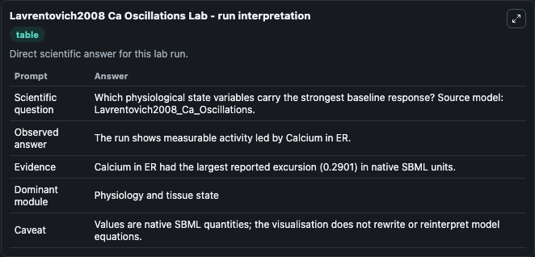
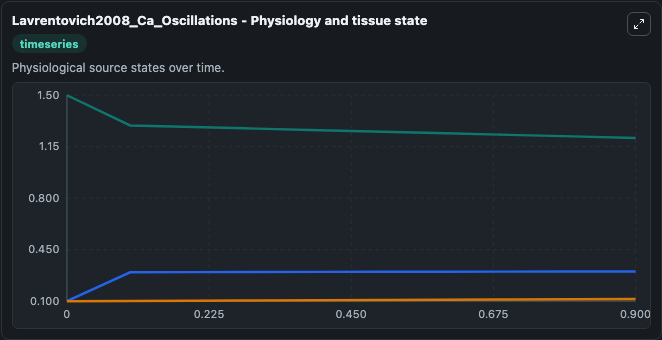
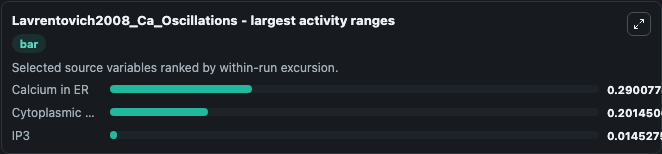
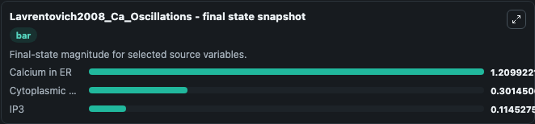
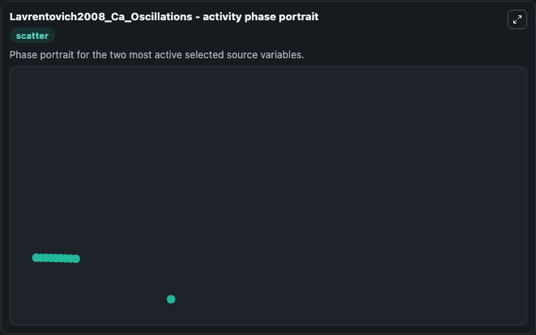

# Lavrentovich2008 Ca Oscillations

This Biosimulant lab wraps `Lavrentovich2008 Ca Oscillations` as a runnable systems biology model with a companion visualization module.
The model reproduces the time profile of cytoplasmic Calcium as depicted in Fig 3 of the paper. It can be used to explore the configured dynamics and compare scenario outcomes across configurations.

## What You'll See

The lab asks: Which physiological state variables carry the strongest baseline response? Source model: Lavrentovich2008_Ca_Oscillations. It runs for 1.0 time units with a communication step of 0.1. The run uses the model defaults declared by the curated SBML wrapper. The generated visualizations focus on Calcium in ER, IP3, and Cytoplasmic Calcium, combining trajectory, endpoint-comparison, and summary-table views from one completed dark-mode run.

In this captured run, **Calcium in ER** moved from 1.500 to 1.210 across 1.0 simulation windows.


### Output Visualizations



*Summary table for Lavrentovich2008 Ca Oscillations, reporting the scientific question, observed answer, dominant module, and caveat.*



*Trajectories of Calcium in ER, Cytoplasmic Calcium, and IP3 across the 1.0 simulation. In this run **Cytoplasmic Calcium** climbed from 0.1000 to 0.3015 and **Calcium in ER** fell from 1.500 to 1.210 — the largest movements among the focused observables.*



*Largest-excursion ranking of the focused observables — the absolute movement magnitude during the run. Top 3: **Calcium in ER** = 0.2901, **Cytoplasmic Calcium** = 0.2015, **IP3** = 0.0145.*



*Endpoint snapshot of the focused observables — final values from the captured run. Top 3 by value: **Calcium in ER** = 1.210, **Cytoplasmic Calcium** = 0.3015, **IP3** = 0.1145.*



*Visualization card from the Lavrentovich2008 Ca Oscillations dark-mode run.*


## Model Context

- Core model: `models/core`
- Visualization model: `models/visualisation`
- Standard: `other`
- Upstream source: `biomodels_ebi:BIOMD0000000184`
- License: `CC0`

## Inputs

| Input | Maps To | Default | Notes |
|---|---|---|---|
| Initial Calcium In Er | `systemsbiology_sbml_lavrentovich2008_ca_oscillations_biomd0000000184_model.initial_calcium_in_er` | | Source state initial condition exposed as a model-specific control because no explicit intervention parameter is identifiable. Maps to SBML symbol `Y`. |
| Initial Model State IP3 | `systemsbiology_sbml_lavrentovich2008_ca_oscillations_biomd0000000184_model.initial_model_state_ip3` | | Source state initial condition exposed as a model-specific control because no explicit intervention parameter is identifiable. Maps to SBML symbol `Z`. |
| Initial Cytoplasmic Calcium | `systemsbiology_sbml_lavrentovich2008_ca_oscillations_biomd0000000184_model.initial_cytoplasmic_calcium` | | Source state initial condition exposed as a model-specific control because no explicit intervention parameter is identifiable. Maps to SBML symbol `X`. |

## Outputs

| Output | Maps To | Role |
|---|---|---|
| `state` | `systemsbiology_sbml_lavrentovich2008_ca_oscillations_biomd0000000184_model.state` | Available to the visualization model and downstream workflows. |
| `summary` | `systemsbiology_sbml_lavrentovich2008_ca_oscillations_biomd0000000184_model.summary` | Available to the visualization model and downstream workflows. |
| `species_labels` | `systemsbiology_sbml_lavrentovich2008_ca_oscillations_biomd0000000184_model.species_labels` | Available to the visualization model and downstream workflows. |
| `calcium_in_er` | `systemsbiology_sbml_lavrentovich2008_ca_oscillations_biomd0000000184_model.calcium_in_er` | Available to the visualization model and downstream workflows. |
| `ip3` | `systemsbiology_sbml_lavrentovich2008_ca_oscillations_biomd0000000184_model.ip3` | Available to the visualization model and downstream workflows. |
| `cytoplasmic_calcium` | `systemsbiology_sbml_lavrentovich2008_ca_oscillations_biomd0000000184_model.cytoplasmic_calcium` | Available to the visualization model and downstream workflows. |

## Runtime

- Duration: `1.0`
- Communication step: `0.1`

## Running Locally

```bash
biosimulant labs serve
```
