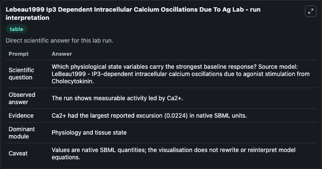
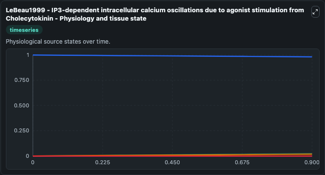
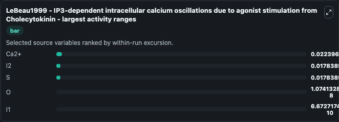
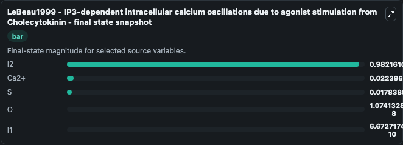
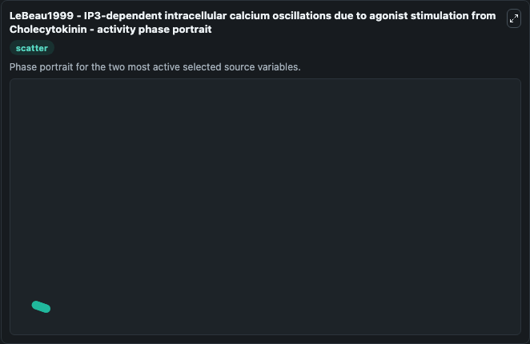

# Lebeau1999 Ip3 Dependent Intracellular Calcium Oscillations Due To Ag

This Biosimulant lab wraps `Lebeau1999 Ip3 Dependent Intracellular Calcium Oscillations Due To Ag` as a runnable systems biology model with a companion visualization module.
The properties of inositol 1,4,5-trisphosphate (IP3)-dependent intracellular calcium oscillations in pancreatic acinar cells depend crucially on the agonist used to stimulate them. It can be used to explore the configured dynamics and compare scenario outcomes across configurations.

## What You'll See

The lab asks: Which physiological state variables carry the strongest baseline response? Source model: LeBeau1999 - IP3-dependent intracellular calcium oscillations due to agonist stimulation from Cholecytokinin. It runs for 1.0 time units with a communication step of 0.1. The run uses the model defaults declared by the curated SBML wrapper. The generated visualizations focus on Ca2+, I2, I1, S, and O, combining trajectory, endpoint-comparison, and summary-table views from one completed dark-mode run.

In this captured run, **Ca2+** moved from 0 to 0.0224 across 1.0 simulation windows.


### Output Visualizations



*Summary table for Lebeau1999 Ip3 Dependent Intracellular Calcium Oscillations Due To Ag, reporting the scientific question, observed answer, dominant module, and caveat.*



*Trajectories of Ca2+, I2, S, O, and I1 across the 1.0 simulation. In this run **Ca2+** climbed from 0 to 0.0224 and **I2** fell from 1.000 to 0.9822 — the largest movements among the focused observables.*



*Largest-excursion ranking of the focused observables — the absolute movement magnitude during the run. Top 3: **Ca2+** = 0.0224, **I2** = 0.0178, **S** = 0.0178, with 2 more observables below.*



*Endpoint snapshot of the focused observables — final values from the captured run. Top 3 by value: **I2** = 0.9822, **Ca2+** = 0.0224, **S** = 0.0178, with 2 more observables below.*



*Visualization card from the Lebeau1999 Ip3 Dependent Intracellular Calcium Oscillations Due To Ag dark-mode run.*


## Model Context

- Core model: `models/core`
- Visualization model: `models/visualisation`
- Standard: `other`
- Upstream source: `biomodels_ebi:BIOMD0000000965`
- License: `CC0`

## Inputs

| Input | Maps To | Default | Notes |
|---|---|---|---|
| Initial Model State CA2 | `systemsbiology_sbml_lebeau1999_ip3_dependent_intracellular_calcium_o_biomd0000000965_model.initial_model_state_ca2` | | Source state initial condition exposed as a model-specific control because no explicit intervention parameter is identifiable. Maps to SBML symbol `c`. |
| Initial Model State I2 | `systemsbiology_sbml_lebeau1999_ip3_dependent_intracellular_calcium_o_biomd0000000965_model.initial_model_state_i2` | | Source state initial condition exposed as a model-specific control because no explicit intervention parameter is identifiable. Maps to SBML symbol `I2`. |
| Initial Model State I1 | `systemsbiology_sbml_lebeau1999_ip3_dependent_intracellular_calcium_o_biomd0000000965_model.initial_model_state_i1` | | Source state initial condition exposed as a model-specific control because no explicit intervention parameter is identifiable. Maps to SBML symbol `I1`. |
| Initial Model State S | `systemsbiology_sbml_lebeau1999_ip3_dependent_intracellular_calcium_o_biomd0000000965_model.initial_model_state_s` | | Source state initial condition exposed as a model-specific control because no explicit intervention parameter is identifiable. Maps to SBML symbol `S`. |
| Initial Model State O | `systemsbiology_sbml_lebeau1999_ip3_dependent_intracellular_calcium_o_biomd0000000965_model.initial_model_state_o` | | Source state initial condition exposed as a model-specific control because no explicit intervention parameter is identifiable. Maps to SBML symbol `O`. |

## Outputs

| Output | Maps To | Role |
|---|---|---|
| `state` | `systemsbiology_sbml_lebeau1999_ip3_dependent_intracellular_calcium_o_biomd0000000965_model.state` | Available to the visualization model and downstream workflows. |
| `summary` | `systemsbiology_sbml_lebeau1999_ip3_dependent_intracellular_calcium_o_biomd0000000965_model.summary` | Available to the visualization model and downstream workflows. |
| `species_labels` | `systemsbiology_sbml_lebeau1999_ip3_dependent_intracellular_calcium_o_biomd0000000965_model.species_labels` | Available to the visualization model and downstream workflows. |
| `ca2` | `systemsbiology_sbml_lebeau1999_ip3_dependent_intracellular_calcium_o_biomd0000000965_model.ca2` | Available to the visualization model and downstream workflows. |
| `model_state_i2` | `systemsbiology_sbml_lebeau1999_ip3_dependent_intracellular_calcium_o_biomd0000000965_model.model_state_i2` | Available to the visualization model and downstream workflows. |
| `model_state_i1` | `systemsbiology_sbml_lebeau1999_ip3_dependent_intracellular_calcium_o_biomd0000000965_model.model_state_i1` | Available to the visualization model and downstream workflows. |
| `model_state_s` | `systemsbiology_sbml_lebeau1999_ip3_dependent_intracellular_calcium_o_biomd0000000965_model.model_state_s` | Available to the visualization model and downstream workflows. |
| `model_state_o` | `systemsbiology_sbml_lebeau1999_ip3_dependent_intracellular_calcium_o_biomd0000000965_model.model_state_o` | Available to the visualization model and downstream workflows. |

## Runtime

- Duration: `1.0`
- Communication step: `0.1`

## Running Locally

```bash
biosimulant labs serve
```
