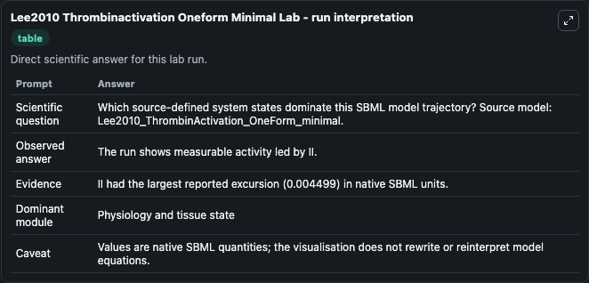
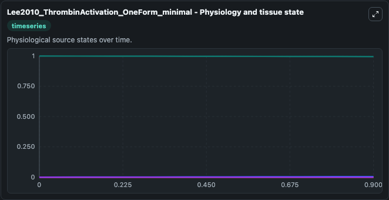
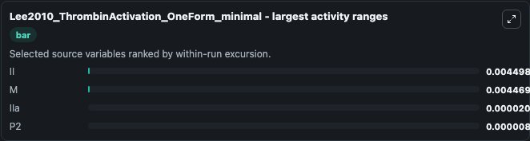
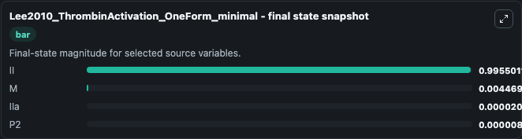
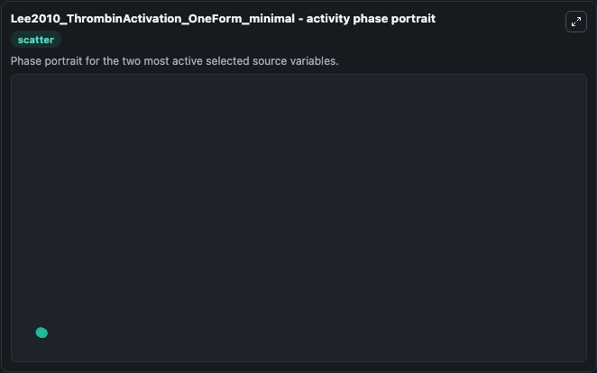

# Lee2010 Thrombinactivation Oneform Minimal

This Biosimulant lab wraps `Lee2010 Thrombinactivation Oneform Minimal` as a runnable systems biology model with a companion visualization module.
Chang Jun Lee, Sangwook Wu, Changsun Eun & Lee G. It can be used to explore the configured dynamics and compare scenario outcomes across configurations.

## What You'll See

The lab asks: Which source-defined system states dominate this SBML model trajectory? Source model: Lee2010_ThrombinActivation_OneForm_minimal. It runs for 1.0 time units with a communication step of 0.1. The run uses the model defaults declared by the curated SBML wrapper. The generated visualizations focus on II, P2, IIa, and M, combining trajectory, endpoint-comparison, and summary-table views from one completed dark-mode run.

In this captured run, **II** moved from 1.000 to 0.9955 across 1.0 simulation windows.


### Output Visualizations



*Summary table for Lee2010 Thrombinactivation Oneform Minimal, reporting the scientific question, observed answer, dominant module, and caveat.*



*Trajectories of II, M, IIa, and P2 across the 1.0 simulation. In this run **M** climbed from 0 to 0.00447 and **II** fell from 1.000 to 0.9955 — the largest movements among the focused observables.*



*Largest-excursion ranking of the focused observables — the absolute movement magnitude during the run. Top 3: **II** = 0.0045, **M** = 0.00447, **IIa** = 2.02e-05, with 1 more observable below.*



*Endpoint snapshot of the focused observables — final values from the captured run. Top 3 by value: **II** = 0.9955, **M** = 0.00447, **IIa** = 2.02e-05, with 1 more observable below.*



*Visualization card from the Lee2010 Thrombinactivation Oneform Minimal dark-mode run.*


## Model Context

- Core model: `models/core`
- Visualization model: `models/visualisation`
- Standard: `other`
- Upstream source: `biomodels_ebi:BIOMD0000000363`
- License: `CC0`

## Inputs

| Input | Maps To | Default | Notes |
|---|---|---|---|
| Initial Model State Ii | `systemsbiology_sbml_lee2010_thrombinactivation_oneform_minimal_biomd0000000363_model.initial_model_state_ii` | | Source state initial condition exposed as a model-specific control because no explicit intervention parameter is identifiable. Maps to SBML symbol `II`. |
| Initial Model State P2 | `systemsbiology_sbml_lee2010_thrombinactivation_oneform_minimal_biomd0000000363_model.initial_model_state_p2` | | Source state initial condition exposed as a model-specific control because no explicit intervention parameter is identifiable. Maps to SBML symbol `P2`. |
| Initial I Ia | `systemsbiology_sbml_lee2010_thrombinactivation_oneform_minimal_biomd0000000363_model.initial_i_ia` | | Source state initial condition exposed as a model-specific control because no explicit intervention parameter is identifiable. Maps to SBML symbol `IIa`. |
| Initial Model State M | `systemsbiology_sbml_lee2010_thrombinactivation_oneform_minimal_biomd0000000363_model.initial_model_state_m` | | Source state initial condition exposed as a model-specific control because no explicit intervention parameter is identifiable. Maps to SBML symbol `M`. |

## Outputs

| Output | Maps To | Role |
|---|---|---|
| `state` | `systemsbiology_sbml_lee2010_thrombinactivation_oneform_minimal_biomd0000000363_model.state` | Available to the visualization model and downstream workflows. |
| `summary` | `systemsbiology_sbml_lee2010_thrombinactivation_oneform_minimal_biomd0000000363_model.summary` | Available to the visualization model and downstream workflows. |
| `species_labels` | `systemsbiology_sbml_lee2010_thrombinactivation_oneform_minimal_biomd0000000363_model.species_labels` | Available to the visualization model and downstream workflows. |
| `model_state_ii` | `systemsbiology_sbml_lee2010_thrombinactivation_oneform_minimal_biomd0000000363_model.model_state_ii` | Available to the visualization model and downstream workflows. |
| `model_state_p2` | `systemsbiology_sbml_lee2010_thrombinactivation_oneform_minimal_biomd0000000363_model.model_state_p2` | Available to the visualization model and downstream workflows. |
| `i_ia` | `systemsbiology_sbml_lee2010_thrombinactivation_oneform_minimal_biomd0000000363_model.i_ia` | Available to the visualization model and downstream workflows. |
| `model_state_m` | `systemsbiology_sbml_lee2010_thrombinactivation_oneform_minimal_biomd0000000363_model.model_state_m` | Available to the visualization model and downstream workflows. |

## Runtime

- Duration: `1.0`
- Communication step: `0.1`

## Running Locally

```bash
biosimulant labs serve
```
