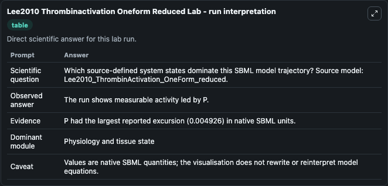
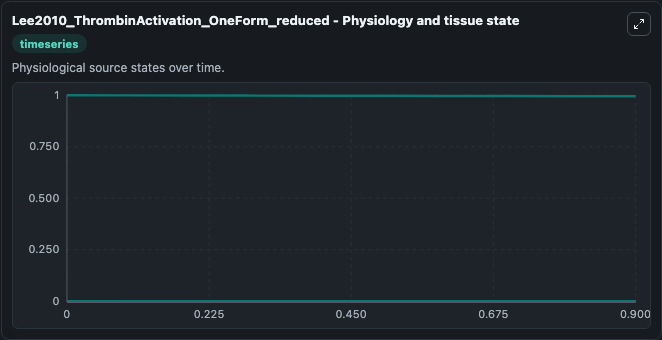
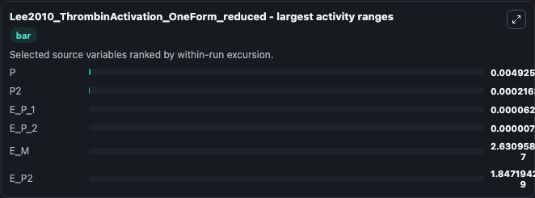
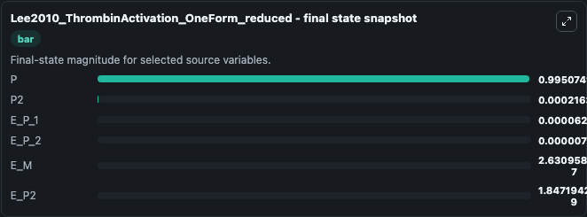
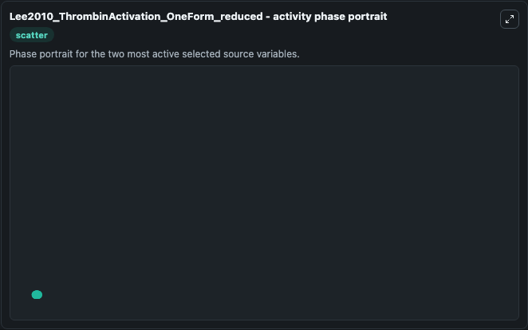

# Lee2010 Thrombinactivation Oneform Reduced

This Biosimulant lab wraps `Lee2010 Thrombinactivation Oneform Reduced` as a runnable systems biology model with a companion visualization module.
Chang Jun Lee, Sangwook Wu, Changsun Eun & Lee G. It can be used to explore the configured dynamics and compare scenario outcomes across configurations.

## What You'll See

The lab asks: Which source-defined system states dominate this SBML model trajectory? Source model: Lee2010_ThrombinActivation_OneForm_reduced. It runs for 1.0 time units with a communication step of 0.1. The run uses the model defaults declared by the curated SBML wrapper. The generated visualizations focus on E_P_2, E_P_1, E_P2, E_M, P2, and P, combining trajectory, endpoint-comparison, and summary-table views from one completed dark-mode run.

In this captured run, **P** moved from 1.000 to 0.9951 across 1.0 simulation windows.


### Output Visualizations



*Summary table for Lee2010 Thrombinactivation Oneform Reduced, reporting the scientific question, observed answer, dominant module, and caveat.*



*Trajectories of P, P2, E_P_1, E_P_2, E_M, and E_P2 across the 1.0 simulation. In this run **P2** climbed from 0 to 0.000216 and **P** fell from 1.000 to 0.9951 — the largest movements among the focused observables.*



*Largest-excursion ranking of the focused observables — the absolute movement magnitude during the run. Top 3: **P** = 0.00493, **P2** = 0.000216, **E_P_1** = 6.3e-05, with 3 more observables below.*



*Endpoint snapshot of the focused observables — final values from the captured run. Top 3 by value: **P** = 0.9951, **P2** = 0.000216, **E_P_1** = 6.27e-05, with 3 more observables below.*



*Visualization card from the Lee2010 Thrombinactivation Oneform Reduced dark-mode run.*


## Model Context

- Core model: `models/core`
- Visualization model: `models/visualisation`
- Standard: `other`
- Upstream source: `biomodels_ebi:BIOMD0000000357`
- License: `CC0`

## Inputs

| Input | Maps To | Default | Notes |
|---|---|---|---|
| Initial E P 2 | `systemsbiology_sbml_lee2010_thrombinactivation_oneform_reduced_biomd0000000357_model.initial_e_p_2` | | Source state initial condition exposed as a model-specific control because no explicit intervention parameter is identifiable. Maps to SBML symbol `E_P_2`. |
| Initial E P 1 | `systemsbiology_sbml_lee2010_thrombinactivation_oneform_reduced_biomd0000000357_model.initial_e_p_1` | | Source state initial condition exposed as a model-specific control because no explicit intervention parameter is identifiable. Maps to SBML symbol `E_P_1`. |
| Initial E P2 | `systemsbiology_sbml_lee2010_thrombinactivation_oneform_reduced_biomd0000000357_model.initial_e_p2` | | Source state initial condition exposed as a model-specific control because no explicit intervention parameter is identifiable. Maps to SBML symbol `E_P2`. |
| Initial Model State E M | `systemsbiology_sbml_lee2010_thrombinactivation_oneform_reduced_biomd0000000357_model.initial_model_state_e_m` | | Source state initial condition exposed as a model-specific control because no explicit intervention parameter is identifiable. Maps to SBML symbol `E_M`. |
| Initial Model State P2 | `systemsbiology_sbml_lee2010_thrombinactivation_oneform_reduced_biomd0000000357_model.initial_model_state_p2` | | Source state initial condition exposed as a model-specific control because no explicit intervention parameter is identifiable. Maps to SBML symbol `P2`. |
| Initial Model State P | `systemsbiology_sbml_lee2010_thrombinactivation_oneform_reduced_biomd0000000357_model.initial_model_state_p` | | Source state initial condition exposed as a model-specific control because no explicit intervention parameter is identifiable. Maps to SBML symbol `P`. |

## Outputs

| Output | Maps To | Role |
|---|---|---|
| `state` | `systemsbiology_sbml_lee2010_thrombinactivation_oneform_reduced_biomd0000000357_model.state` | Available to the visualization model and downstream workflows. |
| `summary` | `systemsbiology_sbml_lee2010_thrombinactivation_oneform_reduced_biomd0000000357_model.summary` | Available to the visualization model and downstream workflows. |
| `species_labels` | `systemsbiology_sbml_lee2010_thrombinactivation_oneform_reduced_biomd0000000357_model.species_labels` | Available to the visualization model and downstream workflows. |
| `e_p_2` | `systemsbiology_sbml_lee2010_thrombinactivation_oneform_reduced_biomd0000000357_model.e_p_2` | Available to the visualization model and downstream workflows. |
| `e_p_1` | `systemsbiology_sbml_lee2010_thrombinactivation_oneform_reduced_biomd0000000357_model.e_p_1` | Available to the visualization model and downstream workflows. |
| `e_p2` | `systemsbiology_sbml_lee2010_thrombinactivation_oneform_reduced_biomd0000000357_model.e_p2` | Available to the visualization model and downstream workflows. |
| `e_m` | `systemsbiology_sbml_lee2010_thrombinactivation_oneform_reduced_biomd0000000357_model.e_m` | Available to the visualization model and downstream workflows. |
| `model_state_p2` | `systemsbiology_sbml_lee2010_thrombinactivation_oneform_reduced_biomd0000000357_model.model_state_p2` | Available to the visualization model and downstream workflows. |
| `model_state_p` | `systemsbiology_sbml_lee2010_thrombinactivation_oneform_reduced_biomd0000000357_model.model_state_p` | Available to the visualization model and downstream workflows. |

## Runtime

- Duration: `1.0`
- Communication step: `0.1`

## Running Locally

```bash
biosimulant labs serve
```
