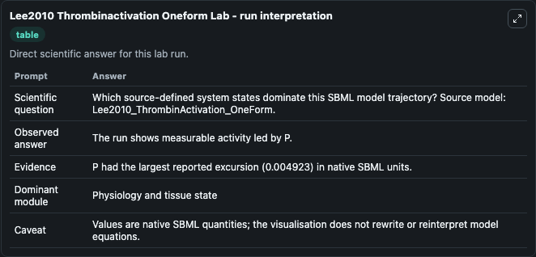
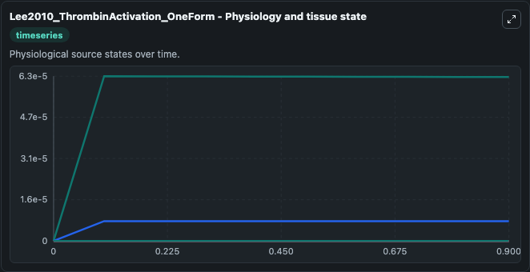
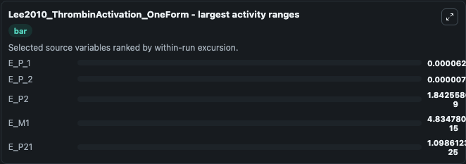
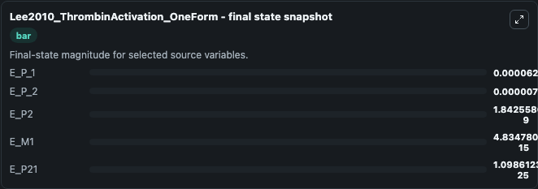
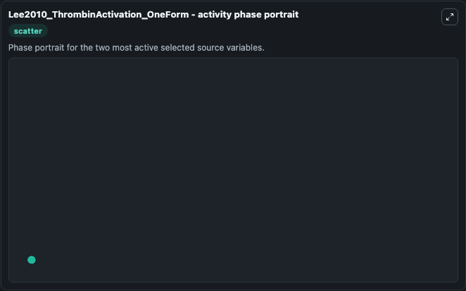

# Lee2010 Thrombinactivation Oneform

This Biosimulant lab wraps `Lee2010 Thrombinactivation Oneform` as a runnable systems biology model with a companion visualization module.
Chang Jun Lee, Sangwook Wu, Changsun Eun & Lee G. It can be used to explore the configured dynamics and compare scenario outcomes across configurations.

## What You'll See

The lab asks: Which source-defined system states dominate this SBML model trajectory? Source model: Lee2010_ThrombinActivation_OneForm. It runs for 1.0 time units with a communication step of 0.1. The run uses the model defaults declared by the curated SBML wrapper. The generated visualizations focus on E_P_2, E_P_1, E_P21, E_P2, E_P1, and E_M1, combining trajectory, endpoint-comparison, and summary-table views from one completed dark-mode run.

In this captured run, **E_P_1** moved from 0 to 6.26e-05 across 1.0 simulation windows.


### Output Visualizations



*Summary table for Lee2010 Thrombinactivation Oneform, reporting the scientific question, observed answer, dominant module, and caveat.*



*Trajectories of E_P_1, E_P_2, E_P2, E_M1, E_P21, and E_P1 across the 1.0 simulation. In this run **E_P_1** climbed from 0 to 6.26e-05 — the largest movements among the focused observables.*



*Largest-excursion ranking of the focused observables — the absolute movement magnitude during the run. Top 3: **E_P_1** = 6.3e-05, **E_P_2** = 7.56e-06, **E_P2** = 1.84e-09, with 2 more observables below.*



*Endpoint snapshot of the focused observables — final values from the captured run. Top 3 by value: **E_P_1** = 6.26e-05, **E_P_2** = 7.53e-06, **E_P2** = 1.84e-09, with 2 more observables below.*



*Visualization card from the Lee2010 Thrombinactivation Oneform dark-mode run.*


## Model Context

- Core model: `models/core`
- Visualization model: `models/visualisation`
- Standard: `other`
- Upstream source: `biomodels_ebi:BIOMD0000000364`
- License: `CC0`

## Inputs

| Input | Maps To | Default | Notes |
|---|---|---|---|
| Initial E P 2 | `systemsbiology_sbml_lee2010_thrombinactivation_oneform_biomd0000000364_model.initial_e_p_2` | | Source state initial condition exposed as a model-specific control because no explicit intervention parameter is identifiable. Maps to SBML symbol `E_P_2`. |
| Initial E P 1 | `systemsbiology_sbml_lee2010_thrombinactivation_oneform_biomd0000000364_model.initial_e_p_1` | | Source state initial condition exposed as a model-specific control because no explicit intervention parameter is identifiable. Maps to SBML symbol `E_P_1`. |
| Initial E P21 | `systemsbiology_sbml_lee2010_thrombinactivation_oneform_biomd0000000364_model.initial_e_p21` | | Source state initial condition exposed as a model-specific control because no explicit intervention parameter is identifiable. Maps to SBML symbol `E_P21`. |
| Initial E P2 | `systemsbiology_sbml_lee2010_thrombinactivation_oneform_biomd0000000364_model.initial_e_p2` | | Source state initial condition exposed as a model-specific control because no explicit intervention parameter is identifiable. Maps to SBML symbol `E_P2`. |
| Initial E P1 | `systemsbiology_sbml_lee2010_thrombinactivation_oneform_biomd0000000364_model.initial_e_p1` | | Source state initial condition exposed as a model-specific control because no explicit intervention parameter is identifiable. Maps to SBML symbol `E_P1`. |
| Initial E M1 | `systemsbiology_sbml_lee2010_thrombinactivation_oneform_biomd0000000364_model.initial_e_m1` | | Source state initial condition exposed as a model-specific control because no explicit intervention parameter is identifiable. Maps to SBML symbol `E_M1`. |

## Outputs

| Output | Maps To | Role |
|---|---|---|
| `state` | `systemsbiology_sbml_lee2010_thrombinactivation_oneform_biomd0000000364_model.state` | Available to the visualization model and downstream workflows. |
| `summary` | `systemsbiology_sbml_lee2010_thrombinactivation_oneform_biomd0000000364_model.summary` | Available to the visualization model and downstream workflows. |
| `species_labels` | `systemsbiology_sbml_lee2010_thrombinactivation_oneform_biomd0000000364_model.species_labels` | Available to the visualization model and downstream workflows. |
| `e_p_2` | `systemsbiology_sbml_lee2010_thrombinactivation_oneform_biomd0000000364_model.e_p_2` | Available to the visualization model and downstream workflows. |
| `e_p_1` | `systemsbiology_sbml_lee2010_thrombinactivation_oneform_biomd0000000364_model.e_p_1` | Available to the visualization model and downstream workflows. |
| `e_p21` | `systemsbiology_sbml_lee2010_thrombinactivation_oneform_biomd0000000364_model.e_p21` | Available to the visualization model and downstream workflows. |
| `e_p2` | `systemsbiology_sbml_lee2010_thrombinactivation_oneform_biomd0000000364_model.e_p2` | Available to the visualization model and downstream workflows. |
| `e_p1` | `systemsbiology_sbml_lee2010_thrombinactivation_oneform_biomd0000000364_model.e_p1` | Available to the visualization model and downstream workflows. |
| `e_m1` | `systemsbiology_sbml_lee2010_thrombinactivation_oneform_biomd0000000364_model.e_m1` | Available to the visualization model and downstream workflows. |

## Runtime

- Duration: `1.0`
- Communication step: `0.1`

## Running Locally

```bash
biosimulant labs serve
```
