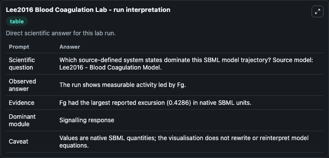
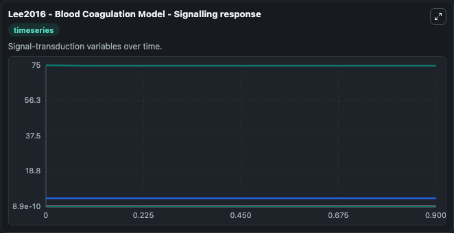
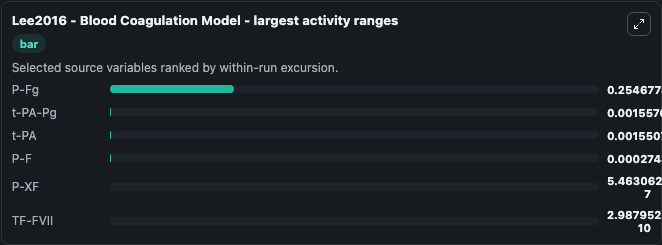
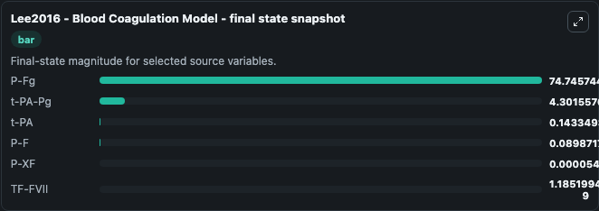
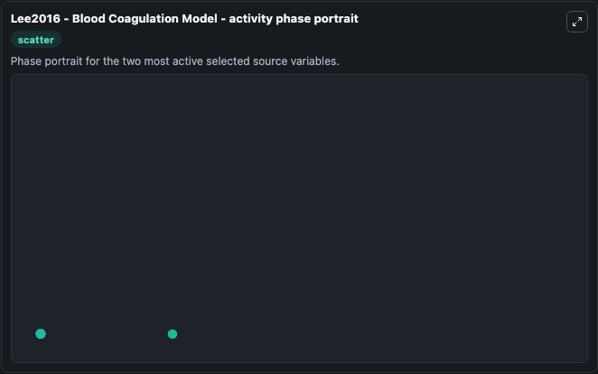

# Lee2016 Blood Coagulation

This Biosimulant lab wraps `Lee2016 Blood Coagulation` as a runnable systems biology model with a companion visualization module.
Systems Biology Lee2016Blood Coagulation Model Model1806060001Model captures systems biology lee2016 blood coagulation model1806060001 behavior in the context of systemsbiology, sbml, biomodels_ebi using a biomo. It can be used to explore the configured dynamics and compare scenario outcomes across configurations.

## What You'll See

The lab asks: Which source-defined system states dominate this SBML model trajectory? Source model: Lee2016 - Blood Coagulation Model. It runs for 1.0 time units with a communication step of 0.1. The run uses the model defaults declared by the curated SBML wrapper. The generated visualizations focus on P-Fg, t-PA-Pg, t-PA, P-F, P-XF, and TF-FVII, combining trajectory, endpoint-comparison, and summary-table views from one completed dark-mode run.

In this captured run, **P-Fg** moved from 75.000 to 74.746 across 1.0 simulation windows.


### Output Visualizations



*Summary table for Lee2016 Blood Coagulation, reporting the scientific question, observed answer, dominant module, and caveat.*



*Trajectories of P-Fg, t-PA-Pg, t-PA, P-F, P-XF, and TF-FVII across the 1.0 simulation. In this run **t-PA-Pg** climbed from 4.300 to 4.302 and **P-Fg** fell from 75.000 to 74.746 — the largest movements among the focused observables.*



*Largest-excursion ranking of the focused observables — the absolute movement magnitude during the run. Top 3: **P-Fg** = 0.2547, **t-PA-Pg** = 0.00156, **t-PA** = 0.00155, with 3 more observables below.*



*Endpoint snapshot of the focused observables — final values from the captured run. Top 3 by value: **P-Fg** = 74.746, **t-PA-Pg** = 4.302, **t-PA** = 0.1433, with 3 more observables below.*



*Visualization card from the Lee2016 Blood Coagulation dark-mode run.*


## Model Context

- Core model: `models/core`
- Visualization model: `models/visualisation`
- Standard: `other`
- Upstream source: `biomodels_ebi:MODEL1806060001`
- License: `CC0`

## Inputs

| Input | Maps To | Default | Notes |
|---|---|---|---|
| Initial P Fg | `systemsbiology_sbml_lee2016_blood_coagulation_model_model1806060001_model.initial_p_fg` | | Source state initial condition exposed as a model-specific control because no explicit intervention parameter is identifiable. Maps to SBML symbol `P_Fg`. |
| Initial T Pa Pg | `systemsbiology_sbml_lee2016_blood_coagulation_model_model1806060001_model.initial_t_pa_pg` | | Source state initial condition exposed as a model-specific control because no explicit intervention parameter is identifiable. Maps to SBML symbol `t_PA_Pg`. |
| Initial T Pa | `systemsbiology_sbml_lee2016_blood_coagulation_model_model1806060001_model.initial_t_pa` | | Source state initial condition exposed as a model-specific control because no explicit intervention parameter is identifiable. Maps to SBML symbol `t_PA`. |
| Initial Model State P F | `systemsbiology_sbml_lee2016_blood_coagulation_model_model1806060001_model.initial_model_state_p_f` | | Source state initial condition exposed as a model-specific control because no explicit intervention parameter is identifiable. Maps to SBML symbol `P_F`. |
| Initial P Xf | `systemsbiology_sbml_lee2016_blood_coagulation_model_model1806060001_model.initial_p_xf` | | Source state initial condition exposed as a model-specific control because no explicit intervention parameter is identifiable. Maps to SBML symbol `P_XF`. |
| Initial Tf Fvii | `systemsbiology_sbml_lee2016_blood_coagulation_model_model1806060001_model.initial_tf_fvii` | | Source state initial condition exposed as a model-specific control because no explicit intervention parameter is identifiable. Maps to SBML symbol `TF_FVII`. |

## Outputs

| Output | Maps To | Role |
|---|---|---|
| `state` | `systemsbiology_sbml_lee2016_blood_coagulation_model_model1806060001_model.state` | Available to the visualization model and downstream workflows. |
| `summary` | `systemsbiology_sbml_lee2016_blood_coagulation_model_model1806060001_model.summary` | Available to the visualization model and downstream workflows. |
| `species_labels` | `systemsbiology_sbml_lee2016_blood_coagulation_model_model1806060001_model.species_labels` | Available to the visualization model and downstream workflows. |
| `p_fg` | `systemsbiology_sbml_lee2016_blood_coagulation_model_model1806060001_model.p_fg` | Available to the visualization model and downstream workflows. |
| `t_pa_pg` | `systemsbiology_sbml_lee2016_blood_coagulation_model_model1806060001_model.t_pa_pg` | Available to the visualization model and downstream workflows. |
| `t_pa` | `systemsbiology_sbml_lee2016_blood_coagulation_model_model1806060001_model.t_pa` | Available to the visualization model and downstream workflows. |
| `p_f` | `systemsbiology_sbml_lee2016_blood_coagulation_model_model1806060001_model.p_f` | Available to the visualization model and downstream workflows. |
| `p_xf` | `systemsbiology_sbml_lee2016_blood_coagulation_model_model1806060001_model.p_xf` | Available to the visualization model and downstream workflows. |
| `tf_fvii` | `systemsbiology_sbml_lee2016_blood_coagulation_model_model1806060001_model.tf_fvii` | Available to the visualization model and downstream workflows. |

## Runtime

- Duration: `1.0`
- Communication step: `0.1`

## Running Locally

```bash
biosimulant labs serve
```
