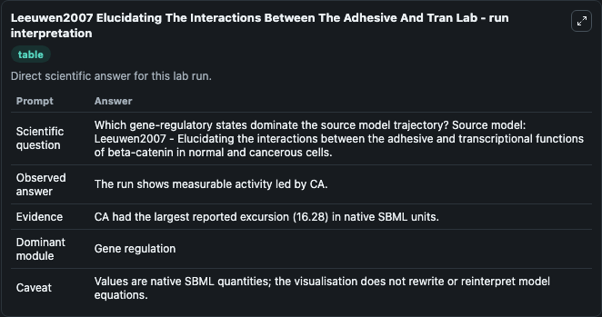
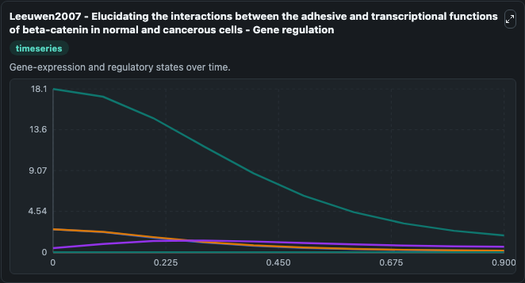
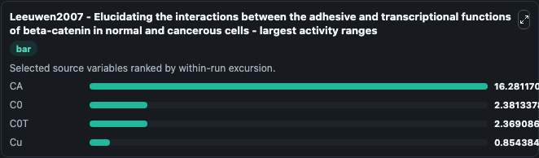
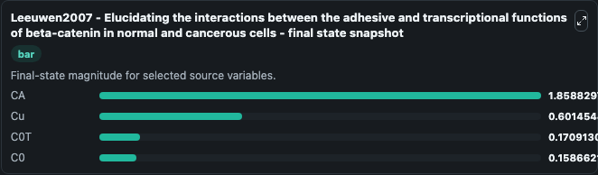
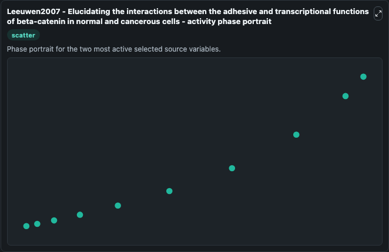

# Leeuwen2007 Elucidating The Interactions Between The Adhesive And Tran

This Biosimulant lab wraps `Leeuwen2007 Elucidating The Interactions Between The Adhesive And Tran` as a runnable systems biology model with a companion visualization module.
Elucidating the interactions between the adhesive and transcriptional functions of beta-catenin in normal and cancerous cells.van Leeuwen IM1, Byrne HM, Jensen OE, King JR.Author information1 Centre f. It can be used to explore the configured dynamics and compare scenario outcomes across configurations.

## What You'll See

The lab asks: Which gene-regulatory states dominate the source model trajectory? Source model: Leeuwen2007 - Elucidating the interactions between the adhesive and transcriptional functions of beta-catenin in normal and cancerous cells. It runs for 1.0 time units with a communication step of 0.1. The run uses the model defaults declared by the curated SBML wrapper. The generated visualizations focus on CA, C0T, C0, Cu, CcT, and Cc, combining trajectory, endpoint-comparison, and summary-table views from one completed dark-mode run.

In this captured run, **CA** moved from 18.140 to 1.859 across 1.0 simulation windows.


### Output Visualizations



*Summary table for Leeuwen2007 Elucidating The Interactions Between The Adhesive And Tran, reporting the scientific question, observed answer, dominant module, and caveat.*



*Trajectories of CA, C0, C0T, Cu, CcT, and Cc across the 1.0 simulation. In this run **Cu** climbed from 0.4500 to 0.6015 and **CA** fell from 18.140 to 1.859 — the largest movements among the focused observables.*



*Largest-excursion ranking of the focused observables — the absolute movement magnitude during the run. Top 3: **CA** = 16.281, **C0** = 2.381, **C0T** = 2.369, with 1 more observable below.*



*Endpoint snapshot of the focused observables — final values from the captured run. Top 3 by value: **CA** = 1.859, **Cu** = 0.6015, **C0T** = 0.1709, with 1 more observable below.*



*Visualization card from the Leeuwen2007 Elucidating The Interactions Between The Adhesive And Tran dark-mode run.*


## Model Context

- Core model: `models/core`
- Visualization model: `models/visualisation`
- Standard: `other`
- Upstream source: `biomodels_ebi:MODEL2001090001`
- License: `CC0`

## Inputs

| Input | Maps To | Default | Notes |
|---|---|---|---|
| Initial Model State Ca | `systemsbiology_sbml_leeuwen2007_elucidating_the_interactions_between_model2001090001_model.initial_model_state_ca` | | Source state initial condition exposed as a model-specific control because no explicit intervention parameter is identifiable. Maps to SBML symbol `CA`. |
| Initial C0 T | `systemsbiology_sbml_leeuwen2007_elucidating_the_interactions_between_model2001090001_model.initial_c0_t` | | Source state initial condition exposed as a model-specific control because no explicit intervention parameter is identifiable. Maps to SBML symbol `C0T`. |
| Initial Model State C0 | `systemsbiology_sbml_leeuwen2007_elucidating_the_interactions_between_model2001090001_model.initial_model_state_c0` | | Source state initial condition exposed as a model-specific control because no explicit intervention parameter is identifiable. Maps to SBML symbol `C0`. |
| Initial Model State Cu | `systemsbiology_sbml_leeuwen2007_elucidating_the_interactions_between_model2001090001_model.initial_model_state_cu` | | Source state initial condition exposed as a model-specific control because no explicit intervention parameter is identifiable. Maps to SBML symbol `Cu`. |
| Initial Cc T | `systemsbiology_sbml_leeuwen2007_elucidating_the_interactions_between_model2001090001_model.initial_cc_t` | | Source state initial condition exposed as a model-specific control because no explicit intervention parameter is identifiable. Maps to SBML symbol `CcT`. |
| Initial Model State Cc | `systemsbiology_sbml_leeuwen2007_elucidating_the_interactions_between_model2001090001_model.initial_model_state_cc` | | Source state initial condition exposed as a model-specific control because no explicit intervention parameter is identifiable. Maps to SBML symbol `Cc`. |

## Outputs

| Output | Maps To | Role |
|---|---|---|
| `state` | `systemsbiology_sbml_leeuwen2007_elucidating_the_interactions_between_model2001090001_model.state` | Available to the visualization model and downstream workflows. |
| `summary` | `systemsbiology_sbml_leeuwen2007_elucidating_the_interactions_between_model2001090001_model.summary` | Available to the visualization model and downstream workflows. |
| `species_labels` | `systemsbiology_sbml_leeuwen2007_elucidating_the_interactions_between_model2001090001_model.species_labels` | Available to the visualization model and downstream workflows. |
| `model_state_ca` | `systemsbiology_sbml_leeuwen2007_elucidating_the_interactions_between_model2001090001_model.model_state_ca` | Available to the visualization model and downstream workflows. |
| `c0_t` | `systemsbiology_sbml_leeuwen2007_elucidating_the_interactions_between_model2001090001_model.c0_t` | Available to the visualization model and downstream workflows. |
| `model_state_c0` | `systemsbiology_sbml_leeuwen2007_elucidating_the_interactions_between_model2001090001_model.model_state_c0` | Available to the visualization model and downstream workflows. |
| `model_state_cu` | `systemsbiology_sbml_leeuwen2007_elucidating_the_interactions_between_model2001090001_model.model_state_cu` | Available to the visualization model and downstream workflows. |
| `cc_t` | `systemsbiology_sbml_leeuwen2007_elucidating_the_interactions_between_model2001090001_model.cc_t` | Available to the visualization model and downstream workflows. |
| `model_state_cc` | `systemsbiology_sbml_leeuwen2007_elucidating_the_interactions_between_model2001090001_model.model_state_cc` | Available to the visualization model and downstream workflows. |

## Runtime

- Duration: `1.0`
- Communication step: `0.1`

## Running Locally

```bash
biosimulant labs serve
```
