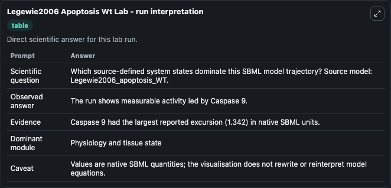
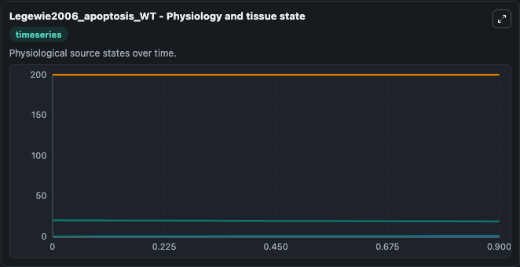
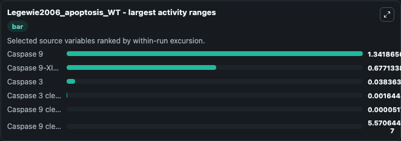
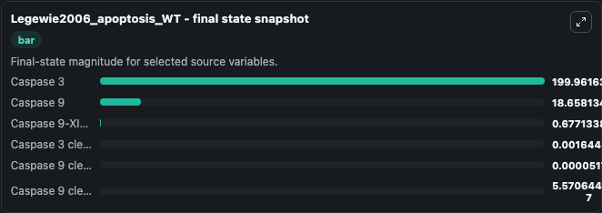
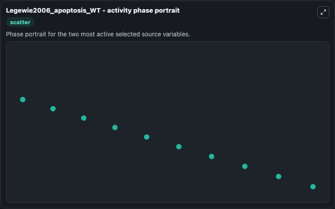

# Legewie2006 Apoptosis Wt

This Biosimulant lab wraps `Legewie2006 Apoptosis Wt` as a runnable systems biology model with a companion visualization module.
The model reproduces active Caspase-3 time profile corresponding to the total Apaf-1 value of 20 nM as depicted in Fig 2-A. It can be used to explore the configured dynamics and compare scenario outcomes across configurations.

## What You'll See

The lab asks: Which source-defined system states dominate this SBML model trajectory? Source model: Legewie2006_apoptosis_WT. It runs for 1.0 time units with a communication step of 0.1. The run uses the model defaults declared by the curated SBML wrapper. The generated visualizations focus on Caspase 3, Caspase 9, Caspase 9-XIAP complex, Caspase 9 cleaved-XIAP complex, Caspase 9 cleaved, and Caspase 3 cleaved - XIAP complex, combining trajectory, endpoint-comparison, and summary-table views from one completed dark-mode run.

In this captured run, **Caspase 9** moved from 20.000 to 18.658 across 1.0 simulation windows.


### Output Visualizations



*Summary table for Legewie2006 Apoptosis Wt, reporting the scientific question, observed answer, dominant module, and caveat.*



*Trajectories of Caspase 9, Caspase 9-XIAP complex, Caspase 3, Caspase 3 cleaved - XIAP complex, Caspase 9 cleaved, and Caspase 9 cleaved-XIAP complex across the 1.0 simulation. In this run **Caspase 9-XIAP complex** climbed from 0 to 0.6771 and **Caspase 9** fell from 20.000 to 18.658 — the largest movements among the focused observables.*



*Largest-excursion ranking of the focused observables — the absolute movement magnitude during the run. Top 3: **Caspase 9** = 1.342, **Caspase 9-XIAP complex** = 0.6771, **Caspase 3** = 0.0384, with 3 more observables below.*



*Endpoint snapshot of the focused observables — final values from the captured run. Top 3 by value: **Caspase 3** = 200.0, **Caspase 9** = 18.658, **Caspase 9-XIAP complex** = 0.6771, with 3 more observables below.*



*Visualization card from the Legewie2006 Apoptosis Wt dark-mode run.*


## Model Context

- Core model: `models/core`
- Visualization model: `models/visualisation`
- Standard: `other`
- Upstream source: `biomodels_ebi:BIOMD0000000102`
- License: `CC0`

## Inputs

| Input | Maps To | Default | Notes |
|---|---|---|---|
| Initial Caspase 3 | `systemsbiology_sbml_legewie2006_apoptosis_wt_biomd0000000102_model.initial_caspase_3` | | Source state initial condition exposed as a model-specific control because no explicit intervention parameter is identifiable. Maps to SBML symbol `C3`. |
| Initial Caspase 9 | `systemsbiology_sbml_legewie2006_apoptosis_wt_biomd0000000102_model.initial_caspase_9` | | Source state initial condition exposed as a model-specific control because no explicit intervention parameter is identifiable. Maps to SBML symbol `C9`. |
| Initial Caspase 9 Xiap Complex | `systemsbiology_sbml_legewie2006_apoptosis_wt_biomd0000000102_model.initial_caspase_9_xiap_complex` | | Source state initial condition exposed as a model-specific control because no explicit intervention parameter is identifiable. Maps to SBML symbol `C9X`. |
| Initial Caspase 9 Cleaved Xiap Complex | `systemsbiology_sbml_legewie2006_apoptosis_wt_biomd0000000102_model.initial_caspase_9_cleaved_xiap_complex` | | Source state initial condition exposed as a model-specific control because no explicit intervention parameter is identifiable. Maps to SBML symbol `C9_starX`. |
| Initial Caspase 9 Cleaved | `systemsbiology_sbml_legewie2006_apoptosis_wt_biomd0000000102_model.initial_caspase_9_cleaved` | | Source state initial condition exposed as a model-specific control because no explicit intervention parameter is identifiable. Maps to SBML symbol `C9_star`. |
| Initial Caspase 3 Cleaved Xiap Complex | `systemsbiology_sbml_legewie2006_apoptosis_wt_biomd0000000102_model.initial_caspase_3_cleaved_xiap_complex` | | Source state initial condition exposed as a model-specific control because no explicit intervention parameter is identifiable. Maps to SBML symbol `C3_starX`. |

## Outputs

| Output | Maps To | Role |
|---|---|---|
| `state` | `systemsbiology_sbml_legewie2006_apoptosis_wt_biomd0000000102_model.state` | Available to the visualization model and downstream workflows. |
| `summary` | `systemsbiology_sbml_legewie2006_apoptosis_wt_biomd0000000102_model.summary` | Available to the visualization model and downstream workflows. |
| `species_labels` | `systemsbiology_sbml_legewie2006_apoptosis_wt_biomd0000000102_model.species_labels` | Available to the visualization model and downstream workflows. |
| `caspase_3` | `systemsbiology_sbml_legewie2006_apoptosis_wt_biomd0000000102_model.caspase_3` | Available to the visualization model and downstream workflows. |
| `caspase_9` | `systemsbiology_sbml_legewie2006_apoptosis_wt_biomd0000000102_model.caspase_9` | Available to the visualization model and downstream workflows. |
| `caspase_9_xiap_complex` | `systemsbiology_sbml_legewie2006_apoptosis_wt_biomd0000000102_model.caspase_9_xiap_complex` | Available to the visualization model and downstream workflows. |
| `caspase_9_cleaved_xiap_complex` | `systemsbiology_sbml_legewie2006_apoptosis_wt_biomd0000000102_model.caspase_9_cleaved_xiap_complex` | Available to the visualization model and downstream workflows. |
| `caspase_9_cleaved` | `systemsbiology_sbml_legewie2006_apoptosis_wt_biomd0000000102_model.caspase_9_cleaved` | Available to the visualization model and downstream workflows. |
| `caspase_3_cleaved_xiap_complex` | `systemsbiology_sbml_legewie2006_apoptosis_wt_biomd0000000102_model.caspase_3_cleaved_xiap_complex` | Available to the visualization model and downstream workflows. |

## Runtime

- Duration: `1.0`
- Communication step: `0.1`

## Running Locally

```bash
biosimulant labs serve
```
