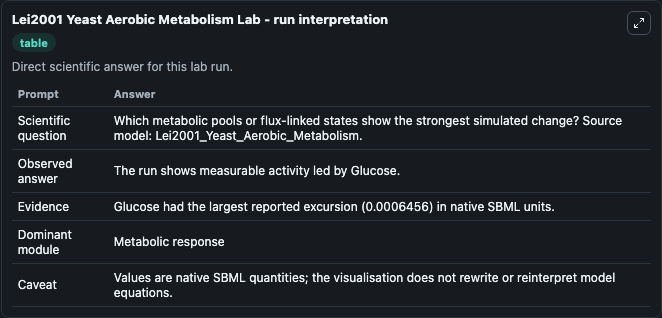
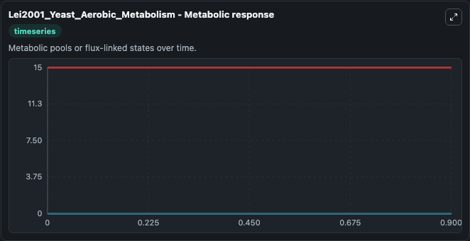
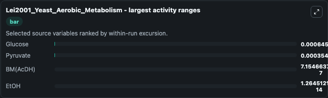
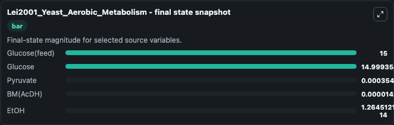
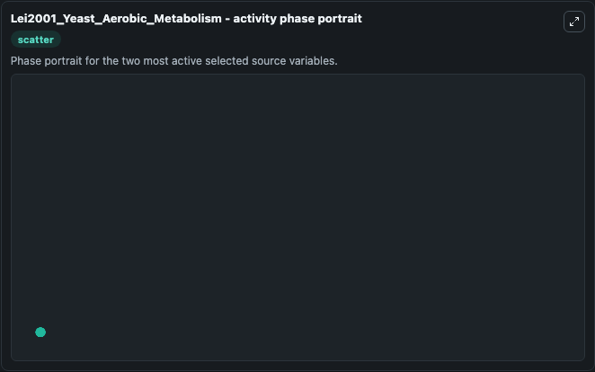

# Lei2001 Yeast Aerobic Metabolism

This Biosimulant lab wraps `Lei2001 Yeast Aerobic Metabolism` as a runnable systems biology model with a companion visualization module.
This the model from the article: A biochemically structured model for Saccharomyces cerevisiae. It can be used to explore the configured dynamics and compare scenario outcomes across configurations.

## What You'll See

The lab asks: Which metabolic pools or flux-linked states show the strongest simulated change? Source model: Lei2001_Yeast_Aerobic_Metabolism. It runs for 1.0 time units with a communication step of 0.1. The run uses the model defaults declared by the curated SBML wrapper. The generated visualizations focus on Glucose(feed), Glucose, Red. Equ. (NADH), Pyruvate, EtOH, and BM(AcDH), combining trajectory, endpoint-comparison, and summary-table views from one completed dark-mode run.

In this captured run, **Glucose** moved from 15.000 to 14.999 across 1.0 simulation windows.


### Output Visualizations



*Summary table for Lei2001 Yeast Aerobic Metabolism, reporting the scientific question, observed answer, dominant module, and caveat.*



*Trajectories of Glucose, Pyruvate, BM(AcDH), EtOH, Glucose(feed), and Red. Equ. (NADH) across the 1.0 simulation. In this run **Pyruvate** climbed from 0 to 0.000354 and **Glucose** fell from 15.000 to 14.999 — the largest movements among the focused observables.*



*Largest-excursion ranking of the focused observables — the absolute movement magnitude during the run. Top 3: **Glucose** = 0.000646, **Pyruvate** = 0.000354, **BM(AcDH)** = 7.15e-07, with 1 more observable below.*



*Endpoint snapshot of the focused observables — final values from the captured run. Top 3 by value: **Glucose(feed)** = 15.000, **Glucose** = 14.999, **Pyruvate** = 0.000354, with 2 more observables below.*



*Visualization card from the Lei2001 Yeast Aerobic Metabolism dark-mode run.*


## Model Context

- Core model: `models/core`
- Visualization model: `models/visualisation`
- Standard: `other`
- Upstream source: `biomodels_ebi:BIOMD0000000245`
- License: `CC0`

## Inputs

| Input | Maps To | Default | Notes |
|---|---|---|---|
| Initial Glucose Feed | `systemsbiology_sbml_lei2001_yeast_aerobic_metabolism_biomd0000000245_model.initial_glucose_feed` | | Source state initial condition exposed as a model-specific control because no explicit intervention parameter is identifiable. Maps to SBML symbol `S_f`. |
| Initial Glucose | `systemsbiology_sbml_lei2001_yeast_aerobic_metabolism_biomd0000000245_model.initial_glucose` | | Source state initial condition exposed as a model-specific control because no explicit intervention parameter is identifiable. Maps to SBML symbol `s_glu`. |
| Initial Red Equ Nadh | `systemsbiology_sbml_lei2001_yeast_aerobic_metabolism_biomd0000000245_model.initial_red_equ_nadh` | | Source state initial condition exposed as a model-specific control because no explicit intervention parameter is identifiable. Maps to SBML symbol `Red`. |
| Initial Pyruvate | `systemsbiology_sbml_lei2001_yeast_aerobic_metabolism_biomd0000000245_model.initial_pyruvate` | | Source state initial condition exposed as a model-specific control because no explicit intervention parameter is identifiable. Maps to SBML symbol `s_pyr`. |
| Initial Et Oh | `systemsbiology_sbml_lei2001_yeast_aerobic_metabolism_biomd0000000245_model.initial_et_oh` | | Source state initial condition exposed as a model-specific control because no explicit intervention parameter is identifiable. Maps to SBML symbol `s_EtOH`. |
| Initial Bm Ac Dh | `systemsbiology_sbml_lei2001_yeast_aerobic_metabolism_biomd0000000245_model.initial_bm_ac_dh` | | Source state initial condition exposed as a model-specific control because no explicit intervention parameter is identifiable. Maps to SBML symbol `AcDH`. |

## Outputs

| Output | Maps To | Role |
|---|---|---|
| `state` | `systemsbiology_sbml_lei2001_yeast_aerobic_metabolism_biomd0000000245_model.state` | Available to the visualization model and downstream workflows. |
| `summary` | `systemsbiology_sbml_lei2001_yeast_aerobic_metabolism_biomd0000000245_model.summary` | Available to the visualization model and downstream workflows. |
| `species_labels` | `systemsbiology_sbml_lei2001_yeast_aerobic_metabolism_biomd0000000245_model.species_labels` | Available to the visualization model and downstream workflows. |
| `glucose_feed` | `systemsbiology_sbml_lei2001_yeast_aerobic_metabolism_biomd0000000245_model.glucose_feed` | Available to the visualization model and downstream workflows. |
| `glucose` | `systemsbiology_sbml_lei2001_yeast_aerobic_metabolism_biomd0000000245_model.glucose` | Available to the visualization model and downstream workflows. |
| `red_equ_nadh` | `systemsbiology_sbml_lei2001_yeast_aerobic_metabolism_biomd0000000245_model.red_equ_nadh` | Available to the visualization model and downstream workflows. |
| `pyruvate` | `systemsbiology_sbml_lei2001_yeast_aerobic_metabolism_biomd0000000245_model.pyruvate` | Available to the visualization model and downstream workflows. |
| `et_oh` | `systemsbiology_sbml_lei2001_yeast_aerobic_metabolism_biomd0000000245_model.et_oh` | Available to the visualization model and downstream workflows. |
| `bm_ac_dh` | `systemsbiology_sbml_lei2001_yeast_aerobic_metabolism_biomd0000000245_model.bm_ac_dh` | Available to the visualization model and downstream workflows. |

## Runtime

- Duration: `1.0`
- Communication step: `0.1`

## Running Locally

```bash
biosimulant labs serve
```
