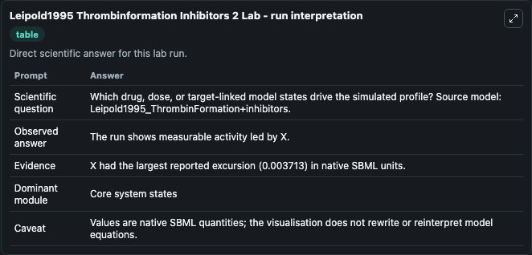
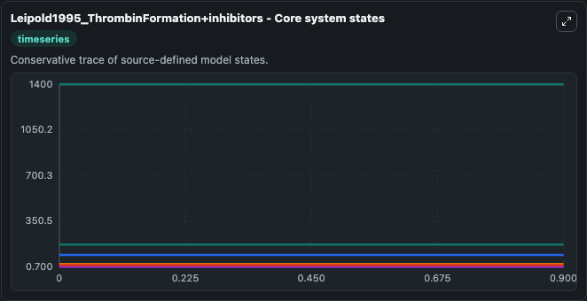
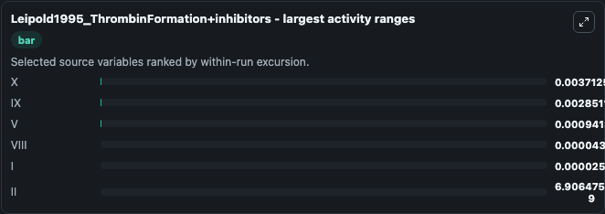
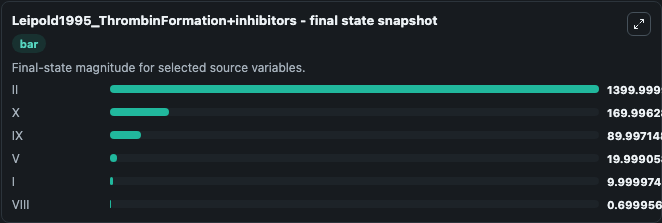
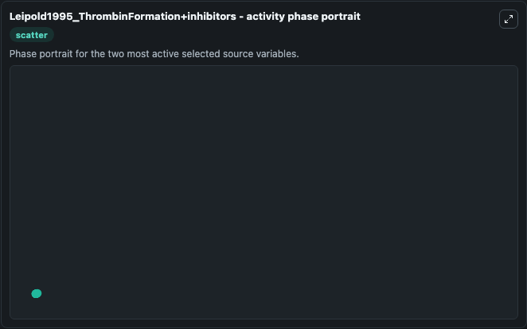

# Leipold1995 Thrombinformation Inhibitors 2

This Biosimulant lab wraps `Leipold1995 Thrombinformation Inhibitors 2` as a runnable systems biology model with a companion visualization module.
This model originates from BioModels Database: A Database of Annotated Published Models (http://www.ebi.ac.uk/biomodels/). It can be used to explore the configured dynamics and compare scenario outcomes across configurations.

## What You'll See

The lab asks: Which drug, dose, or target-linked model states drive the simulated profile? Source model: Leipold1995_ThrombinFormation+inhibitors. It runs for 1.0 time units with a communication step of 0.1. The run uses the model defaults declared by the curated SBML wrapper. The generated visualizations focus on II, X, IX, V, I, and VIII, combining trajectory, endpoint-comparison, and summary-table views from one completed dark-mode run.

In this captured run, **X** moved from 170.0 to 170.0 across 1.0 simulation windows.


### Output Visualizations



*Summary table for Leipold1995 Thrombinformation Inhibitors 2, reporting the scientific question, observed answer, dominant module, and caveat.*



*Trajectories of X, IX, V, VIII, I, and II across the 1.0 simulation. In this run **X** fell from 170.0 to 170.0 — the largest movements among the focused observables.*



*Largest-excursion ranking of the focused observables — the absolute movement magnitude during the run. Top 3: **X** = 0.00371, **IX** = 0.00285, **V** = 0.000941, with 3 more observables below.*



*Endpoint snapshot of the focused observables — final values from the captured run. Top 3 by value: **II** = 1400.0, **X** = 170.0, **IX** = 89.997, with 3 more observables below.*



*Visualization card from the Leipold1995 Thrombinformation Inhibitors 2 dark-mode run.*


## Model Context

- Core model: `models/core`
- Visualization model: `models/visualisation`
- Standard: `other`
- Upstream source: `biomodels_ebi:MODEL1109150002`
- License: `CC0`

## Inputs

| Input | Maps To | Default | Notes |
|---|---|---|---|
| Initial Model State Ii | `systemsbiology_sbml_leipold1995_thrombinformation_inhibitors_model1109150002_model.initial_model_state_ii` | | Source state initial condition exposed as a model-specific control because no explicit intervention parameter is identifiable. Maps to SBML symbol `species_24`. |
| Initial Model State X | `systemsbiology_sbml_leipold1995_thrombinformation_inhibitors_model1109150002_model.initial_model_state_x` | | Source state initial condition exposed as a model-specific control because no explicit intervention parameter is identifiable. Maps to SBML symbol `species_6`. |
| Initial Model State Ix | `systemsbiology_sbml_leipold1995_thrombinformation_inhibitors_model1109150002_model.initial_model_state_ix` | | Source state initial condition exposed as a model-specific control because no explicit intervention parameter is identifiable. Maps to SBML symbol `species_1`. |
| Initial Model State V | `systemsbiology_sbml_leipold1995_thrombinformation_inhibitors_model1109150002_model.initial_model_state_v` | | Source state initial condition exposed as a model-specific control because no explicit intervention parameter is identifiable. Maps to SBML symbol `species_19`. |
| Initial Model State I | `systemsbiology_sbml_leipold1995_thrombinformation_inhibitors_model1109150002_model.initial_model_state_i` | | Source state initial condition exposed as a model-specific control because no explicit intervention parameter is identifiable. Maps to SBML symbol `species_34`. |
| Initial Viii | `systemsbiology_sbml_leipold1995_thrombinformation_inhibitors_model1109150002_model.initial_viii` | | Source state initial condition exposed as a model-specific control because no explicit intervention parameter is identifiable. Maps to SBML symbol `species_8`. |

## Outputs

| Output | Maps To | Role |
|---|---|---|
| `state` | `systemsbiology_sbml_leipold1995_thrombinformation_inhibitors_model1109150002_model.state` | Available to the visualization model and downstream workflows. |
| `summary` | `systemsbiology_sbml_leipold1995_thrombinformation_inhibitors_model1109150002_model.summary` | Available to the visualization model and downstream workflows. |
| `species_labels` | `systemsbiology_sbml_leipold1995_thrombinformation_inhibitors_model1109150002_model.species_labels` | Available to the visualization model and downstream workflows. |
| `model_state_ii` | `systemsbiology_sbml_leipold1995_thrombinformation_inhibitors_model1109150002_model.model_state_ii` | Available to the visualization model and downstream workflows. |
| `model_state_x` | `systemsbiology_sbml_leipold1995_thrombinformation_inhibitors_model1109150002_model.model_state_x` | Available to the visualization model and downstream workflows. |
| `model_state_ix` | `systemsbiology_sbml_leipold1995_thrombinformation_inhibitors_model1109150002_model.model_state_ix` | Available to the visualization model and downstream workflows. |
| `model_state_v` | `systemsbiology_sbml_leipold1995_thrombinformation_inhibitors_model1109150002_model.model_state_v` | Available to the visualization model and downstream workflows. |
| `model_state_i` | `systemsbiology_sbml_leipold1995_thrombinformation_inhibitors_model1109150002_model.model_state_i` | Available to the visualization model and downstream workflows. |
| `viii` | `systemsbiology_sbml_leipold1995_thrombinformation_inhibitors_model1109150002_model.viii` | Available to the visualization model and downstream workflows. |

## Runtime

- Duration: `1.0`
- Communication step: `0.1`

## Running Locally

```bash
biosimulant labs serve
```
