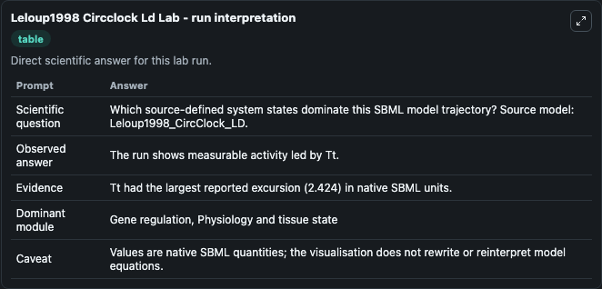
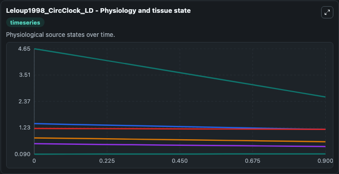
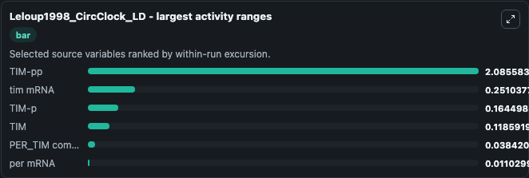
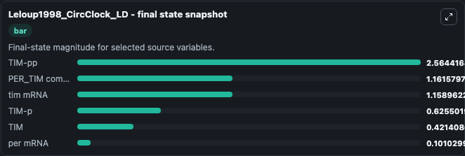
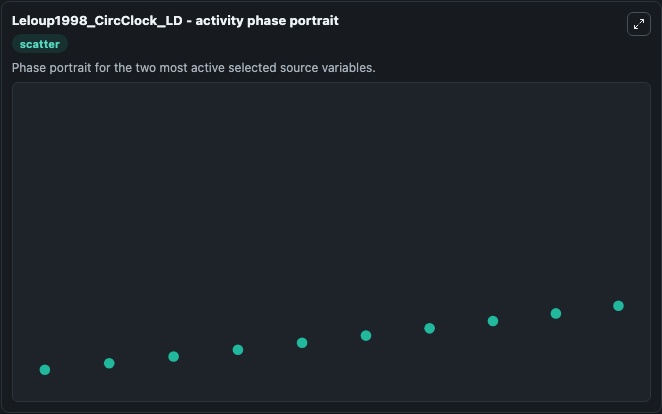

# Leloup1998 Circclock Ld

This Biosimulant lab wraps `Leloup1998 Circclock Ld` as a runnable systems biology model with a companion visualization module.
Leloup and Goldbeter, 1998 This model was created after the article by Leloup and Goldbeter, J Biol Rhythms 1998, Vol:13(1),pp70-87, pubmedID: 9486845 A Model for Circadian Rhythms in Drosophila Incor. It can be used to explore the configured dynamics and compare scenario outcomes across configurations.

## What You'll See

The lab asks: Which source-defined system states dominate this SBML model trajectory? Source model: Leloup1998_CircClock_LD. It runs for 1.0 time units with a communication step of 0.1. The run uses the model defaults declared by the curated SBML wrapper. The generated visualizations focus on tim mRNA, per mRNA, TIM-pp, PER_TIM complex nuclear, TIM-p, and TIM, combining trajectory, endpoint-comparison, and summary-table views from one completed dark-mode run.

In this captured run, **TIM-pp** moved from 4.650 to 2.564 across 1.0 simulation windows.


### Output Visualizations



*Summary table for Leloup1998 Circclock Ld, reporting the scientific question, observed answer, dominant module, and caveat.*



*Trajectories of TIM-pp, tim mRNA, TIM-p, TIM, PER_TIM complex nuclear, and per mRNA across the 1.0 simulation. In this run **per mRNA** climbed from 0.0900 to 0.1010 and **TIM-pp** fell from 4.650 to 2.564 — the largest movements among the focused observables.*



*Largest-excursion ranking of the focused observables — the absolute movement magnitude during the run. Top 3: **TIM-pp** = 2.086, **tim mRNA** = 0.2510, **TIM-p** = 0.1645, with 3 more observables below.*



*Endpoint snapshot of the focused observables — final values from the captured run. Top 3 by value: **TIM-pp** = 2.564, **PER_TIM complex nuclear** = 1.162, **tim mRNA** = 1.159, with 3 more observables below.*



*Visualization card from the Leloup1998 Circclock Ld dark-mode run.*


## Model Context

- Core model: `models/core`
- Visualization model: `models/visualisation`
- Standard: `other`
- Upstream source: `biomodels_ebi:BIOMD0000000171`
- License: `CC0`

## Inputs

| Input | Maps To | Default | Notes |
|---|---|---|---|
| Light Dark Period | `systemsbiology_sbml_leloup1998_circclock_ld_biomd0000000171_model.light_dark_period` | | Source parameter exposed because its SBML label indicates a boundary, stimulus, dose, ligand, protocol, substrate, or environmental control. Maps to SBML symbol `l_d`. |
| V D T Fold Incr During Light | `systemsbiology_sbml_leloup1998_circclock_ld_biomd0000000171_model.v_d_t_fold_incr_during_light` | | Source parameter exposed because its SBML label indicates a boundary, stimulus, dose, ligand, protocol, substrate, or environmental control. Maps to SBML symbol `v_dT_fac`. |

## Outputs

| Output | Maps To | Role |
|---|---|---|
| `state` | `systemsbiology_sbml_leloup1998_circclock_ld_biomd0000000171_model.state` | Available to the visualization model and downstream workflows. |
| `summary` | `systemsbiology_sbml_leloup1998_circclock_ld_biomd0000000171_model.summary` | Available to the visualization model and downstream workflows. |
| `species_labels` | `systemsbiology_sbml_leloup1998_circclock_ld_biomd0000000171_model.species_labels` | Available to the visualization model and downstream workflows. |
| `tim_mrna` | `systemsbiology_sbml_leloup1998_circclock_ld_biomd0000000171_model.tim_mrna` | Available to the visualization model and downstream workflows. |
| `per_mrna` | `systemsbiology_sbml_leloup1998_circclock_ld_biomd0000000171_model.per_mrna` | Available to the visualization model and downstream workflows. |
| `tim_pp` | `systemsbiology_sbml_leloup1998_circclock_ld_biomd0000000171_model.tim_pp` | Available to the visualization model and downstream workflows. |
| `per_tim_complex_nuclear` | `systemsbiology_sbml_leloup1998_circclock_ld_biomd0000000171_model.per_tim_complex_nuclear` | Available to the visualization model and downstream workflows. |
| `tim_p` | `systemsbiology_sbml_leloup1998_circclock_ld_biomd0000000171_model.tim_p` | Available to the visualization model and downstream workflows. |
| `tim` | `systemsbiology_sbml_leloup1998_circclock_ld_biomd0000000171_model.tim` | Available to the visualization model and downstream workflows. |

## Runtime

- Duration: `1.0`
- Communication step: `0.1`

## Running Locally

```bash
biosimulant labs serve
```
