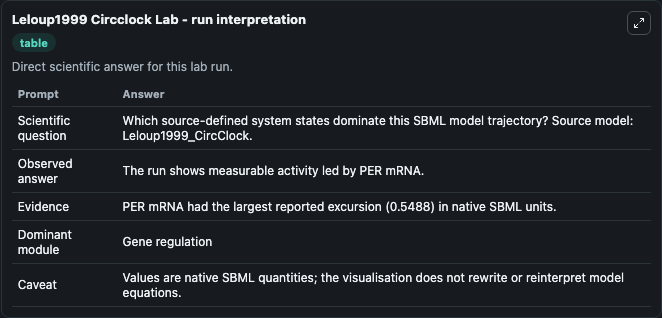
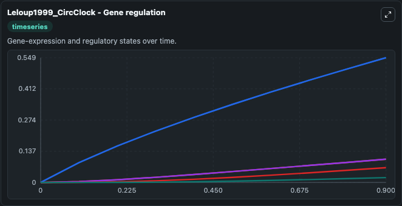
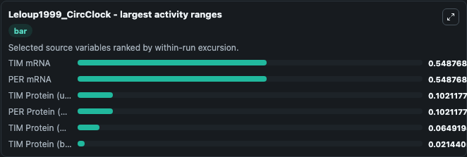
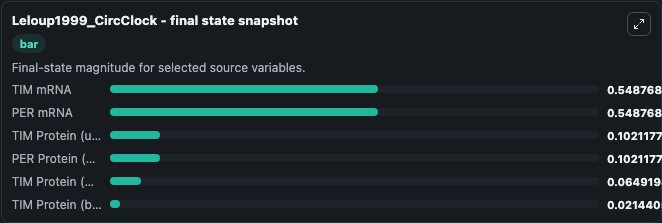
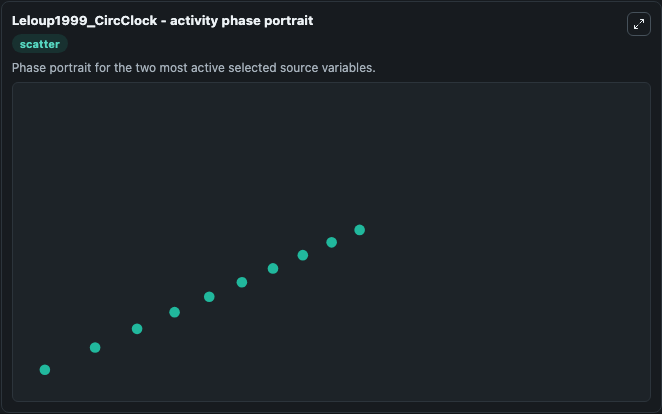

# Leloup1999 Circclock

This Biosimulant lab wraps `Leloup1999 Circclock` as a runnable systems biology model with a companion visualization module.
This model originates from BioModels Database: A Database of Annotated Published Models. It can be used to explore the configured dynamics and compare scenario outcomes across configurations.

## What You'll See

The lab asks: Which source-defined system states dominate this SBML model trajectory? Source model: Leloup1999_CircClock. It runs for 1.0 time units with a communication step of 0.1. The run uses the model defaults declared by the curated SBML wrapper. The generated visualizations focus on TIM mRNA, TIM Protein (unphosphorylated), TIM Protein (mono-phosphorylated), TIM Protein (bi-phosphorylated), PER mRNA, and PER Protein (unphosphorylated), combining trajectory, endpoint-comparison, and summary-table views from one completed dark-mode run.

In this captured run, **TIM mRNA** moved from 0 to 0.5488 across 1.0 simulation windows.


### Output Visualizations



*Summary table for Leloup1999 Circclock, reporting the scientific question, observed answer, dominant module, and caveat.*



*Trajectories of TIM mRNA, PER mRNA, TIM Protein (unphosphorylated), PER Protein (unphosphorylated), TIM Protein (mono-phosphorylated), and TIM Protein (bi-phosphorylated) across the 1.0 simulation. In this run **TIM mRNA** climbed from 0 to 0.5488 — the largest movements among the focused observables.*



*Largest-excursion ranking of the focused observables — the absolute movement magnitude during the run. Top 3: **TIM mRNA** = 0.5488, **PER mRNA** = 0.5488, **TIM Protein (unphosphorylated)** = 0.1021, with 3 more observables below.*



*Endpoint snapshot of the focused observables — final values from the captured run. Top 3 by value: **TIM mRNA** = 0.5488, **PER mRNA** = 0.5488, **TIM Protein (unphosphorylated)** = 0.1021, with 3 more observables below.*



*Visualization card from the Leloup1999 Circclock dark-mode run.*


## Model Context

- Core model: `models/core`
- Visualization model: `models/visualisation`
- Standard: `other`
- Upstream source: `biomodels_ebi:BIOMD0000000021`
- License: `CC0`

## Inputs

| Input | Maps To | Default | Notes |
|---|---|---|---|
| Initial Tim MRNA | `systemsbiology_sbml_leloup1999_circclock_biomd0000000021_model.initial_tim_mrna` | | Source state initial condition exposed as a model-specific control because no explicit intervention parameter is identifiable. Maps to SBML symbol `Mt`. |
| Initial Tim Protein Unphosphorylated | `systemsbiology_sbml_leloup1999_circclock_biomd0000000021_model.initial_tim_protein_unphosphorylated` | | Source state initial condition exposed as a model-specific control because no explicit intervention parameter is identifiable. Maps to SBML symbol `T0`. |
| Initial Tim Protein Mono Phosphorylated | `systemsbiology_sbml_leloup1999_circclock_biomd0000000021_model.initial_tim_protein_mono_phosphorylated` | | Source state initial condition exposed as a model-specific control because no explicit intervention parameter is identifiable. Maps to SBML symbol `T1`. |
| Initial Tim Protein Bi Phosphorylated | `systemsbiology_sbml_leloup1999_circclock_biomd0000000021_model.initial_tim_protein_bi_phosphorylated` | | Source state initial condition exposed as a model-specific control because no explicit intervention parameter is identifiable. Maps to SBML symbol `T2`. |
| Initial Per MRNA | `systemsbiology_sbml_leloup1999_circclock_biomd0000000021_model.initial_per_mrna` | | Source state initial condition exposed as a model-specific control because no explicit intervention parameter is identifiable. Maps to SBML symbol `Mp`. |
| Initial Per Protein Unphosphorylated | `systemsbiology_sbml_leloup1999_circclock_biomd0000000021_model.initial_per_protein_unphosphorylated` | | Source state initial condition exposed as a model-specific control because no explicit intervention parameter is identifiable. Maps to SBML symbol `P0`. |

## Outputs

| Output | Maps To | Role |
|---|---|---|
| `state` | `systemsbiology_sbml_leloup1999_circclock_biomd0000000021_model.state` | Available to the visualization model and downstream workflows. |
| `summary` | `systemsbiology_sbml_leloup1999_circclock_biomd0000000021_model.summary` | Available to the visualization model and downstream workflows. |
| `species_labels` | `systemsbiology_sbml_leloup1999_circclock_biomd0000000021_model.species_labels` | Available to the visualization model and downstream workflows. |
| `tim_mrna` | `systemsbiology_sbml_leloup1999_circclock_biomd0000000021_model.tim_mrna` | Available to the visualization model and downstream workflows. |
| `tim_protein_unphosphorylated` | `systemsbiology_sbml_leloup1999_circclock_biomd0000000021_model.tim_protein_unphosphorylated` | Available to the visualization model and downstream workflows. |
| `tim_protein_mono_phosphorylated` | `systemsbiology_sbml_leloup1999_circclock_biomd0000000021_model.tim_protein_mono_phosphorylated` | Available to the visualization model and downstream workflows. |
| `tim_protein_bi_phosphorylated` | `systemsbiology_sbml_leloup1999_circclock_biomd0000000021_model.tim_protein_bi_phosphorylated` | Available to the visualization model and downstream workflows. |
| `per_mrna` | `systemsbiology_sbml_leloup1999_circclock_biomd0000000021_model.per_mrna` | Available to the visualization model and downstream workflows. |
| `per_protein_unphosphorylated` | `systemsbiology_sbml_leloup1999_circclock_biomd0000000021_model.per_protein_unphosphorylated` | Available to the visualization model and downstream workflows. |

## Runtime

- Duration: `1.0`
- Communication step: `0.1`

## Running Locally

```bash
biosimulant labs serve
```
