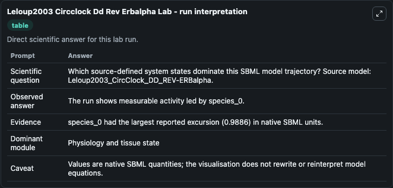
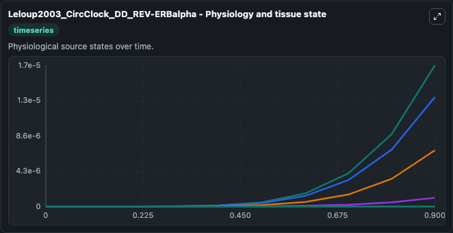
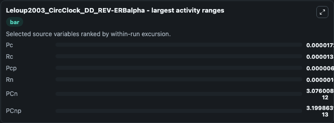
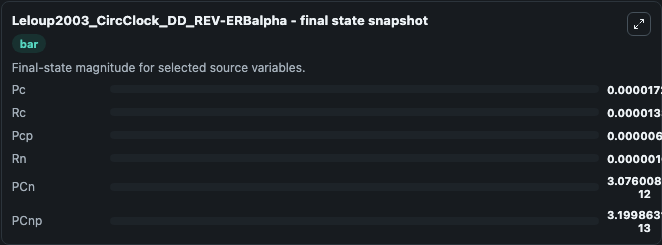
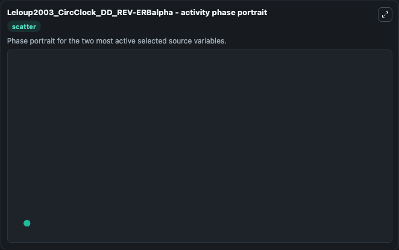

# Leloup2003 Circclock Dd Rev Erbalpha

This Biosimulant lab wraps `Leloup2003 Circclock Dd Rev Erbalpha` as a runnable systems biology model with a companion visualization module.
This is model in continous darkness (DD) described in the article Toward a detailed computational model for the mammalian circadian clock This model features the full interlocked negative and positive. It can be used to explore the configured dynamics and compare scenario outcomes across configurations.

## What You'll See

The lab asks: Which source-defined system states dominate this SBML model trajectory? Source model: Leloup2003_CircClock_DD_REV-ERBalpha. It runs for 1.0 time units with a communication step of 0.1. The run uses the model defaults declared by the curated SBML wrapper. The generated visualizations focus on Rn, Rc, Pcp, Pc, PCnp, and PCn, combining trajectory, endpoint-comparison, and summary-table views from one completed dark-mode run.

In this captured run, **Pc** moved from 0 to 1.73e-05 across 1.0 simulation windows.


### Output Visualizations



*Summary table for Leloup2003 Circclock Dd Rev Erbalpha, reporting the scientific question, observed answer, dominant module, and caveat.*



*Trajectories of Pc, Rc, Pcp, Rn, PCn, and PCnp across the 1.0 simulation. In this run **Pc** climbed from 0 to 1.73e-05 — the largest movements among the focused observables.*



*Largest-excursion ranking of the focused observables — the absolute movement magnitude during the run. Top 3: **Pc** = 1.73e-05, **Rc** = 1.34e-05, **Pcp** = 6.88e-06, with 3 more observables below.*



*Endpoint snapshot of the focused observables — final values from the captured run. Top 3 by value: **Pc** = 1.73e-05, **Rc** = 1.34e-05, **Pcp** = 6.88e-06, with 3 more observables below.*



*Visualization card from the Leloup2003 Circclock Dd Rev Erbalpha dark-mode run.*


## Model Context

- Core model: `models/core`
- Visualization model: `models/visualisation`
- Standard: `other`
- Upstream source: `biomodels_ebi:BIOMD0000000074`
- License: `CC0`

## Inputs

| Input | Maps To | Default | Notes |
|---|---|---|---|
| Initial Model State Rn | `systemsbiology_sbml_leloup2003_circclock_dd_rev_erbalpha_biomd0000000074_model.initial_model_state_rn` | | Source state initial condition exposed as a model-specific control because no explicit intervention parameter is identifiable. Maps to SBML symbol `species_18`. |
| Initial Model State Rc | `systemsbiology_sbml_leloup2003_circclock_dd_rev_erbalpha_biomd0000000074_model.initial_model_state_rc` | | Source state initial condition exposed as a model-specific control because no explicit intervention parameter is identifiable. Maps to SBML symbol `species_17`. |
| Initial Model State Pcp | `systemsbiology_sbml_leloup2003_circclock_dd_rev_erbalpha_biomd0000000074_model.initial_model_state_pcp` | | Source state initial condition exposed as a model-specific control because no explicit intervention parameter is identifiable. Maps to SBML symbol `species_9`. |
| Initial Model State Pc | `systemsbiology_sbml_leloup2003_circclock_dd_rev_erbalpha_biomd0000000074_model.initial_model_state_pc` | | Source state initial condition exposed as a model-specific control because no explicit intervention parameter is identifiable. Maps to SBML symbol `species_8`. |
| Initial P Cnp | `systemsbiology_sbml_leloup2003_circclock_dd_rev_erbalpha_biomd0000000074_model.initial_p_cnp` | | Source state initial condition exposed as a model-specific control because no explicit intervention parameter is identifiable. Maps to SBML symbol `species_14`. |
| Initial P Cn | `systemsbiology_sbml_leloup2003_circclock_dd_rev_erbalpha_biomd0000000074_model.initial_p_cn` | | Source state initial condition exposed as a model-specific control because no explicit intervention parameter is identifiable. Maps to SBML symbol `species_12`. |

## Outputs

| Output | Maps To | Role |
|---|---|---|
| `state` | `systemsbiology_sbml_leloup2003_circclock_dd_rev_erbalpha_biomd0000000074_model.state` | Available to the visualization model and downstream workflows. |
| `summary` | `systemsbiology_sbml_leloup2003_circclock_dd_rev_erbalpha_biomd0000000074_model.summary` | Available to the visualization model and downstream workflows. |
| `species_labels` | `systemsbiology_sbml_leloup2003_circclock_dd_rev_erbalpha_biomd0000000074_model.species_labels` | Available to the visualization model and downstream workflows. |
| `model_state_rn` | `systemsbiology_sbml_leloup2003_circclock_dd_rev_erbalpha_biomd0000000074_model.model_state_rn` | Available to the visualization model and downstream workflows. |
| `model_state_rc` | `systemsbiology_sbml_leloup2003_circclock_dd_rev_erbalpha_biomd0000000074_model.model_state_rc` | Available to the visualization model and downstream workflows. |
| `pcp` | `systemsbiology_sbml_leloup2003_circclock_dd_rev_erbalpha_biomd0000000074_model.pcp` | Available to the visualization model and downstream workflows. |
| `model_state_pc` | `systemsbiology_sbml_leloup2003_circclock_dd_rev_erbalpha_biomd0000000074_model.model_state_pc` | Available to the visualization model and downstream workflows. |
| `p_cnp` | `systemsbiology_sbml_leloup2003_circclock_dd_rev_erbalpha_biomd0000000074_model.p_cnp` | Available to the visualization model and downstream workflows. |
| `p_cn` | `systemsbiology_sbml_leloup2003_circclock_dd_rev_erbalpha_biomd0000000074_model.p_cn` | Available to the visualization model and downstream workflows. |

## Runtime

- Duration: `1.0`
- Communication step: `0.1`

## Running Locally

```bash
biosimulant labs serve
```
