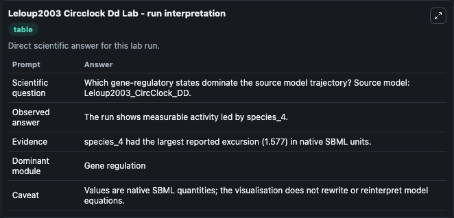
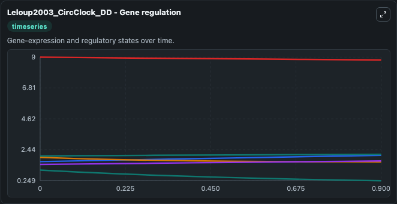
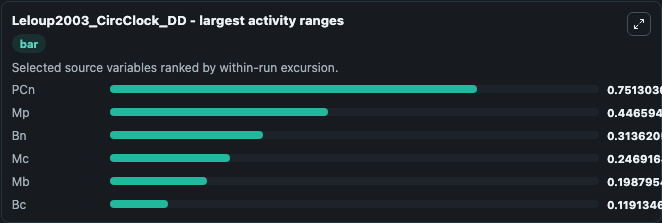
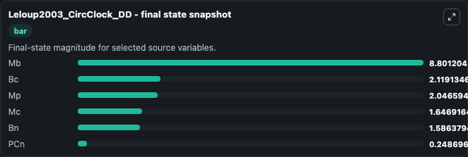
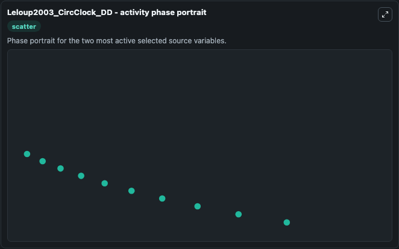

# Leloup2003 Circclock Dd

This Biosimulant lab wraps `Leloup2003 Circclock Dd` as a runnable systems biology model with a companion visualization module.
This model is according to the paper Toward a detailed computational model for the mammalian circadian clock. It can be used to explore the configured dynamics and compare scenario outcomes across configurations.

## What You'll See

The lab asks: Which gene-regulatory states dominate the source model trajectory? Source model: Leloup2003_CircClock_DD. It runs for 1.0 time units with a communication step of 0.1. The run uses the model defaults declared by the curated SBML wrapper. The generated visualizations focus on Mb, Bc, Bn, Mp, Mc, and PCn, combining trajectory, endpoint-comparison, and summary-table views from one completed dark-mode run.

In this captured run, **PCn** moved from 1.000 to 0.2487 across 1.0 simulation windows.


### Output Visualizations



*Summary table for Leloup2003 Circclock Dd, reporting the scientific question, observed answer, dominant module, and caveat.*



*Trajectories of PCn, Mp, Bn, Mc, Mb, and Bc across the 1.0 simulation. In this run **Mp** climbed from 1.600 to 2.047 and **PCn** fell from 1.000 to 0.2487 — the largest movements among the focused observables.*



*Largest-excursion ranking of the focused observables — the absolute movement magnitude during the run. Top 3: **PCn** = 0.7513, **Mp** = 0.4466, **Bn** = 0.3136, with 3 more observables below.*



*Endpoint snapshot of the focused observables — final values from the captured run. Top 3 by value: **Mb** = 8.801, **Bc** = 2.119, **Mp** = 2.047, with 3 more observables below.*



*Visualization card from the Leloup2003 Circclock Dd dark-mode run.*


## Model Context

- Core model: `models/core`
- Visualization model: `models/visualisation`
- Standard: `other`
- Upstream source: `biomodels_ebi:BIOMD0000000073`
- License: `CC0`

## Inputs

| Input | Maps To | Default | Notes |
|---|---|---|---|
| Initial Model State Mb | `systemsbiology_sbml_leloup2003_circclock_dd_biomd0000000073_model.initial_model_state_mb` | | Source state initial condition exposed as a model-specific control because no explicit intervention parameter is identifiable. Maps to SBML symbol `species_0`. |
| Initial Model State Bc | `systemsbiology_sbml_leloup2003_circclock_dd_biomd0000000073_model.initial_model_state_bc` | | Source state initial condition exposed as a model-specific control because no explicit intervention parameter is identifiable. Maps to SBML symbol `species_1`. |
| Initial Model State Bn | `systemsbiology_sbml_leloup2003_circclock_dd_biomd0000000073_model.initial_model_state_bn` | | Source state initial condition exposed as a model-specific control because no explicit intervention parameter is identifiable. Maps to SBML symbol `species_3`. |
| Initial Model State Mp | `systemsbiology_sbml_leloup2003_circclock_dd_biomd0000000073_model.initial_model_state_mp` | | Source state initial condition exposed as a model-specific control because no explicit intervention parameter is identifiable. Maps to SBML symbol `species_7`. |
| Initial Model State Mc | `systemsbiology_sbml_leloup2003_circclock_dd_biomd0000000073_model.initial_model_state_mc` | | Source state initial condition exposed as a model-specific control because no explicit intervention parameter is identifiable. Maps to SBML symbol `species_5`. |
| Initial P Cn | `systemsbiology_sbml_leloup2003_circclock_dd_biomd0000000073_model.initial_p_cn` | | Source state initial condition exposed as a model-specific control because no explicit intervention parameter is identifiable. Maps to SBML symbol `species_12`. |

## Outputs

| Output | Maps To | Role |
|---|---|---|
| `state` | `systemsbiology_sbml_leloup2003_circclock_dd_biomd0000000073_model.state` | Available to the visualization model and downstream workflows. |
| `summary` | `systemsbiology_sbml_leloup2003_circclock_dd_biomd0000000073_model.summary` | Available to the visualization model and downstream workflows. |
| `species_labels` | `systemsbiology_sbml_leloup2003_circclock_dd_biomd0000000073_model.species_labels` | Available to the visualization model and downstream workflows. |
| `model_state_mb` | `systemsbiology_sbml_leloup2003_circclock_dd_biomd0000000073_model.model_state_mb` | Available to the visualization model and downstream workflows. |
| `model_state_bc` | `systemsbiology_sbml_leloup2003_circclock_dd_biomd0000000073_model.model_state_bc` | Available to the visualization model and downstream workflows. |
| `model_state_bn` | `systemsbiology_sbml_leloup2003_circclock_dd_biomd0000000073_model.model_state_bn` | Available to the visualization model and downstream workflows. |
| `model_state_mp` | `systemsbiology_sbml_leloup2003_circclock_dd_biomd0000000073_model.model_state_mp` | Available to the visualization model and downstream workflows. |
| `model_state_mc` | `systemsbiology_sbml_leloup2003_circclock_dd_biomd0000000073_model.model_state_mc` | Available to the visualization model and downstream workflows. |
| `p_cn` | `systemsbiology_sbml_leloup2003_circclock_dd_biomd0000000073_model.p_cn` | Available to the visualization model and downstream workflows. |

## Runtime

- Duration: `1.0`
- Communication step: `0.1`

## Running Locally

```bash
biosimulant labs serve
```
