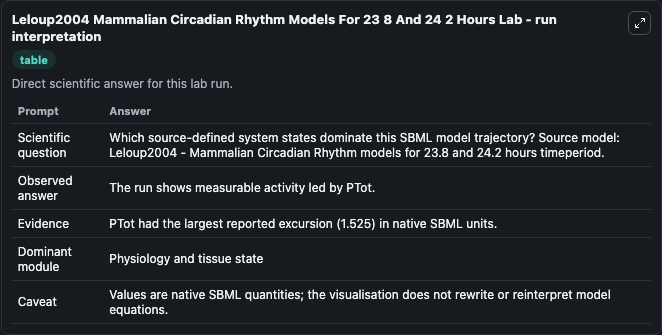
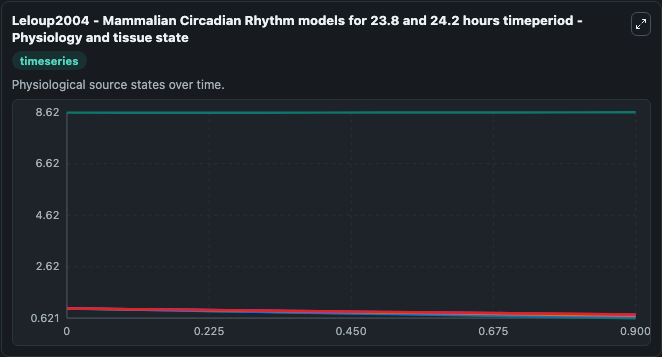
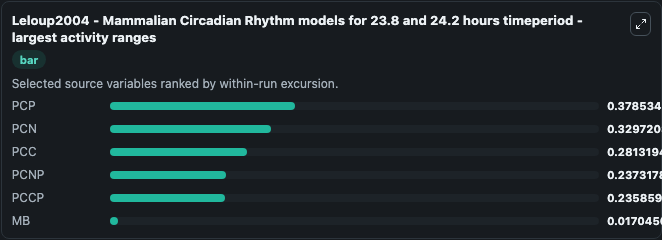
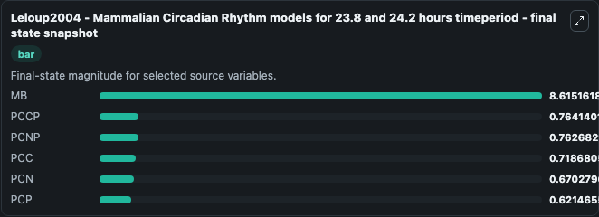
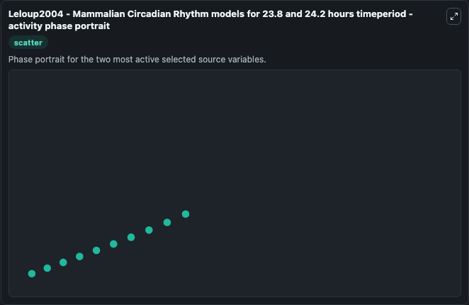

# Leloup2004 Mammalian Circadian Rhythm Models For 23 8 And 24 2 Hours

This Biosimulant lab wraps `Leloup2004 Mammalian Circadian Rhythm Models For 23 8 And 24 2 Hours` as a runnable systems biology model with a companion visualization module.
We extend the study of a computational model recently proposed for the mammalian circadian clock (Proc. It can be used to explore the configured dynamics and compare scenario outcomes across configurations.

## What You'll See

The lab asks: Which source-defined system states dominate this SBML model trajectory? Source model: Leloup2004 - Mammalian Circadian Rhythm models for 23.8 and 24.2 hours timeperiod. It runs for 1.0 time units with a communication step of 0.1. The run uses the model defaults declared by the curated SBML wrapper. The generated visualizations focus on MB, PCP, PCNP, PCN, PCCP, and PCC, combining trajectory, endpoint-comparison, and summary-table views from one completed dark-mode run.

In this captured run, **PCP** moved from 1.000 to 0.6215 across 1.0 simulation windows.


### Output Visualizations



*Summary table for Leloup2004 Mammalian Circadian Rhythm Models For 23 8 And 24 2 Hours, reporting the scientific question, observed answer, dominant module, and caveat.*



*Trajectories of PCP, PCN, PCC, PCNP, PCCP, and MB across the 1.0 simulation. In this run **MB** climbed from 8.600 to 8.615 and **PCP** fell from 1.000 to 0.6215 — the largest movements among the focused observables.*



*Largest-excursion ranking of the focused observables — the absolute movement magnitude during the run. Top 3: **PCP** = 0.3785, **PCN** = 0.3297, **PCC** = 0.2813, with 3 more observables below.*



*Endpoint snapshot of the focused observables — final values from the captured run. Top 3 by value: **MB** = 8.615, **PCCP** = 0.7641, **PCNP** = 0.7627, with 3 more observables below.*



*Visualization card from the Leloup2004 Mammalian Circadian Rhythm Models For 23 8 And 24 2 Hours dark-mode run.*


## Model Context

- Core model: `models/core`
- Visualization model: `models/visualisation`
- Standard: `other`
- Upstream source: `biomodels_ebi:BIOMD0000000975`
- License: `CC0`

## Inputs

| Input | Maps To | Default | Notes |
|---|---|---|---|
| Initial Model State Mb | `systemsbiology_sbml_leloup2004_mammalian_circadian_rhythm_models_for_biomd0000000975_model.initial_model_state_mb` | | Source state initial condition exposed as a model-specific control because no explicit intervention parameter is identifiable. Maps to SBML symbol `MB_0`. |
| Initial Model State Pcp | `systemsbiology_sbml_leloup2004_mammalian_circadian_rhythm_models_for_biomd0000000975_model.initial_model_state_pcp` | | Source state initial condition exposed as a model-specific control because no explicit intervention parameter is identifiable. Maps to SBML symbol `PCP_0`. |
| Initial Pcnp | `systemsbiology_sbml_leloup2004_mammalian_circadian_rhythm_models_for_biomd0000000975_model.initial_pcnp` | | Source state initial condition exposed as a model-specific control because no explicit intervention parameter is identifiable. Maps to SBML symbol `PCNP_0`. |
| Initial Model State Pcn | `systemsbiology_sbml_leloup2004_mammalian_circadian_rhythm_models_for_biomd0000000975_model.initial_model_state_pcn` | | Source state initial condition exposed as a model-specific control because no explicit intervention parameter is identifiable. Maps to SBML symbol `PCN_0`. |
| Initial Pccp | `systemsbiology_sbml_leloup2004_mammalian_circadian_rhythm_models_for_biomd0000000975_model.initial_pccp` | | Source state initial condition exposed as a model-specific control because no explicit intervention parameter is identifiable. Maps to SBML symbol `PCCP_0`. |
| Initial Model State Pcc | `systemsbiology_sbml_leloup2004_mammalian_circadian_rhythm_models_for_biomd0000000975_model.initial_model_state_pcc` | | Source state initial condition exposed as a model-specific control because no explicit intervention parameter is identifiable. Maps to SBML symbol `PCC_0`. |

## Outputs

| Output | Maps To | Role |
|---|---|---|
| `state` | `systemsbiology_sbml_leloup2004_mammalian_circadian_rhythm_models_for_biomd0000000975_model.state` | Available to the visualization model and downstream workflows. |
| `summary` | `systemsbiology_sbml_leloup2004_mammalian_circadian_rhythm_models_for_biomd0000000975_model.summary` | Available to the visualization model and downstream workflows. |
| `species_labels` | `systemsbiology_sbml_leloup2004_mammalian_circadian_rhythm_models_for_biomd0000000975_model.species_labels` | Available to the visualization model and downstream workflows. |
| `model_state_mb` | `systemsbiology_sbml_leloup2004_mammalian_circadian_rhythm_models_for_biomd0000000975_model.model_state_mb` | Available to the visualization model and downstream workflows. |
| `pcp` | `systemsbiology_sbml_leloup2004_mammalian_circadian_rhythm_models_for_biomd0000000975_model.pcp` | Available to the visualization model and downstream workflows. |
| `pcnp` | `systemsbiology_sbml_leloup2004_mammalian_circadian_rhythm_models_for_biomd0000000975_model.pcnp` | Available to the visualization model and downstream workflows. |
| `pcn` | `systemsbiology_sbml_leloup2004_mammalian_circadian_rhythm_models_for_biomd0000000975_model.pcn` | Available to the visualization model and downstream workflows. |
| `pccp` | `systemsbiology_sbml_leloup2004_mammalian_circadian_rhythm_models_for_biomd0000000975_model.pccp` | Available to the visualization model and downstream workflows. |
| `pcc` | `systemsbiology_sbml_leloup2004_mammalian_circadian_rhythm_models_for_biomd0000000975_model.pcc` | Available to the visualization model and downstream workflows. |

## Runtime

- Duration: `1.0`
- Communication step: `0.1`

## Running Locally

```bash
biosimulant labs serve
```
