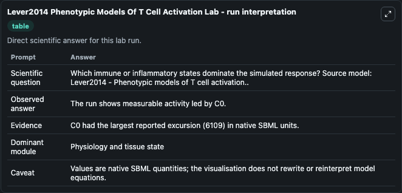
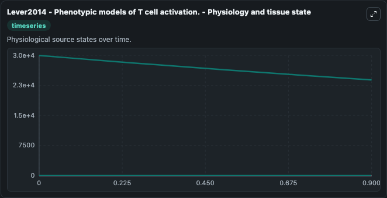
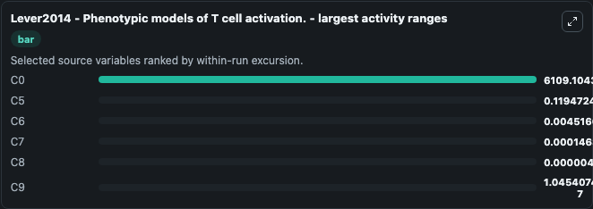
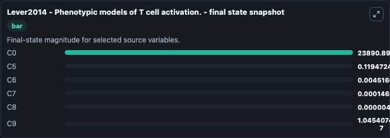
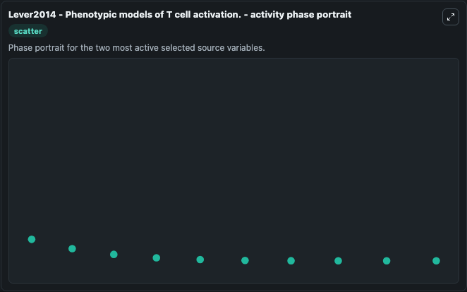

# Lever2014 Phenotypic Models Of T Cell Activation

This Biosimulant lab wraps `Lever2014 Phenotypic Models Of T Cell Activation` as a runnable systems biology model with a companion visualization module.
This is a phenotypic model of a kinetic proofreading mechanism used to describe dynamics governing interactions between T cell receptors and peptide-MHC complexes. It can be used to explore the configured dynamics and compare scenario outcomes across configurations.

## What You'll See

The lab asks: Which immune or inflammatory states dominate the simulated response? Source model: Lever2014 - Phenotypic models of T cell activation.. It runs for 1.0 time units with a communication step of 0.1. The run uses the model defaults declared by the curated SBML wrapper. The generated visualizations focus on C0, C9, C8, C7, C6, and C5, combining trajectory, endpoint-comparison, and summary-table views from one completed dark-mode run.

In this captured run, **C0** moved from 3e+04 to 2.39e+04 across 1.0 simulation windows.


### Output Visualizations



*Summary table for Lever2014 Phenotypic Models Of T Cell Activation, reporting the scientific question, observed answer, dominant module, and caveat.*



*Trajectories of C0, C5, C6, C7, C8, and C9 across the 1.0 simulation. In this run **C5** climbed from 0 to 0.1195 and **C0** fell from 3e+04 to 2.39e+04 — the largest movements among the focused observables.*



*Largest-excursion ranking of the focused observables — the absolute movement magnitude during the run. Top 3: **C0** = 6109.1, **C5** = 0.1195, **C6** = 0.00452, with 3 more observables below.*



*Endpoint snapshot of the focused observables — final values from the captured run. Top 3 by value: **C0** = 2.39e+04, **C5** = 0.1195, **C6** = 0.00452, with 3 more observables below.*



*Visualization card from the Lever2014 Phenotypic Models Of T Cell Activation dark-mode run.*


## Model Context

- Core model: `models/core`
- Visualization model: `models/visualisation`
- Standard: `other`
- Upstream source: `biomodels_ebi:MODEL1907260003`
- License: `CC0`

## Inputs

| Input | Maps To | Default | Notes |
|---|---|---|---|
| Initial Model State C0 | `systemsbiology_sbml_lever2014_phenotypic_models_of_t_cell_activation_model1907260003_model.initial_model_state_c0` | | Source state initial condition exposed as a model-specific control because no explicit intervention parameter is identifiable. Maps to SBML symbol `C0`. |
| Initial Model State C9 | `systemsbiology_sbml_lever2014_phenotypic_models_of_t_cell_activation_model1907260003_model.initial_model_state_c9` | | Source state initial condition exposed as a model-specific control because no explicit intervention parameter is identifiable. Maps to SBML symbol `C9`. |
| Initial Model State C8 | `systemsbiology_sbml_lever2014_phenotypic_models_of_t_cell_activation_model1907260003_model.initial_model_state_c8` | | Source state initial condition exposed as a model-specific control because no explicit intervention parameter is identifiable. Maps to SBML symbol `C8`. |
| Initial Model State C7 | `systemsbiology_sbml_lever2014_phenotypic_models_of_t_cell_activation_model1907260003_model.initial_model_state_c7` | | Source state initial condition exposed as a model-specific control because no explicit intervention parameter is identifiable. Maps to SBML symbol `C7`. |
| Initial Model State C6 | `systemsbiology_sbml_lever2014_phenotypic_models_of_t_cell_activation_model1907260003_model.initial_model_state_c6` | | Source state initial condition exposed as a model-specific control because no explicit intervention parameter is identifiable. Maps to SBML symbol `C6`. |
| Initial Model State C5 | `systemsbiology_sbml_lever2014_phenotypic_models_of_t_cell_activation_model1907260003_model.initial_model_state_c5` | | Source state initial condition exposed as a model-specific control because no explicit intervention parameter is identifiable. Maps to SBML symbol `C5`. |

## Outputs

| Output | Maps To | Role |
|---|---|---|
| `state` | `systemsbiology_sbml_lever2014_phenotypic_models_of_t_cell_activation_model1907260003_model.state` | Available to the visualization model and downstream workflows. |
| `summary` | `systemsbiology_sbml_lever2014_phenotypic_models_of_t_cell_activation_model1907260003_model.summary` | Available to the visualization model and downstream workflows. |
| `species_labels` | `systemsbiology_sbml_lever2014_phenotypic_models_of_t_cell_activation_model1907260003_model.species_labels` | Available to the visualization model and downstream workflows. |
| `model_state_c0` | `systemsbiology_sbml_lever2014_phenotypic_models_of_t_cell_activation_model1907260003_model.model_state_c0` | Available to the visualization model and downstream workflows. |
| `model_state_c9` | `systemsbiology_sbml_lever2014_phenotypic_models_of_t_cell_activation_model1907260003_model.model_state_c9` | Available to the visualization model and downstream workflows. |
| `model_state_c8` | `systemsbiology_sbml_lever2014_phenotypic_models_of_t_cell_activation_model1907260003_model.model_state_c8` | Available to the visualization model and downstream workflows. |
| `model_state_c7` | `systemsbiology_sbml_lever2014_phenotypic_models_of_t_cell_activation_model1907260003_model.model_state_c7` | Available to the visualization model and downstream workflows. |
| `model_state_c6` | `systemsbiology_sbml_lever2014_phenotypic_models_of_t_cell_activation_model1907260003_model.model_state_c6` | Available to the visualization model and downstream workflows. |
| `model_state_c5` | `systemsbiology_sbml_lever2014_phenotypic_models_of_t_cell_activation_model1907260003_model.model_state_c5` | Available to the visualization model and downstream workflows. |

## Runtime

- Duration: `1.0`
- Communication step: `0.1`

## Running Locally

```bash
biosimulant labs serve
```
