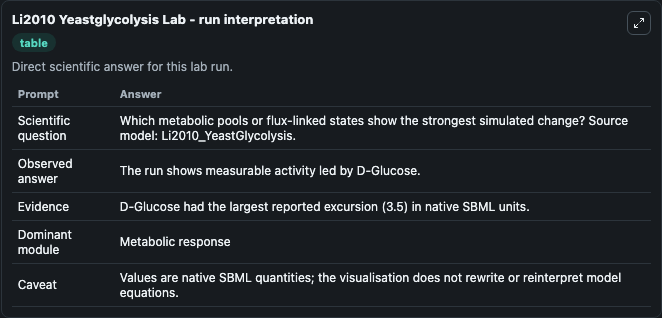
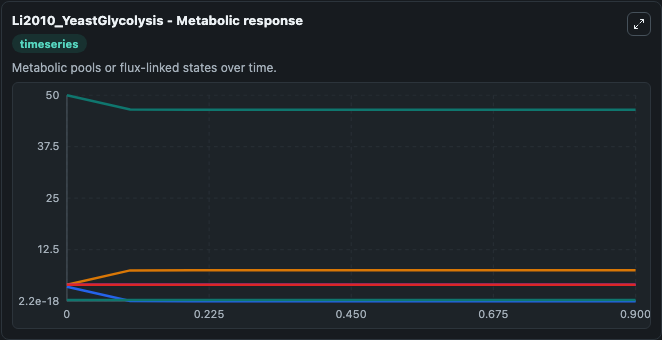
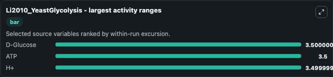
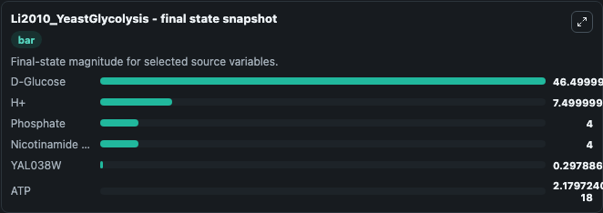
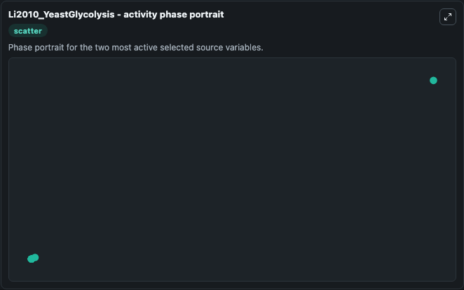

# Li2010 Yeastglycolysis

This Biosimulant lab wraps `Li2010 Yeastglycolysis` as a runnable systems biology model with a companion visualization module.
This model originates from BioModels Database: A Database of Annotated Published Models (http://www.ebi.ac.uk/biomodels/). It can be used to explore the configured dynamics and compare scenario outcomes across configurations.

## What You'll See

The lab asks: Which metabolic pools or flux-linked states show the strongest simulated change? Source model: Li2010_YeastGlycolysis. It runs for 1.0 time units with a communication step of 0.1. The run uses the model defaults declared by the curated SBML wrapper. The generated visualizations focus on D-Glucose, Phosphate, Nicotinamide adenine dinucleotide, H+, ATP, and YAL038W, combining trajectory, endpoint-comparison, and summary-table views from one completed dark-mode run.

In this captured run, **D-Glucose** moved from 50.000 to 46.500 across 1.0 simulation windows.


### Output Visualizations



*Summary table for Li2010 Yeastglycolysis, reporting the scientific question, observed answer, dominant module, and caveat.*



*Trajectories of D-Glucose, ATP, H+, Phosphate, Nicotinamide adenine dinucleotide, and YAL038W across the 1.0 simulation. In this run **H+** climbed from 4.000 to 7.500 and **D-Glucose** fell from 50.000 to 46.500 — the largest movements among the focused observables.*



*Largest-excursion ranking of the focused observables — the absolute movement magnitude during the run. Top 3: **D-Glucose** = 3.500, **ATP** = 3.500, **H+** = 3.500.*



*Endpoint snapshot of the focused observables — final values from the captured run. Top 3 by value: **D-Glucose** = 46.500, **H+** = 7.500, **Phosphate** = 4.000, with 3 more observables below.*



*Visualization card from the Li2010 Yeastglycolysis dark-mode run.*


## Model Context

- Core model: `models/core`
- Visualization model: `models/visualisation`
- Standard: `other`
- Upstream source: `biomodels_ebi:MODEL1012110001`
- License: `CC0`

## Inputs

| Input | Maps To | Default | Notes |
|---|---|---|---|
| Initial D Glucose | `systemsbiology_sbml_li2010_yeastglycolysis_model1012110001_model.initial_d_glucose` | | Source state initial condition exposed as a model-specific control because no explicit intervention parameter is identifiable. Maps to SBML symbol `M_304`. |
| Initial Phosphate | `systemsbiology_sbml_li2010_yeastglycolysis_model1012110001_model.initial_phosphate` | | Source state initial condition exposed as a model-specific control because no explicit intervention parameter is identifiable. Maps to SBML symbol `M_454`. |
| Initial Nicotinamide Adenine Dinucleotide | `systemsbiology_sbml_li2010_yeastglycolysis_model1012110001_model.initial_nicotinamide_adenine_dinucleotide` | | Source state initial condition exposed as a model-specific control because no explicit intervention parameter is identifiable. Maps to SBML symbol `M_411`. |
| Initial Model State H | `systemsbiology_sbml_li2010_yeastglycolysis_model1012110001_model.initial_model_state_h` | | Source state initial condition exposed as a model-specific control because no explicit intervention parameter is identifiable. Maps to SBML symbol `M_329`. |
| Initial Model State ATP | `systemsbiology_sbml_li2010_yeastglycolysis_model1012110001_model.initial_model_state_atp` | | Source state initial condition exposed as a model-specific control because no explicit intervention parameter is identifiable. Maps to SBML symbol `M_172`. |
| Initial Yal038 W | `systemsbiology_sbml_li2010_yeastglycolysis_model1012110001_model.initial_yal038_w` | | Source state initial condition exposed as a model-specific control because no explicit intervention parameter is identifiable. Maps to SBML symbol `E_726`. |

## Outputs

| Output | Maps To | Role |
|---|---|---|
| `state` | `systemsbiology_sbml_li2010_yeastglycolysis_model1012110001_model.state` | Available to the visualization model and downstream workflows. |
| `summary` | `systemsbiology_sbml_li2010_yeastglycolysis_model1012110001_model.summary` | Available to the visualization model and downstream workflows. |
| `species_labels` | `systemsbiology_sbml_li2010_yeastglycolysis_model1012110001_model.species_labels` | Available to the visualization model and downstream workflows. |
| `d_glucose` | `systemsbiology_sbml_li2010_yeastglycolysis_model1012110001_model.d_glucose` | Available to the visualization model and downstream workflows. |
| `phosphate` | `systemsbiology_sbml_li2010_yeastglycolysis_model1012110001_model.phosphate` | Available to the visualization model and downstream workflows. |
| `nicotinamide_adenine_dinucleotide` | `systemsbiology_sbml_li2010_yeastglycolysis_model1012110001_model.nicotinamide_adenine_dinucleotide` | Available to the visualization model and downstream workflows. |
| `model_state_h` | `systemsbiology_sbml_li2010_yeastglycolysis_model1012110001_model.model_state_h` | Available to the visualization model and downstream workflows. |
| `atp` | `systemsbiology_sbml_li2010_yeastglycolysis_model1012110001_model.atp` | Available to the visualization model and downstream workflows. |
| `yal038_w` | `systemsbiology_sbml_li2010_yeastglycolysis_model1012110001_model.yal038_w` | Available to the visualization model and downstream workflows. |

## Runtime

- Duration: `1.0`
- Communication step: `0.1`

## Running Locally

```bash
biosimulant labs serve
```
