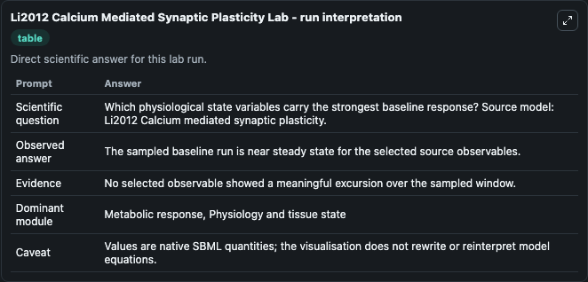
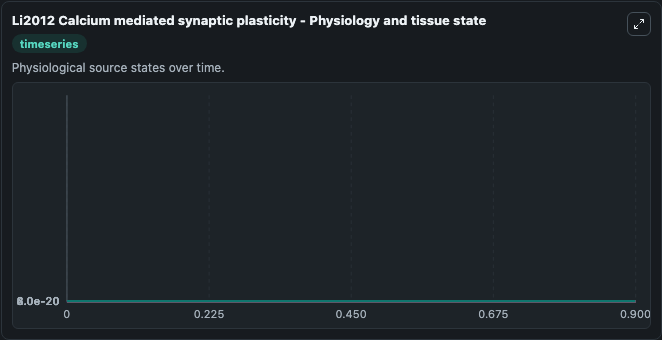
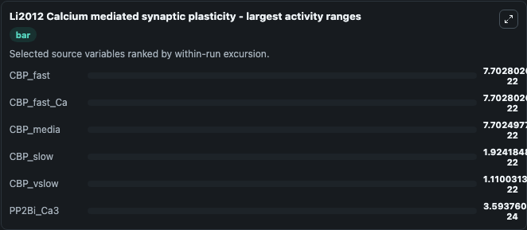
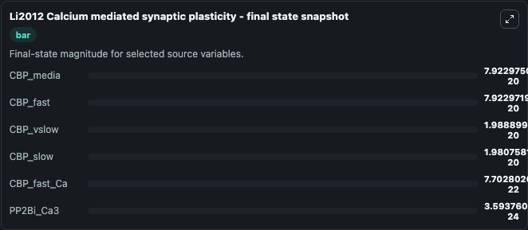
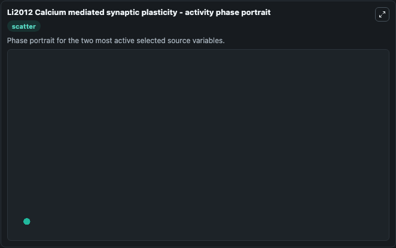

# Li2012 Calcium Mediated Synaptic Plasticity

This Biosimulant lab wraps `Li2012 Calcium Mediated Synaptic Plasticity` as a runnable systems biology model with a companion visualization module.
Li2012 Calcium mediated synapticplasticity This model is an extension of BIOMD0000000183. It can be used to explore the configured dynamics and compare scenario outcomes across configurations.

## What You'll See

The lab asks: Which physiological state variables carry the strongest baseline response? Source model: Li2012 Calcium mediated synaptic plasticity. It runs for 1.0 time units with a communication step of 0.1. The run uses the model defaults declared by the curated SBML wrapper. The generated visualizations focus on CBP_fast_Ca, CBP_media, CBP_fast, CBP_vslow, CBP_slow, and PP2Bi_Ca3, combining trajectory, endpoint-comparison, and summary-table views from one completed dark-mode run.

In this captured run, **CBP_fast** moved from 8e-20 to 7.92e-20 across 1.0 simulation windows.


### Output Visualizations



*Summary table for Li2012 Calcium Mediated Synaptic Plasticity, reporting the scientific question, observed answer, dominant module, and caveat.*



*Trajectories of CBP_fast, CBP_fast_Ca, CBP_media, CBP_slow, CBP_vslow, and PP2Bi_Ca3 across the 1.0 simulation. In this run **CBP_fast_Ca** climbed from 0 to 7.7e-22 and **CBP_fast** fell from 8e-20 to 7.92e-20 — the largest movements among the focused observables.*



*Largest-excursion ranking of the focused observables — the absolute movement magnitude during the run. Top 3: **CBP_fast** = 7.7e-22, **CBP_fast_Ca** = 7.7e-22, **CBP_media** = 7.7e-22, with 3 more observables below.*



*Endpoint snapshot of the focused observables — final values from the captured run. Top 3 by value: **CBP_media** = 7.92e-20, **CBP_fast** = 7.92e-20, **CBP_vslow** = 1.99e-20, with 3 more observables below.*



*Visualization card from the Li2012 Calcium Mediated Synaptic Plasticity dark-mode run.*


## Model Context

- Core model: `models/core`
- Visualization model: `models/visualisation`
- Standard: `other`
- Upstream source: `biomodels_ebi:BIOMD0000000628`
- License: `CC0`

## Inputs

| Input | Maps To | Default | Notes |
|---|---|---|---|
| Initial Cbp Fast Ca | `systemsbiology_sbml_li2012_calcium_mediated_synaptic_plasticity_biomd0000000628_model.initial_cbp_fast_ca` | | Source state initial condition exposed as a model-specific control because no explicit intervention parameter is identifiable. Maps to SBML symbol `CBPfastCa`. |
| Initial Cbp Media | `systemsbiology_sbml_li2012_calcium_mediated_synaptic_plasticity_biomd0000000628_model.initial_cbp_media` | | Source state initial condition exposed as a model-specific control because no explicit intervention parameter is identifiable. Maps to SBML symbol `CBPmedia`. |
| Initial Cbp Fast | `systemsbiology_sbml_li2012_calcium_mediated_synaptic_plasticity_biomd0000000628_model.initial_cbp_fast` | | Source state initial condition exposed as a model-specific control because no explicit intervention parameter is identifiable. Maps to SBML symbol `CBPfast`. |
| Initial Cbp Vslow | `systemsbiology_sbml_li2012_calcium_mediated_synaptic_plasticity_biomd0000000628_model.initial_cbp_vslow` | | Source state initial condition exposed as a model-specific control because no explicit intervention parameter is identifiable. Maps to SBML symbol `CBPvslow`. |
| Initial Cbp Slow | `systemsbiology_sbml_li2012_calcium_mediated_synaptic_plasticity_biomd0000000628_model.initial_cbp_slow` | | Source state initial condition exposed as a model-specific control because no explicit intervention parameter is identifiable. Maps to SBML symbol `CBPslow`. |
| Initial PP2 Bi CA3 | `systemsbiology_sbml_li2012_calcium_mediated_synaptic_plasticity_biomd0000000628_model.initial_pp2_bi_ca3` | | Source state initial condition exposed as a model-specific control because no explicit intervention parameter is identifiable. Maps to SBML symbol `PP2Bi_Ca3`. |

## Outputs

| Output | Maps To | Role |
|---|---|---|
| `state` | `systemsbiology_sbml_li2012_calcium_mediated_synaptic_plasticity_biomd0000000628_model.state` | Available to the visualization model and downstream workflows. |
| `summary` | `systemsbiology_sbml_li2012_calcium_mediated_synaptic_plasticity_biomd0000000628_model.summary` | Available to the visualization model and downstream workflows. |
| `species_labels` | `systemsbiology_sbml_li2012_calcium_mediated_synaptic_plasticity_biomd0000000628_model.species_labels` | Available to the visualization model and downstream workflows. |
| `cbp_fast_ca` | `systemsbiology_sbml_li2012_calcium_mediated_synaptic_plasticity_biomd0000000628_model.cbp_fast_ca` | Available to the visualization model and downstream workflows. |
| `cbp_media` | `systemsbiology_sbml_li2012_calcium_mediated_synaptic_plasticity_biomd0000000628_model.cbp_media` | Available to the visualization model and downstream workflows. |
| `cbp_fast` | `systemsbiology_sbml_li2012_calcium_mediated_synaptic_plasticity_biomd0000000628_model.cbp_fast` | Available to the visualization model and downstream workflows. |
| `cbp_vslow` | `systemsbiology_sbml_li2012_calcium_mediated_synaptic_plasticity_biomd0000000628_model.cbp_vslow` | Available to the visualization model and downstream workflows. |
| `cbp_slow` | `systemsbiology_sbml_li2012_calcium_mediated_synaptic_plasticity_biomd0000000628_model.cbp_slow` | Available to the visualization model and downstream workflows. |
| `pp2_bi_ca3` | `systemsbiology_sbml_li2012_calcium_mediated_synaptic_plasticity_biomd0000000628_model.pp2_bi_ca3` | Available to the visualization model and downstream workflows. |

## Runtime

- Duration: `1.0`
- Communication step: `0.1`

## Running Locally

```bash
biosimulant labs serve
```
