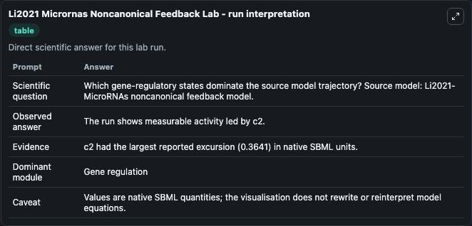
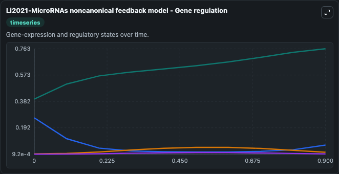
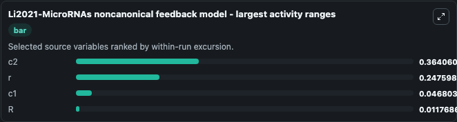
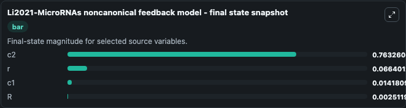
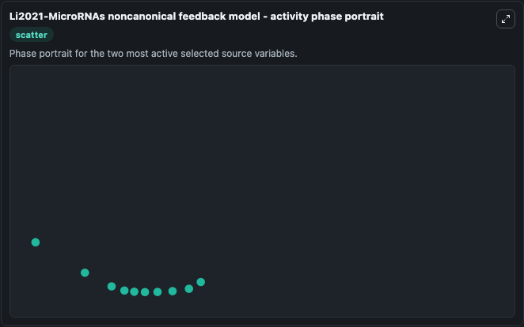

# Li2021 Micrornas Noncanonical Feedback

This Biosimulant lab wraps `Li2021 Micrornas Noncanonical Feedback` as a runnable systems biology model with a companion visualization module.
(I am not the first author of the paper who contributed to the experimental data, I did the modeling)Bistable switches and oscillators have long been considered key mechanisms underlying cell fate dec. It can be used to explore the configured dynamics and compare scenario outcomes across configurations.

## What You'll See

The lab asks: Which gene-regulatory states dominate the source model trajectory? Source model: Li2021-MicroRNAs noncanonical feedback model. It runs for 1.0 time units with a communication step of 0.1. The run uses the model defaults declared by the curated SBML wrapper. The generated visualizations focus on c2, c1, r, and R, combining trajectory, endpoint-comparison, and summary-table views from one completed dark-mode run.

In this captured run, **c2** moved from 0.3992 to 0.7633 across 1.0 simulation windows.


### Output Visualizations



*Summary table for Li2021 Micrornas Noncanonical Feedback, reporting the scientific question, observed answer, dominant module, and caveat.*



*Trajectories of c2, r, c1, and R across the 1.0 simulation. In this run **c2** climbed from 0.3992 to 0.7633 and **r** fell from 0.2637 to 0.0664 — the largest movements among the focused observables.*



*Largest-excursion ranking of the focused observables — the absolute movement magnitude during the run. Top 3: **c2** = 0.3641, **r** = 0.2476, **c1** = 0.0468, with 1 more observable below.*



*Endpoint snapshot of the focused observables — final values from the captured run. Top 3 by value: **c2** = 0.7633, **r** = 0.0664, **c1** = 0.0142, with 1 more observable below.*



*Visualization card from the Li2021 Micrornas Noncanonical Feedback dark-mode run.*


## Model Context

- Core model: `models/core`
- Visualization model: `models/visualisation`
- Standard: `other`
- Upstream source: `biomodels_ebi:MODEL2301180001`
- License: `CC0`

## Inputs

| Input | Maps To | Default | Notes |
|---|---|---|---|
| Initial Model State C2 | `systemsbiology_sbml_li2021_micrornas_noncanonical_feedback_model_model2301180001_model.initial_model_state_c2` | | Source state initial condition exposed as a model-specific control because no explicit intervention parameter is identifiable. Maps to SBML symbol `c2`. |
| Initial Model State C1 | `systemsbiology_sbml_li2021_micrornas_noncanonical_feedback_model_model2301180001_model.initial_model_state_c1` | | Source state initial condition exposed as a model-specific control because no explicit intervention parameter is identifiable. Maps to SBML symbol `c1`. |
| Initial Model State R | `systemsbiology_sbml_li2021_micrornas_noncanonical_feedback_model_model2301180001_model.initial_model_state_r` | | Source state initial condition exposed as a model-specific control because no explicit intervention parameter is identifiable. Maps to SBML symbol `r`. |
| Initial Model State R 2 | `systemsbiology_sbml_li2021_micrornas_noncanonical_feedback_model_model2301180001_model.initial_model_state_r_2` | | Source state initial condition exposed as a model-specific control because no explicit intervention parameter is identifiable. Maps to SBML symbol `R`. |

## Outputs

| Output | Maps To | Role |
|---|---|---|
| `state` | `systemsbiology_sbml_li2021_micrornas_noncanonical_feedback_model_model2301180001_model.state` | Available to the visualization model and downstream workflows. |
| `summary` | `systemsbiology_sbml_li2021_micrornas_noncanonical_feedback_model_model2301180001_model.summary` | Available to the visualization model and downstream workflows. |
| `species_labels` | `systemsbiology_sbml_li2021_micrornas_noncanonical_feedback_model_model2301180001_model.species_labels` | Available to the visualization model and downstream workflows. |
| `model_state_c2` | `systemsbiology_sbml_li2021_micrornas_noncanonical_feedback_model_model2301180001_model.model_state_c2` | Available to the visualization model and downstream workflows. |
| `model_state_c1` | `systemsbiology_sbml_li2021_micrornas_noncanonical_feedback_model_model2301180001_model.model_state_c1` | Available to the visualization model and downstream workflows. |
| `model_state_r` | `systemsbiology_sbml_li2021_micrornas_noncanonical_feedback_model_model2301180001_model.model_state_r` | Available to the visualization model and downstream workflows. |
| `model_state_r_2` | `systemsbiology_sbml_li2021_micrornas_noncanonical_feedback_model_model2301180001_model.model_state_r_2` | Available to the visualization model and downstream workflows. |

## Runtime

- Duration: `1.0`
- Communication step: `0.1`

## Running Locally

```bash
biosimulant labs serve
```
