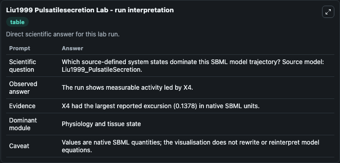
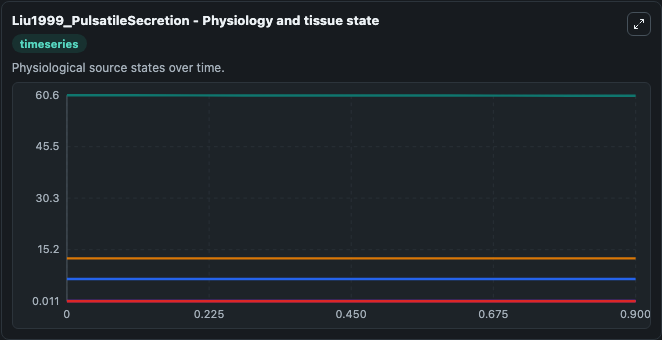
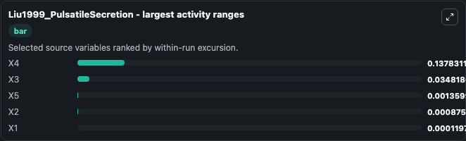
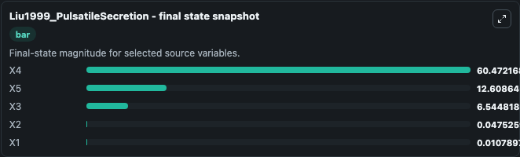
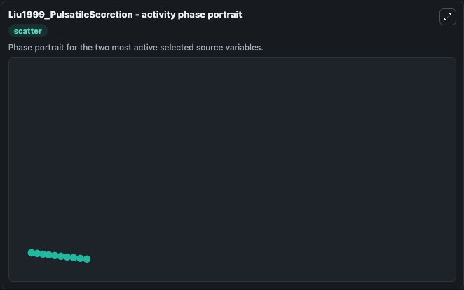

# Liu1999 Pulsatilesecretion

This Biosimulant lab wraps `Liu1999 Pulsatilesecretion` as a runnable systems biology model with a companion visualization module.
This a model from the article: A dynamical model for the pubsatile secretion of the hypothalamo-pituitary-adrenal axis. It can be used to explore the configured dynamics and compare scenario outcomes across configurations.

## What You'll See

The lab asks: Which source-defined system states dominate this SBML model trajectory? Source model: Liu1999_PulsatileSecretion. It runs for 1.0 time units with a communication step of 0.1. The run uses the model defaults declared by the curated SBML wrapper. The generated visualizations focus on X5, X4, X3, X2, and X1, combining trajectory, endpoint-comparison, and summary-table views from one completed dark-mode run.

In this captured run, **X4** moved from 60.610 to 60.472 across 1.0 simulation windows.


### Output Visualizations



*Summary table for Liu1999 Pulsatilesecretion, reporting the scientific question, observed answer, dominant module, and caveat.*



*Trajectories of X4, X3, X5, X2, and X1 across the 1.0 simulation. In this run **X3** climbed from 6.510 to 6.545 and **X4** fell from 60.610 to 60.472 — the largest movements among the focused observables.*



*Largest-excursion ranking of the focused observables — the absolute movement magnitude during the run. Top 3: **X4** = 0.1378, **X3** = 0.0348, **X5** = 0.00136, with 2 more observables below.*



*Endpoint snapshot of the focused observables — final values from the captured run. Top 3 by value: **X4** = 60.472, **X5** = 12.609, **X3** = 6.545, with 2 more observables below.*



*Visualization card from the Liu1999 Pulsatilesecretion dark-mode run.*


## Model Context

- Core model: `models/core`
- Visualization model: `models/visualisation`
- Standard: `other`
- Upstream source: `biomodels_ebi:MODEL1006230060`
- License: `CC0`

## Inputs

| Input | Maps To | Default | Notes |
|---|---|---|---|
| Initial Model State X5 | `systemsbiology_sbml_liu1999_pulsatilesecretion_model1006230060_model.initial_model_state_x5` | | Source state initial condition exposed as a model-specific control because no explicit intervention parameter is identifiable. Maps to SBML symbol `x5`. |
| Initial Model State X4 | `systemsbiology_sbml_liu1999_pulsatilesecretion_model1006230060_model.initial_model_state_x4` | | Source state initial condition exposed as a model-specific control because no explicit intervention parameter is identifiable. Maps to SBML symbol `x4`. |
| Initial Model State X3 | `systemsbiology_sbml_liu1999_pulsatilesecretion_model1006230060_model.initial_model_state_x3` | | Source state initial condition exposed as a model-specific control because no explicit intervention parameter is identifiable. Maps to SBML symbol `x3`. |
| Initial Model State X2 | `systemsbiology_sbml_liu1999_pulsatilesecretion_model1006230060_model.initial_model_state_x2` | | Source state initial condition exposed as a model-specific control because no explicit intervention parameter is identifiable. Maps to SBML symbol `x2`. |
| Initial Model State X1 | `systemsbiology_sbml_liu1999_pulsatilesecretion_model1006230060_model.initial_model_state_x1` | | Source state initial condition exposed as a model-specific control because no explicit intervention parameter is identifiable. Maps to SBML symbol `x1`. |

## Outputs

| Output | Maps To | Role |
|---|---|---|
| `state` | `systemsbiology_sbml_liu1999_pulsatilesecretion_model1006230060_model.state` | Available to the visualization model and downstream workflows. |
| `summary` | `systemsbiology_sbml_liu1999_pulsatilesecretion_model1006230060_model.summary` | Available to the visualization model and downstream workflows. |
| `species_labels` | `systemsbiology_sbml_liu1999_pulsatilesecretion_model1006230060_model.species_labels` | Available to the visualization model and downstream workflows. |
| `model_state_x5` | `systemsbiology_sbml_liu1999_pulsatilesecretion_model1006230060_model.model_state_x5` | Available to the visualization model and downstream workflows. |
| `model_state_x4` | `systemsbiology_sbml_liu1999_pulsatilesecretion_model1006230060_model.model_state_x4` | Available to the visualization model and downstream workflows. |
| `model_state_x3` | `systemsbiology_sbml_liu1999_pulsatilesecretion_model1006230060_model.model_state_x3` | Available to the visualization model and downstream workflows. |
| `model_state_x2` | `systemsbiology_sbml_liu1999_pulsatilesecretion_model1006230060_model.model_state_x2` | Available to the visualization model and downstream workflows. |
| `model_state_x1` | `systemsbiology_sbml_liu1999_pulsatilesecretion_model1006230060_model.model_state_x1` | Available to the visualization model and downstream workflows. |

## Runtime

- Duration: `1.0`
- Communication step: `0.1`

## Running Locally

```bash
biosimulant labs serve
```
