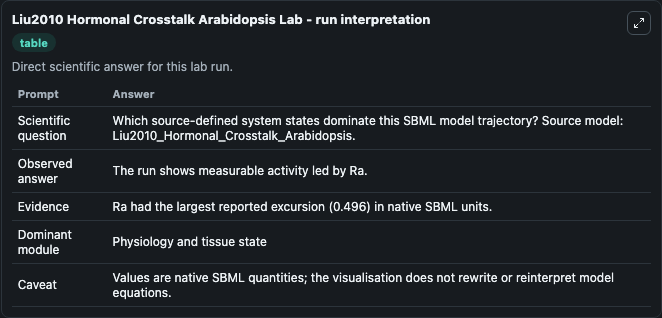
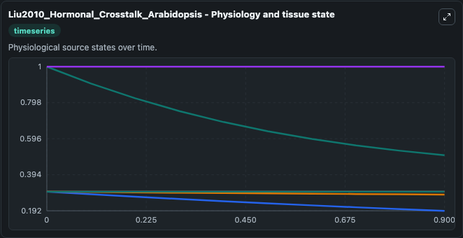
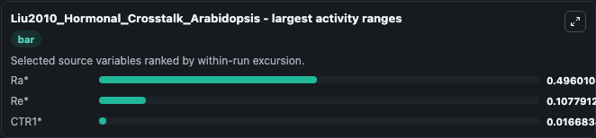
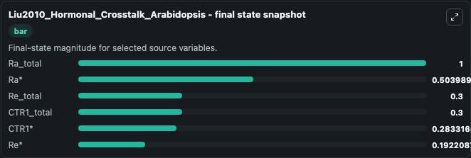
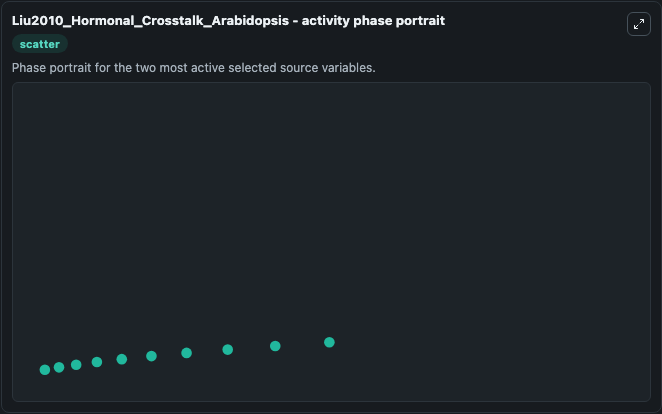

# Liu2010 Hormonal Crosstalk Arabidopsis

This Biosimulant lab wraps `Liu2010 Hormonal Crosstalk Arabidopsis` as a runnable systems biology model with a companion visualization module.
This is the single cell model for analysis of hormonal crosstalk in Arabidopsis described in the article: Modelling and experimental analysis of hormonal crosstalk in Arabidopsis. It can be used to explore the configured dynamics and compare scenario outcomes across configurations.

## What You'll See

The lab asks: Which source-defined system states dominate this SBML model trajectory? Source model: Liu2010_Hormonal_Crosstalk_Arabidopsis. It runs for 1.0 time units with a communication step of 0.1. The run uses the model defaults declared by the curated SBML wrapper. The generated visualizations focus on Ra_total, Ra*, Re_total, Re*, CTR1_total, and CTR1*, combining trajectory, endpoint-comparison, and summary-table views from one completed dark-mode run.

In this captured run, **Ra*** moved from 1.000 to 0.5040 across 1.0 simulation windows.


### Output Visualizations



*Summary table for Liu2010 Hormonal Crosstalk Arabidopsis, reporting the scientific question, observed answer, dominant module, and caveat.*



*Trajectories of Ra*, Re*, CTR1*, Ra_total, Re_total, and CTR1_total across the 1.0 simulation. In this run **Ra*** fell from 1.000 to 0.5040 — the largest movements among the focused observables.*



*Largest-excursion ranking of the focused observables — the absolute movement magnitude during the run. Top 3: **Ra*** = 0.4960, **Re*** = 0.1078, **CTR1*** = 0.0167.*



*Endpoint snapshot of the focused observables — final values from the captured run. Top 3 by value: **Ra_total** = 1.000, **Ra*** = 0.5040, **Re_total** = 0.3000, with 3 more observables below.*



*Visualization card from the Liu2010 Hormonal Crosstalk Arabidopsis dark-mode run.*


## Model Context

- Core model: `models/core`
- Visualization model: `models/visualisation`
- Standard: `other`
- Upstream source: `biomodels_ebi:BIOMD0000000269`
- License: `CC0`

## Inputs

| Input | Maps To | Default | Notes |
|---|---|---|---|
| Initial Ra Total | `systemsbiology_sbml_liu2010_hormonal_crosstalk_arabidopsis_biomd0000000269_model.initial_ra_total` | | Source state initial condition exposed as a model-specific control because no explicit intervention parameter is identifiable. Maps to SBML symbol `RaT`. |
| Initial Model State Ra | `systemsbiology_sbml_liu2010_hormonal_crosstalk_arabidopsis_biomd0000000269_model.initial_model_state_ra` | | Source state initial condition exposed as a model-specific control because no explicit intervention parameter is identifiable. Maps to SBML symbol `Ra_star`. |
| Initial Re Total | `systemsbiology_sbml_liu2010_hormonal_crosstalk_arabidopsis_biomd0000000269_model.initial_re_total` | | Source state initial condition exposed as a model-specific control because no explicit intervention parameter is identifiable. Maps to SBML symbol `ReT`. |
| Initial Model State Re | `systemsbiology_sbml_liu2010_hormonal_crosstalk_arabidopsis_biomd0000000269_model.initial_model_state_re` | | Source state initial condition exposed as a model-specific control because no explicit intervention parameter is identifiable. Maps to SBML symbol `Re_star`. |
| Initial Ctr1 Total | `systemsbiology_sbml_liu2010_hormonal_crosstalk_arabidopsis_biomd0000000269_model.initial_ctr1_total` | | Source state initial condition exposed as a model-specific control because no explicit intervention parameter is identifiable. Maps to SBML symbol `CTR1T`. |
| Initial Ctr1 | `systemsbiology_sbml_liu2010_hormonal_crosstalk_arabidopsis_biomd0000000269_model.initial_ctr1` | | Source state initial condition exposed as a model-specific control because no explicit intervention parameter is identifiable. Maps to SBML symbol `CTR1_star`. |

## Outputs

| Output | Maps To | Role |
|---|---|---|
| `state` | `systemsbiology_sbml_liu2010_hormonal_crosstalk_arabidopsis_biomd0000000269_model.state` | Available to the visualization model and downstream workflows. |
| `summary` | `systemsbiology_sbml_liu2010_hormonal_crosstalk_arabidopsis_biomd0000000269_model.summary` | Available to the visualization model and downstream workflows. |
| `species_labels` | `systemsbiology_sbml_liu2010_hormonal_crosstalk_arabidopsis_biomd0000000269_model.species_labels` | Available to the visualization model and downstream workflows. |
| `ra_total` | `systemsbiology_sbml_liu2010_hormonal_crosstalk_arabidopsis_biomd0000000269_model.ra_total` | Available to the visualization model and downstream workflows. |
| `model_state_ra` | `systemsbiology_sbml_liu2010_hormonal_crosstalk_arabidopsis_biomd0000000269_model.model_state_ra` | Available to the visualization model and downstream workflows. |
| `re_total` | `systemsbiology_sbml_liu2010_hormonal_crosstalk_arabidopsis_biomd0000000269_model.re_total` | Available to the visualization model and downstream workflows. |
| `model_state_re` | `systemsbiology_sbml_liu2010_hormonal_crosstalk_arabidopsis_biomd0000000269_model.model_state_re` | Available to the visualization model and downstream workflows. |
| `ctr1_total` | `systemsbiology_sbml_liu2010_hormonal_crosstalk_arabidopsis_biomd0000000269_model.ctr1_total` | Available to the visualization model and downstream workflows. |
| `ctr1` | `systemsbiology_sbml_liu2010_hormonal_crosstalk_arabidopsis_biomd0000000269_model.ctr1` | Available to the visualization model and downstream workflows. |

## Runtime

- Duration: `1.0`
- Communication step: `0.1`

## Running Locally

```bash
biosimulant labs serve
```
