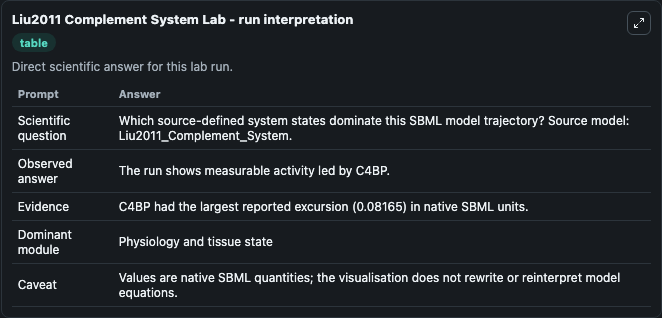
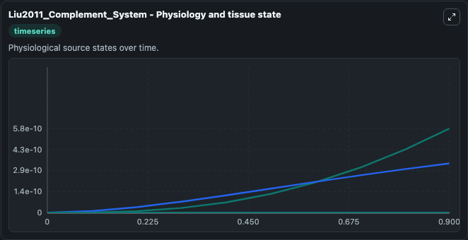
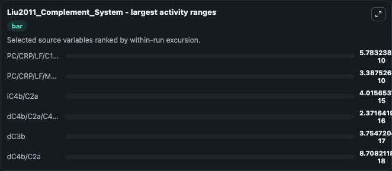
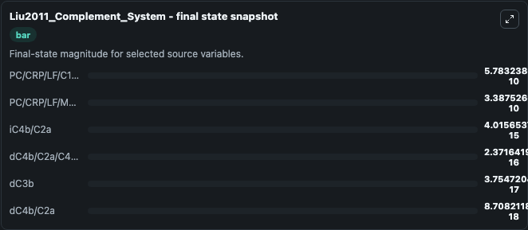
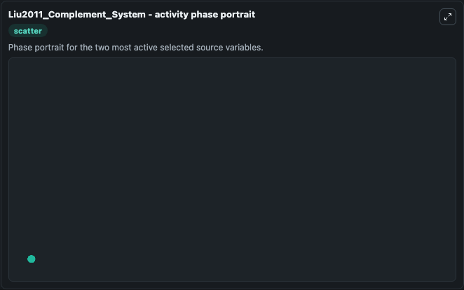

# Liu2011 Complement System

This Biosimulant lab wraps `Liu2011 Complement System` as a runnable systems biology model with a companion visualization module.
Model of the Complement System This is the continuous deterministic (ODE) model of the complement system described in the article: Computational and Experimental Study of the Regulatory Mechanisms of. It can be used to explore the configured dynamics and compare scenario outcomes across configurations.

## What You'll See

The lab asks: Which source-defined system states dominate this SBML model trajectory? Source model: Liu2011_Complement_System. It runs for 1.0 time units with a communication step of 0.1. The run uses the model defaults declared by the curated SBML wrapper. The generated visualizations focus on iC4b/C2a, dC4b/C2a/C4BP, dC4b/C2a, dC3b, PC/CRP/LF/MASP, and PC/CRP/LF/C1/MASP, combining trajectory, endpoint-comparison, and summary-table views from one completed dark-mode run.

In this captured run, **PC/CRP/LF/C1/MASP** moved from 0 to 5.78e-10 across 1.0 simulation windows.


### Output Visualizations



*Summary table for Liu2011 Complement System, reporting the scientific question, observed answer, dominant module, and caveat.*



*Trajectories of PC/CRP/LF/C1/MASP, PC/CRP/LF/MASP, iC4b/C2a, dC4b/C2a/C4BP, dC3b, and dC4b/C2a across the 1.0 simulation. In this run **PC/CRP/LF/C1/MASP** climbed from 0 to 5.78e-10 — the largest movements among the focused observables.*



*Largest-excursion ranking of the focused observables — the absolute movement magnitude during the run. Top 3: **PC/CRP/LF/C1/MASP** = 5.78e-10, **PC/CRP/LF/MASP** = 3.39e-10, **iC4b/C2a** = 4.02e-15, with 3 more observables below.*



*Endpoint snapshot of the focused observables — final values from the captured run. Top 3 by value: **PC/CRP/LF/C1/MASP** = 5.78e-10, **PC/CRP/LF/MASP** = 3.39e-10, **iC4b/C2a** = 4.02e-15, with 3 more observables below.*



*Visualization card from the Liu2011 Complement System dark-mode run.*


## Model Context

- Core model: `models/core`
- Visualization model: `models/visualisation`
- Standard: `other`
- Upstream source: `biomodels_ebi:BIOMD0000000303`
- License: `CC0`

## Inputs

| Input | Maps To | Default | Notes |
|---|---|---|---|
| Initial I C4B C2A | `systemsbiology_sbml_liu2011_complement_system_biomd0000000303_model.initial_i_c4b_c2a` | | Source state initial condition exposed as a model-specific control because no explicit intervention parameter is identifiable. Maps to SBML symbol `iC4b_C2a`. |
| Initial D C4B C2A C4 Bp | `systemsbiology_sbml_liu2011_complement_system_biomd0000000303_model.initial_d_c4b_c2a_c4_bp` | | Source state initial condition exposed as a model-specific control because no explicit intervention parameter is identifiable. Maps to SBML symbol `dC4b_C2a_C4BP`. |
| Initial D C4B C2A | `systemsbiology_sbml_liu2011_complement_system_biomd0000000303_model.initial_d_c4b_c2a` | | Source state initial condition exposed as a model-specific control because no explicit intervention parameter is identifiable. Maps to SBML symbol `dC4b_C2a`. |
| Initial D C3B | `systemsbiology_sbml_liu2011_complement_system_biomd0000000303_model.initial_d_c3b` | | Source state initial condition exposed as a model-specific control because no explicit intervention parameter is identifiable. Maps to SBML symbol `dC3b`. |
| Initial Pc Crp Lf Masp | `systemsbiology_sbml_liu2011_complement_system_biomd0000000303_model.initial_pc_crp_lf_masp` | | Source state initial condition exposed as a model-specific control because no explicit intervention parameter is identifiable. Maps to SBML symbol `PC_CRP_LF_MASP`. |
| Initial Pc Crp Lf C1 Masp | `systemsbiology_sbml_liu2011_complement_system_biomd0000000303_model.initial_pc_crp_lf_c1_masp` | | Source state initial condition exposed as a model-specific control because no explicit intervention parameter is identifiable. Maps to SBML symbol `PC_CRP_LF_C1_MASP`. |

## Outputs

| Output | Maps To | Role |
|---|---|---|
| `state` | `systemsbiology_sbml_liu2011_complement_system_biomd0000000303_model.state` | Available to the visualization model and downstream workflows. |
| `summary` | `systemsbiology_sbml_liu2011_complement_system_biomd0000000303_model.summary` | Available to the visualization model and downstream workflows. |
| `species_labels` | `systemsbiology_sbml_liu2011_complement_system_biomd0000000303_model.species_labels` | Available to the visualization model and downstream workflows. |
| `i_c4b_c2a` | `systemsbiology_sbml_liu2011_complement_system_biomd0000000303_model.i_c4b_c2a` | Available to the visualization model and downstream workflows. |
| `d_c4b_c2a_c4_bp` | `systemsbiology_sbml_liu2011_complement_system_biomd0000000303_model.d_c4b_c2a_c4_bp` | Available to the visualization model and downstream workflows. |
| `d_c4b_c2a` | `systemsbiology_sbml_liu2011_complement_system_biomd0000000303_model.d_c4b_c2a` | Available to the visualization model and downstream workflows. |
| `d_c3b` | `systemsbiology_sbml_liu2011_complement_system_biomd0000000303_model.d_c3b` | Available to the visualization model and downstream workflows. |
| `pc_crp_lf_masp` | `systemsbiology_sbml_liu2011_complement_system_biomd0000000303_model.pc_crp_lf_masp` | Available to the visualization model and downstream workflows. |
| `pc_crp_lf_c1_masp` | `systemsbiology_sbml_liu2011_complement_system_biomd0000000303_model.pc_crp_lf_c1_masp` | Available to the visualization model and downstream workflows. |

## Runtime

- Duration: `1.0`
- Communication step: `0.1`

## Running Locally

```bash
biosimulant labs serve
```
