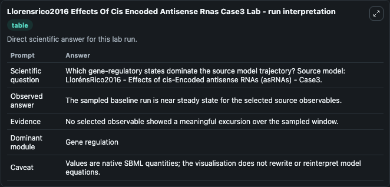
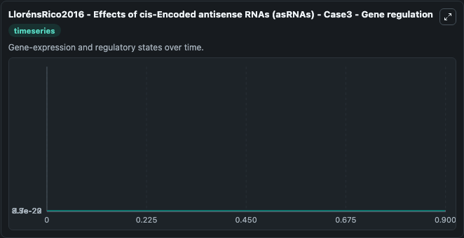
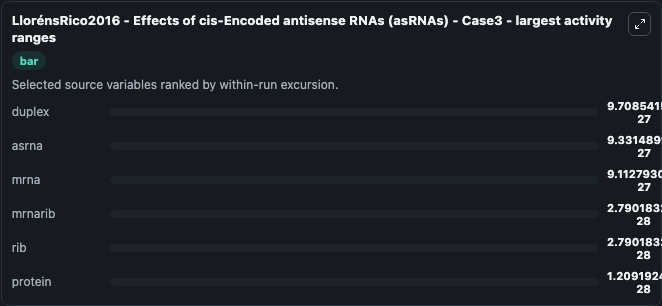
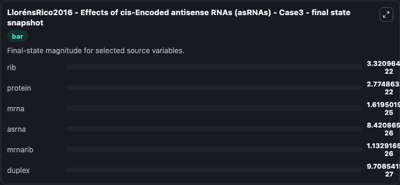
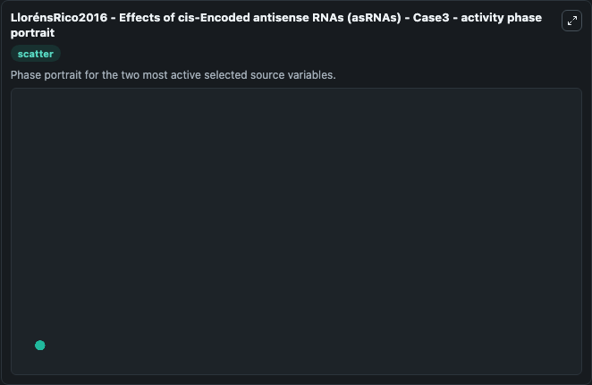

# Llorensrico2016 Effects Of Cis Encoded Antisense Rnas Case3

This Biosimulant lab wraps `Llorensrico2016 Effects Of Cis Encoded Antisense Rnas Case3` as a runnable systems biology model with a companion visualization module.
LlorénsRico2016 - Effects of cis-Encodedantisense RNAs (asRNAs) - Case3 Three putative effects of the asRNAs were considered in this study: in case 1, the binding of the asRNA to the corresponding mRN. It can be used to explore the configured dynamics and compare scenario outcomes across configurations.

## What You'll See

The lab asks: Which gene-regulatory states dominate the source model trajectory? Source model: LlorénsRico2016 - Effects of cis-Encoded antisense RNAs (asRNAs) - Case3. It runs for 1.0 time units with a communication step of 0.1. The run uses the model defaults declared by the curated SBML wrapper. The generated visualizations focus on rib, protein, mrna, asrna, mrnarib, and duplex, combining trajectory, endpoint-comparison, and summary-table views from one completed dark-mode run.

In this captured run, **duplex** moved from 0 to 9.71e-27 across 1.0 simulation windows.


### Output Visualizations



*Summary table for Llorensrico2016 Effects Of Cis Encoded Antisense Rnas Case3, reporting the scientific question, observed answer, dominant module, and caveat.*



*Trajectories of duplex, asrna, mrna, mrnarib, rib, and protein across the 1.0 simulation. In this run **duplex** climbed from 0 to 9.71e-27 and **asrna** fell from 9.35e-26 to 8.42e-26 — the largest movements among the focused observables.*



*Largest-excursion ranking of the focused observables — the absolute movement magnitude during the run. Top 3: **duplex** = 9.71e-27, **asrna** = 9.33e-27, **mrna** = 9.11e-27, with 3 more observables below.*



*Trajectories of duplex, asrna, mrna, mrnarib, rib, and protein across the 1.0 simulation. In this run **duplex** climbed from 0 to 9.71e-27 and **asrna** fell from 9.35e-26 to 8.42e-26 — the largest movements among the focused observables.*



*Visualization card from the Llorensrico2016 Effects Of Cis Encoded Antisense Rnas Case3 dark-mode run.*


## Model Context

- Core model: `models/core`
- Visualization model: `models/visualisation`
- Standard: `other`
- Upstream source: `biomodels_ebi:MODEL1511170002`
- License: `CC0`

## Inputs

| Input | Maps To | Default | Notes |
|---|---|---|---|
| Initial Model State Rib | `systemsbiology_sbml_llor_nsrico2016_effects_of_cis_encoded_antisense_model1511170002_model.initial_model_state_rib` | | Source state initial condition exposed as a model-specific control because no explicit intervention parameter is identifiable. Maps to SBML symbol `rib`. |
| Initial Protein | `systemsbiology_sbml_llor_nsrico2016_effects_of_cis_encoded_antisense_model1511170002_model.initial_protein` | | Source state initial condition exposed as a model-specific control because no explicit intervention parameter is identifiable. Maps to SBML symbol `protein`. |
| Initial MRNA | `systemsbiology_sbml_llor_nsrico2016_effects_of_cis_encoded_antisense_model1511170002_model.initial_mrna` | | Source state initial condition exposed as a model-specific control because no explicit intervention parameter is identifiable. Maps to SBML symbol `mrna`. |
| Initial Asrna | `systemsbiology_sbml_llor_nsrico2016_effects_of_cis_encoded_antisense_model1511170002_model.initial_asrna` | | Source state initial condition exposed as a model-specific control because no explicit intervention parameter is identifiable. Maps to SBML symbol `asrna`. |
| Initial Mrnarib | `systemsbiology_sbml_llor_nsrico2016_effects_of_cis_encoded_antisense_model1511170002_model.initial_mrnarib` | | Source state initial condition exposed as a model-specific control because no explicit intervention parameter is identifiable. Maps to SBML symbol `mrnarib`. |
| Initial Duplex | `systemsbiology_sbml_llor_nsrico2016_effects_of_cis_encoded_antisense_model1511170002_model.initial_duplex` | | Source state initial condition exposed as a model-specific control because no explicit intervention parameter is identifiable. Maps to SBML symbol `duplex`. |

## Outputs

| Output | Maps To | Role |
|---|---|---|
| `state` | `systemsbiology_sbml_llor_nsrico2016_effects_of_cis_encoded_antisense_model1511170002_model.state` | Available to the visualization model and downstream workflows. |
| `summary` | `systemsbiology_sbml_llor_nsrico2016_effects_of_cis_encoded_antisense_model1511170002_model.summary` | Available to the visualization model and downstream workflows. |
| `species_labels` | `systemsbiology_sbml_llor_nsrico2016_effects_of_cis_encoded_antisense_model1511170002_model.species_labels` | Available to the visualization model and downstream workflows. |
| `rib` | `systemsbiology_sbml_llor_nsrico2016_effects_of_cis_encoded_antisense_model1511170002_model.rib` | Available to the visualization model and downstream workflows. |
| `protein` | `systemsbiology_sbml_llor_nsrico2016_effects_of_cis_encoded_antisense_model1511170002_model.protein` | Available to the visualization model and downstream workflows. |
| `mrna` | `systemsbiology_sbml_llor_nsrico2016_effects_of_cis_encoded_antisense_model1511170002_model.mrna` | Available to the visualization model and downstream workflows. |
| `asrna` | `systemsbiology_sbml_llor_nsrico2016_effects_of_cis_encoded_antisense_model1511170002_model.asrna` | Available to the visualization model and downstream workflows. |
| `mrnarib` | `systemsbiology_sbml_llor_nsrico2016_effects_of_cis_encoded_antisense_model1511170002_model.mrnarib` | Available to the visualization model and downstream workflows. |
| `duplex` | `systemsbiology_sbml_llor_nsrico2016_effects_of_cis_encoded_antisense_model1511170002_model.duplex` | Available to the visualization model and downstream workflows. |

## Runtime

- Duration: `1.0`
- Communication step: `0.1`

## Running Locally

```bash
biosimulant labs serve
```
