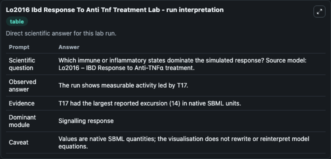
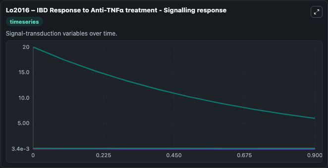
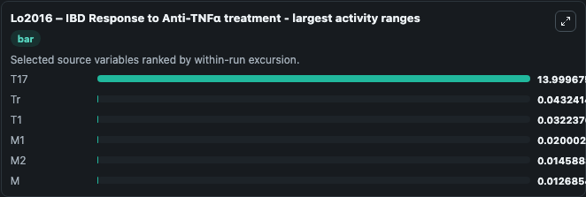
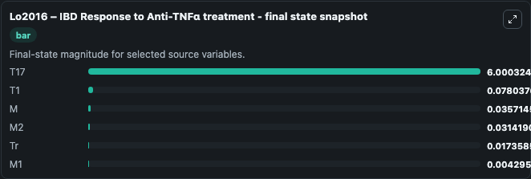
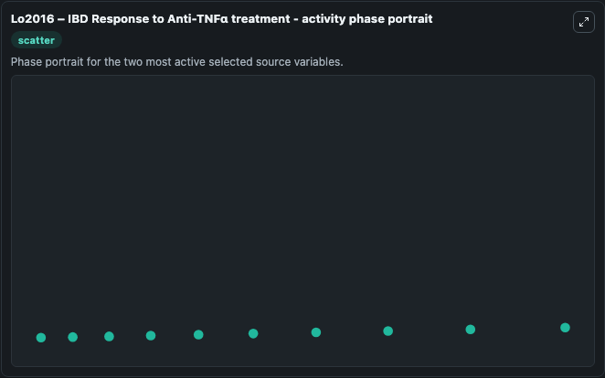

# Lo2016 Ibd Response To Anti Tnf Treatment

This Biosimulant lab wraps `Lo2016 Ibd Response To Anti Tnf Treatment` as a runnable systems biology model with a companion visualization module.
Systems Biology Lo2016Ibd Response To Anti Tnf Treatment Model2505090001Model captures core biological behavior in the context of systemsbiology, sbml, biomodels_ebi using a biomodels_ebi-sourced OTHER model. It can be used to explore the configured dynamics and compare scenario outcomes across configurations.

## What You'll See

The lab asks: Which immune or inflammatory states dominate the simulated response? Source model: Lo2016 – IBD Response to Anti-TNFα treatment. It runs for 1.0 time units with a communication step of 0.1. The run uses the model defaults declared by the curated SBML wrapper. The generated visualizations focus on T17, Tr, M, T1, M2, and M1, combining trajectory, endpoint-comparison, and summary-table views from one completed dark-mode run.

In this captured run, **T17** moved from 20.000 to 6.000 across 1.0 simulation windows.


### Output Visualizations



*Summary table for Lo2016 Ibd Response To Anti Tnf Treatment, reporting the scientific question, observed answer, dominant module, and caveat.*



*Trajectories of T17, Tr, T1, M1, M2, and M across the 1.0 simulation. In this run **T1** climbed from 0.0458 to 0.0780 and **T17** fell from 20.000 to 6.000 — the largest movements among the focused observables.*



*Trajectories of T17, Tr, T1, M1, M2, and M across the 1.0 simulation. In this run **T1** climbed from 0.0458 to 0.0780 and **T17** fell from 20.000 to 6.000 — the largest movements among the focused observables.*



*Endpoint snapshot of the focused observables — final values from the captured run. Top 3 by value: **T17** = 6.000, **T1** = 0.0780, **M** = 0.0357, with 3 more observables below.*



*Trajectories of T17, Tr, T1, M1, M2, and M across the 1.0 simulation. In this run **T1** climbed from 0.0458 to 0.0780 and **T17** fell from 20.000 to 6.000 — the largest movements among the focused observables.*


## Model Context

- Core model: `models/core`
- Visualization model: `models/visualisation`
- Standard: `other`
- Upstream source: `biomodels_ebi:MODEL2505090001`
- License: `CC0`

## Inputs

| Input | Maps To | Default | Notes |
|---|---|---|---|
| Initial Model State T17 | `systemsbiology_sbml_lo2016_ibd_response_to_anti_tnf_treatment_model2505090001_model.initial_model_state_t17` | | Source state initial condition exposed as a model-specific control because no explicit intervention parameter is identifiable. Maps to SBML symbol `T17_0`. |
| Initial Model State Tr | `systemsbiology_sbml_lo2016_ibd_response_to_anti_tnf_treatment_model2505090001_model.initial_model_state_tr` | | Source state initial condition exposed as a model-specific control because no explicit intervention parameter is identifiable. Maps to SBML symbol `Tr_0`. |
| Initial Model State M | `systemsbiology_sbml_lo2016_ibd_response_to_anti_tnf_treatment_model2505090001_model.initial_model_state_m` | | Source state initial condition exposed as a model-specific control because no explicit intervention parameter is identifiable. Maps to SBML symbol `M_0`. |
| Initial Model State T1 | `systemsbiology_sbml_lo2016_ibd_response_to_anti_tnf_treatment_model2505090001_model.initial_model_state_t1` | | Source state initial condition exposed as a model-specific control because no explicit intervention parameter is identifiable. Maps to SBML symbol `T1_0`. |
| Initial Model State M2 | `systemsbiology_sbml_lo2016_ibd_response_to_anti_tnf_treatment_model2505090001_model.initial_model_state_m2` | | Source state initial condition exposed as a model-specific control because no explicit intervention parameter is identifiable. Maps to SBML symbol `M2_0`. |
| Initial Model State M1 | `systemsbiology_sbml_lo2016_ibd_response_to_anti_tnf_treatment_model2505090001_model.initial_model_state_m1` | | Source state initial condition exposed as a model-specific control because no explicit intervention parameter is identifiable. Maps to SBML symbol `M1_0`. |

## Outputs

| Output | Maps To | Role |
|---|---|---|
| `state` | `systemsbiology_sbml_lo2016_ibd_response_to_anti_tnf_treatment_model2505090001_model.state` | Available to the visualization model and downstream workflows. |
| `summary` | `systemsbiology_sbml_lo2016_ibd_response_to_anti_tnf_treatment_model2505090001_model.summary` | Available to the visualization model and downstream workflows. |
| `species_labels` | `systemsbiology_sbml_lo2016_ibd_response_to_anti_tnf_treatment_model2505090001_model.species_labels` | Available to the visualization model and downstream workflows. |
| `t17` | `systemsbiology_sbml_lo2016_ibd_response_to_anti_tnf_treatment_model2505090001_model.t17` | Available to the visualization model and downstream workflows. |
| `model_state_tr` | `systemsbiology_sbml_lo2016_ibd_response_to_anti_tnf_treatment_model2505090001_model.model_state_tr` | Available to the visualization model and downstream workflows. |
| `model_state_m` | `systemsbiology_sbml_lo2016_ibd_response_to_anti_tnf_treatment_model2505090001_model.model_state_m` | Available to the visualization model and downstream workflows. |
| `model_state_t1` | `systemsbiology_sbml_lo2016_ibd_response_to_anti_tnf_treatment_model2505090001_model.model_state_t1` | Available to the visualization model and downstream workflows. |
| `model_state_m2` | `systemsbiology_sbml_lo2016_ibd_response_to_anti_tnf_treatment_model2505090001_model.model_state_m2` | Available to the visualization model and downstream workflows. |
| `model_state_m1` | `systemsbiology_sbml_lo2016_ibd_response_to_anti_tnf_treatment_model2505090001_model.model_state_m1` | Available to the visualization model and downstream workflows. |

## Runtime

- Duration: `1.0`
- Communication step: `0.1`

## Running Locally

```bash
biosimulant labs serve
```
