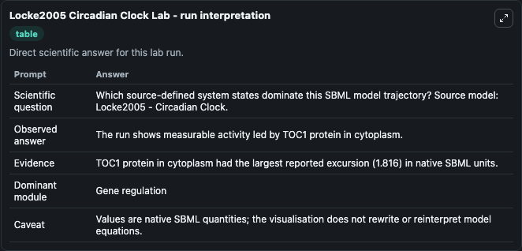
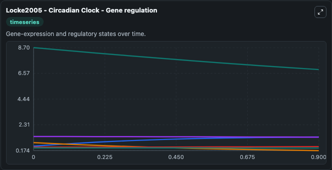
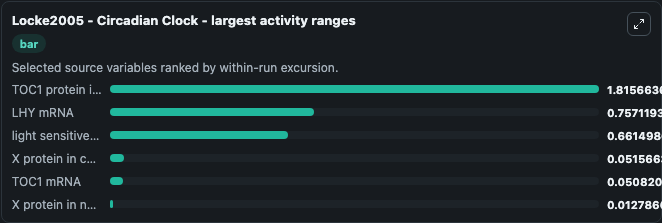
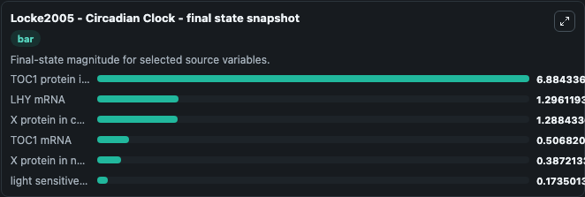
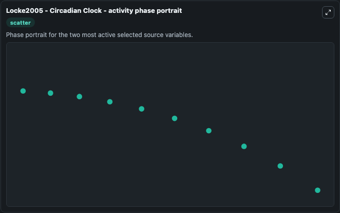

# Locke2005 Circadian Clock

This Biosimulant lab wraps `Locke2005 Circadian Clock` as a runnable systems biology model with a companion visualization module.
Locke2005 - Circadian Clock SBML model of the interlocked feedback loop network The model describes the circuit depicted in Fig. 4 and reproduces the simulations in Figure 5A and 5B. It can be used to explore the configured dynamics and compare scenario outcomes across configurations.

## What You'll See

The lab asks: Which source-defined system states dominate this SBML model trajectory? Source model: Locke2005 - Circadian Clock. It runs for 1.0 time units with a communication step of 0.1. The run uses the model defaults declared by the curated SBML wrapper. The generated visualizations focus on TOC1 protein in cytoplasm, X protein in cytoplasm, light sensitive protein P, LHY mRNA, TOC1 mRNA, and X protein in nucleus, combining trajectory, endpoint-comparison, and summary-table views from one completed dark-mode run.

In this captured run, **TOC1 protein in cytoplasm** moved from 8.700 to 6.884 across 1.0 simulation windows.


### Output Visualizations



*Summary table for Locke2005 Circadian Clock, reporting the scientific question, observed answer, dominant module, and caveat.*



*Trajectories of TOC1 protein in cytoplasm, LHY mRNA, light sensitive protein P, X protein in cytoplasm, TOC1 mRNA, and X protein in nucleus across the 1.0 simulation. In this run **LHY mRNA** climbed from 0.5390 to 1.296 and **TOC1 protein in cytoplasm** fell from 8.700 to 6.884 — the largest movements among the focused observables.*



*Largest-excursion ranking of the focused observables — the absolute movement magnitude during the run. Top 3: **TOC1 protein in cytoplasm** = 1.816, **LHY mRNA** = 0.7571, **light sensitive protein P** = 0.6615, with 3 more observables below.*



*Endpoint snapshot of the focused observables — final values from the captured run. Top 3 by value: **TOC1 protein in cytoplasm** = 6.884, **LHY mRNA** = 1.296, **X protein in cytoplasm** = 1.288, with 3 more observables below.*



*Visualization card from the Locke2005 Circadian Clock dark-mode run.*


## Model Context

- Core model: `models/core`
- Visualization model: `models/visualisation`
- Standard: `other`
- Upstream source: `biomodels_ebi:BIOMD0000000055`
- License: `CC0`

## Inputs

| Input | Maps To | Default | Notes |
|---|---|---|---|
| Initial Toc1 Protein In Cytoplasm | `systemsbiology_sbml_locke2005_circadian_clock_biomd0000000055_model.initial_toc1_protein_in_cytoplasm` | | Source state initial condition exposed as a model-specific control because no explicit intervention parameter is identifiable. Maps to SBML symbol `cTc`. |
| Initial X Protein In Cytoplasm | `systemsbiology_sbml_locke2005_circadian_clock_biomd0000000055_model.initial_x_protein_in_cytoplasm` | | Source state initial condition exposed as a model-specific control because no explicit intervention parameter is identifiable. Maps to SBML symbol `cXc`. |
| Initial Light Sensitive Protein P | `systemsbiology_sbml_locke2005_circadian_clock_biomd0000000055_model.initial_light_sensitive_protein_p` | | Source state initial condition exposed as a model-specific control because no explicit intervention parameter is identifiable. Maps to SBML symbol `cPn`. |
| Initial Lhy MRNA | `systemsbiology_sbml_locke2005_circadian_clock_biomd0000000055_model.initial_lhy_mrna` | | Source state initial condition exposed as a model-specific control because no explicit intervention parameter is identifiable. Maps to SBML symbol `cLm`. |
| Initial Toc1 MRNA | `systemsbiology_sbml_locke2005_circadian_clock_biomd0000000055_model.initial_toc1_mrna` | | Source state initial condition exposed as a model-specific control because no explicit intervention parameter is identifiable. Maps to SBML symbol `cTm`. |
| Initial X Protein In Nucleus | `systemsbiology_sbml_locke2005_circadian_clock_biomd0000000055_model.initial_x_protein_in_nucleus` | | Source state initial condition exposed as a model-specific control because no explicit intervention parameter is identifiable. Maps to SBML symbol `cXn`. |

## Outputs

| Output | Maps To | Role |
|---|---|---|
| `state` | `systemsbiology_sbml_locke2005_circadian_clock_biomd0000000055_model.state` | Available to the visualization model and downstream workflows. |
| `summary` | `systemsbiology_sbml_locke2005_circadian_clock_biomd0000000055_model.summary` | Available to the visualization model and downstream workflows. |
| `species_labels` | `systemsbiology_sbml_locke2005_circadian_clock_biomd0000000055_model.species_labels` | Available to the visualization model and downstream workflows. |
| `toc1_protein_in_cytoplasm` | `systemsbiology_sbml_locke2005_circadian_clock_biomd0000000055_model.toc1_protein_in_cytoplasm` | Available to the visualization model and downstream workflows. |
| `x_protein_in_cytoplasm` | `systemsbiology_sbml_locke2005_circadian_clock_biomd0000000055_model.x_protein_in_cytoplasm` | Available to the visualization model and downstream workflows. |
| `light_sensitive_protein_p` | `systemsbiology_sbml_locke2005_circadian_clock_biomd0000000055_model.light_sensitive_protein_p` | Available to the visualization model and downstream workflows. |
| `lhy_mrna` | `systemsbiology_sbml_locke2005_circadian_clock_biomd0000000055_model.lhy_mrna` | Available to the visualization model and downstream workflows. |
| `toc1_mrna` | `systemsbiology_sbml_locke2005_circadian_clock_biomd0000000055_model.toc1_mrna` | Available to the visualization model and downstream workflows. |
| `x_protein_in_nucleus` | `systemsbiology_sbml_locke2005_circadian_clock_biomd0000000055_model.x_protein_in_nucleus` | Available to the visualization model and downstream workflows. |

## Runtime

- Duration: `1.0`
- Communication step: `0.1`

## Running Locally

```bash
biosimulant labs serve
```
