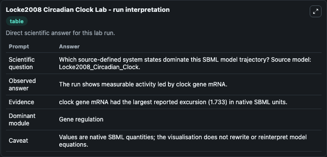
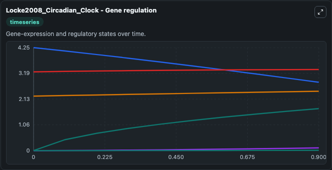
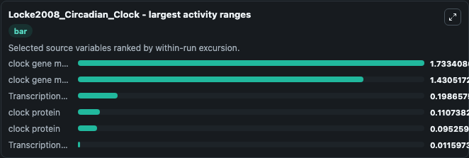
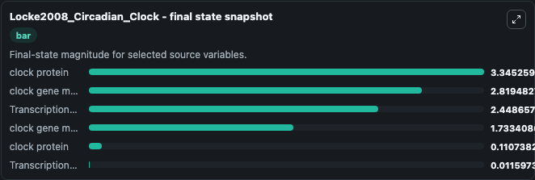
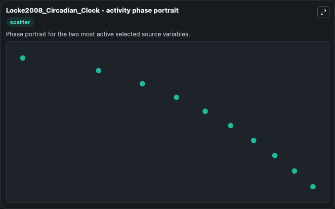

# Locke2008 Circadian Clock

This Biosimulant lab wraps `Locke2008 Circadian Clock` as a runnable systems biology model with a companion visualization module.
The model reproduces Fig 2A of the paper. It can be used to explore the configured dynamics and compare scenario outcomes across configurations.

## What You'll See

The lab asks: Which source-defined system states dominate this SBML model trajectory? Source model: Locke2008_Circadian_Clock. It runs for 1.0 time units with a communication step of 0.1. The run uses the model defaults declared by the curated SBML wrapper. The generated visualizations focus on clock gene mRNA, clock protein, and Transcriptional repressor, combining trajectory, endpoint-comparison, and summary-table views from one completed dark-mode run.

In this captured run, **clock gene mRNA** moved from 0 to 1.733 across 1.0 simulation windows.


### Output Visualizations



*Summary table for Locke2008 Circadian Clock, reporting the scientific question, observed answer, dominant module, and caveat.*



*Trajectories of clock gene mRNA, clock gene mRNA, Transcriptional repressor, clock protein, clock protein, and Transcriptional repressor across the 1.0 simulation. In this run **clock gene mRNA** climbed from 0 to 1.733 and **clock gene mRNA** fell from 4.250 to 2.819 — the largest movements among the focused observables.*



*Largest-excursion ranking of the focused observables — the absolute movement magnitude during the run. Top 3: **clock gene mRNA** = 1.733, **clock gene mRNA** = 1.431, **Transcriptional repressor** = 0.1987, with 3 more observables below.*



*Endpoint snapshot of the focused observables — final values from the captured run. Top 3 by value: **clock protein** = 3.345, **clock gene mRNA** = 2.819, **Transcriptional repressor** = 2.449, with 3 more observables below.*



*Visualization card from the Locke2008 Circadian Clock dark-mode run.*


## Model Context

- Core model: `models/core`
- Visualization model: `models/visualisation`
- Standard: `other`
- Upstream source: `biomodels_ebi:BIOMD0000000185`
- License: `CC0`

## Inputs

| Input | Maps To | Default | Notes |
|---|---|---|---|
| Initial Clock Gene MRNA | `systemsbiology_sbml_locke2008_circadian_clock_biomd0000000185_model.initial_clock_gene_mrna` | | Source state initial condition exposed as a model-specific control because no explicit intervention parameter is identifiable. Maps to SBML symbol `X1`. |
| Initial Clock Protein | `systemsbiology_sbml_locke2008_circadian_clock_biomd0000000185_model.initial_clock_protein` | | Source state initial condition exposed as a model-specific control because no explicit intervention parameter is identifiable. Maps to SBML symbol `Y1`. |
| Initial Transcriptional Repressor | `systemsbiology_sbml_locke2008_circadian_clock_biomd0000000185_model.initial_transcriptional_repressor` | | Source state initial condition exposed as a model-specific control because no explicit intervention parameter is identifiable. Maps to SBML symbol `Z1`. |
| Initial Clock Protein 2 | `systemsbiology_sbml_locke2008_circadian_clock_biomd0000000185_model.initial_clock_protein_2` | | Source state initial condition exposed as a model-specific control because no explicit intervention parameter is identifiable. Maps to SBML symbol `Y2`. |
| Initial Clock Gene MRNA 2 | `systemsbiology_sbml_locke2008_circadian_clock_biomd0000000185_model.initial_clock_gene_mrna_2` | | Source state initial condition exposed as a model-specific control because no explicit intervention parameter is identifiable. Maps to SBML symbol `X2`. |
| Initial Transcriptional Repressor 2 | `systemsbiology_sbml_locke2008_circadian_clock_biomd0000000185_model.initial_transcriptional_repressor_2` | | Source state initial condition exposed as a model-specific control because no explicit intervention parameter is identifiable. Maps to SBML symbol `Z2`. |

## Outputs

| Output | Maps To | Role |
|---|---|---|
| `state` | `systemsbiology_sbml_locke2008_circadian_clock_biomd0000000185_model.state` | Available to the visualization model and downstream workflows. |
| `summary` | `systemsbiology_sbml_locke2008_circadian_clock_biomd0000000185_model.summary` | Available to the visualization model and downstream workflows. |
| `species_labels` | `systemsbiology_sbml_locke2008_circadian_clock_biomd0000000185_model.species_labels` | Available to the visualization model and downstream workflows. |
| `clock_gene_mrna` | `systemsbiology_sbml_locke2008_circadian_clock_biomd0000000185_model.clock_gene_mrna` | Available to the visualization model and downstream workflows. |
| `clock_protein` | `systemsbiology_sbml_locke2008_circadian_clock_biomd0000000185_model.clock_protein` | Available to the visualization model and downstream workflows. |
| `transcriptional_repressor` | `systemsbiology_sbml_locke2008_circadian_clock_biomd0000000185_model.transcriptional_repressor` | Available to the visualization model and downstream workflows. |
| `clock_protein_2` | `systemsbiology_sbml_locke2008_circadian_clock_biomd0000000185_model.clock_protein_2` | Available to the visualization model and downstream workflows. |
| `clock_gene_mrna_2` | `systemsbiology_sbml_locke2008_circadian_clock_biomd0000000185_model.clock_gene_mrna_2` | Available to the visualization model and downstream workflows. |
| `transcriptional_repressor_2` | `systemsbiology_sbml_locke2008_circadian_clock_biomd0000000185_model.transcriptional_repressor_2` | Available to the visualization model and downstream workflows. |

## Runtime

- Duration: `1.0`
- Communication step: `0.1`

## Running Locally

```bash
biosimulant labs serve
```
