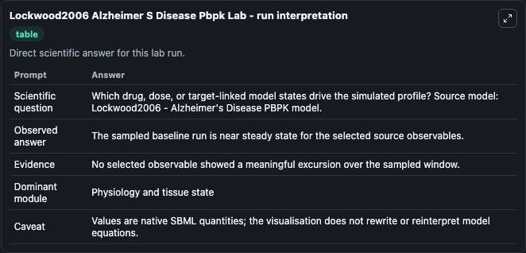
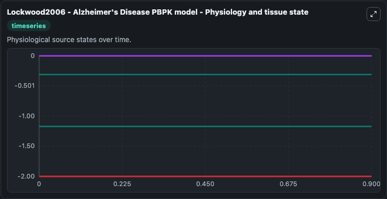
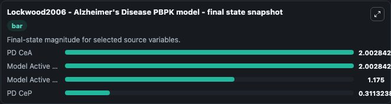

# Lockwood2006 Alzheimer S Disease Pbpk

This Biosimulant lab wraps `Lockwood2006 Alzheimer S Disease Pbpk` as a runnable systems biology model with a companion visualization module.
Lockwood2006 - AlzheimersDisease PBPKmodel A mathematical model to predict theeffectiveness of CI-1017 (muscarinic agonist) for Alzheimer'sdisease by evaluating changes in ADAS-cog score. It can be used to explore the configured dynamics and compare scenario outcomes across configurations.

## What You'll See

The lab asks: Which drug, dose, or target-linked model states drive the simulated profile? Source model: Lockwood2006 - Alzheimer's Disease PBPK model. It runs for 1.0 time units with a communication step of 0.1. The run uses the model defaults declared by the curated SBML wrapper. The generated visualizations focus on PD CeP, PD CeA, Model Inactive, Model Active U Shaped, Model Active Sigmoidal, and Model Active Linear, combining trajectory, endpoint-comparison, and summary-table views from one completed dark-mode run.

In this captured run, **PD CeP** moved from -0.3113 to -0.3113 across 1.0 simulation windows.


### Output Visualizations



*Summary table for Lockwood2006 Alzheimer S Disease Pbpk, reporting the scientific question, observed answer, dominant module, and caveat.*



*Trajectories of PD CeP, PD CeA, Model Inactive, Model Active U Shaped, Model Active Sigmoidal, and Model Active Linear across the 1.0 simulation. In this run PD CeP, PD CeA, Model Inactive, Model Active U Shaped stayed near their initial values — no observable moved appreciably.*



*Endpoint snapshot of the focused observables — final values from the captured run. Top 3 by value: **PD CeA** = 2.003, **Model Active Sigmoidal** = 2.003, **Model Active Linear** = 1.175, with 1 more observable below.*


## Model Context

- Core model: `models/core`
- Visualization model: `models/visualisation`
- Standard: `other`
- Upstream source: `biomodels_ebi:BIOMD0000000673`
- License: `CC0`

## Inputs

| Input | Maps To | Default | Notes |
|---|---|---|---|

## Outputs

| Output | Maps To | Role |
|---|---|---|
| `state` | `systemsbiology_sbml_lockwood2006_alzheimer_s_disease_pbpk_model_biomd0000000673_model.state` | Available to the visualization model and downstream workflows. |
| `summary` | `systemsbiology_sbml_lockwood2006_alzheimer_s_disease_pbpk_model_biomd0000000673_model.summary` | Available to the visualization model and downstream workflows. |
| `species_labels` | `systemsbiology_sbml_lockwood2006_alzheimer_s_disease_pbpk_model_biomd0000000673_model.species_labels` | Available to the visualization model and downstream workflows. |
| `pd_ce_p` | `systemsbiology_sbml_lockwood2006_alzheimer_s_disease_pbpk_model_biomd0000000673_model.pd_ce_p` | Available to the visualization model and downstream workflows. |
| `pd_ce_a` | `systemsbiology_sbml_lockwood2006_alzheimer_s_disease_pbpk_model_biomd0000000673_model.pd_ce_a` | Available to the visualization model and downstream workflows. |
| `model_inactive` | `systemsbiology_sbml_lockwood2006_alzheimer_s_disease_pbpk_model_biomd0000000673_model.model_inactive` | Available to the visualization model and downstream workflows. |
| `model_active_u_shaped` | `systemsbiology_sbml_lockwood2006_alzheimer_s_disease_pbpk_model_biomd0000000673_model.model_active_u_shaped` | Available to the visualization model and downstream workflows. |
| `model_active_sigmoidal` | `systemsbiology_sbml_lockwood2006_alzheimer_s_disease_pbpk_model_biomd0000000673_model.model_active_sigmoidal` | Available to the visualization model and downstream workflows. |
| `model_active_linear` | `systemsbiology_sbml_lockwood2006_alzheimer_s_disease_pbpk_model_biomd0000000673_model.model_active_linear` | Available to the visualization model and downstream workflows. |

## Runtime

- Duration: `1.0`
- Communication step: `0.1`

## Running Locally

```bash
biosimulant labs serve
```
