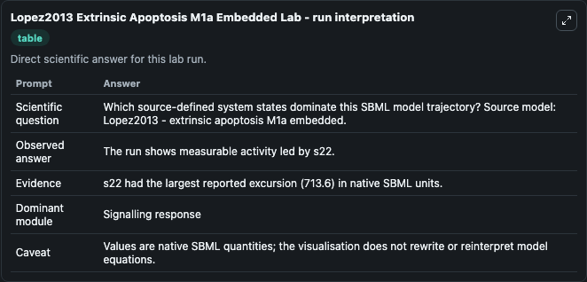
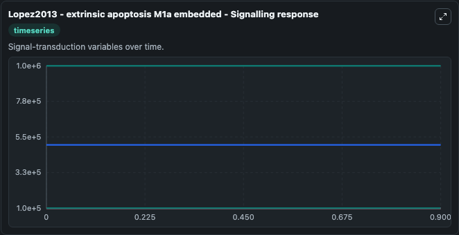
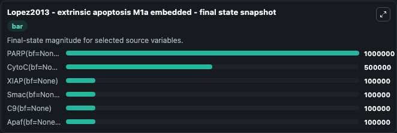

# Lopez2013 Extrinsic Apoptosis M1a Embedded

This Biosimulant lab wraps `Lopez2013 Extrinsic Apoptosis M1a Embedded` as a runnable systems biology model with a companion visualization module.
Systems Biology Lopez2013Extrinsic Apoptosis M1a Embedded Model1303010000Model models core biological dynamics as a OTHER simulation curated from biomodels_ebi (biomodels_ebi:MODEL1303010000), focused on system. It can be used to explore the configured dynamics and compare scenario outcomes across configurations.

## What You'll See

The lab asks: Which source-defined system states dominate this SBML model trajectory? Source model: Lopez2013 - extrinsic apoptosis M1a embedded. It runs for 1.0 time units with a communication step of 0.1. The run uses the model defaults declared by the curated SBML wrapper. The generated visualizations focus on PARP(bf=None, state=U), CytoC(bf=None, state=M), XIAP(bf=None), Smac(bf=None, state=M), C9(bf=None), and Apaf(bf=None, state=I), combining trajectory, endpoint-comparison, and summary-table views from one completed dark-mode run.

In this captured run, **PARP(bf=None, state=U)** moved from 1e+06 to 1e+06 across 1.0 simulation windows.


### Output Visualizations



*Summary table for Lopez2013 Extrinsic Apoptosis M1a Embedded, reporting the scientific question, observed answer, dominant module, and caveat.*



*Trajectories of PARP(bf=None, state=U), CytoC(bf=None, state=M), XIAP(bf=None), Smac(bf=None, state=M), C9(bf=None), and Apaf(bf=None, state=I) across the 1.0 simulation. In this run PARP(bf=None, state=U), CytoC(bf=None, state=M), XIAP(bf=None), Smac(bf=None, state=M) stayed near their initial values — no observable moved appreciably.*



*Endpoint snapshot of the focused observables — final values from the captured run. Top 3 by value: **PARP(bf=None, state=U)** = 1e+06, **CytoC(bf=None, state=M)** = 5e+05, **XIAP(bf=None)** = 1e+05, with 3 more observables below.*


## Model Context

- Core model: `models/core`
- Visualization model: `models/visualisation`
- Standard: `other`
- Upstream source: `biomodels_ebi:MODEL1303010000`
- License: `CC0`

## Inputs

| Input | Maps To | Default | Notes |
|---|---|---|---|
| Initial Parp Bf None State U | `systemsbiology_sbml_lopez2013_extrinsic_apoptosis_m1a_embedded_model1303010000_model.initial_parp_bf_none_state_u` | | Source state initial condition exposed as a model-specific control because no explicit intervention parameter is identifiable. Maps to SBML symbol `s9`. |
| Initial Cyto C Bf None State M | `systemsbiology_sbml_lopez2013_extrinsic_apoptosis_m1a_embedded_model1303010000_model.initial_cyto_c_bf_none_state_m` | | Source state initial condition exposed as a model-specific control because no explicit intervention parameter is identifiable. Maps to SBML symbol `s19`. |
| Initial Xiap Bf None | `systemsbiology_sbml_lopez2013_extrinsic_apoptosis_m1a_embedded_model1303010000_model.initial_xiap_bf_none` | | Source state initial condition exposed as a model-specific control because no explicit intervention parameter is identifiable. Maps to SBML symbol `s10`. |
| Initial Smac Bf None State M | `systemsbiology_sbml_lopez2013_extrinsic_apoptosis_m1a_embedded_model1303010000_model.initial_smac_bf_none_state_m` | | Source state initial condition exposed as a model-specific control because no explicit intervention parameter is identifiable. Maps to SBML symbol `s20`. |
| Initial C9 Bf None | `systemsbiology_sbml_lopez2013_extrinsic_apoptosis_m1a_embedded_model1303010000_model.initial_c9_bf_none` | | Source state initial condition exposed as a model-specific control because no explicit intervention parameter is identifiable. Maps to SBML symbol `s8`. |
| Initial Apaf Bf None State I | `systemsbiology_sbml_lopez2013_extrinsic_apoptosis_m1a_embedded_model1303010000_model.initial_apaf_bf_none_state_i` | | Source state initial condition exposed as a model-specific control because no explicit intervention parameter is identifiable. Maps to SBML symbol `s5`. |

## Outputs

| Output | Maps To | Role |
|---|---|---|
| `state` | `systemsbiology_sbml_lopez2013_extrinsic_apoptosis_m1a_embedded_model1303010000_model.state` | Available to the visualization model and downstream workflows. |
| `summary` | `systemsbiology_sbml_lopez2013_extrinsic_apoptosis_m1a_embedded_model1303010000_model.summary` | Available to the visualization model and downstream workflows. |
| `species_labels` | `systemsbiology_sbml_lopez2013_extrinsic_apoptosis_m1a_embedded_model1303010000_model.species_labels` | Available to the visualization model and downstream workflows. |
| `parp_bf_none_state_u` | `systemsbiology_sbml_lopez2013_extrinsic_apoptosis_m1a_embedded_model1303010000_model.parp_bf_none_state_u` | Available to the visualization model and downstream workflows. |
| `cyto_c_bf_none_state_m` | `systemsbiology_sbml_lopez2013_extrinsic_apoptosis_m1a_embedded_model1303010000_model.cyto_c_bf_none_state_m` | Available to the visualization model and downstream workflows. |
| `xiap_bf_none` | `systemsbiology_sbml_lopez2013_extrinsic_apoptosis_m1a_embedded_model1303010000_model.xiap_bf_none` | Available to the visualization model and downstream workflows. |
| `smac_bf_none_state_m` | `systemsbiology_sbml_lopez2013_extrinsic_apoptosis_m1a_embedded_model1303010000_model.smac_bf_none_state_m` | Available to the visualization model and downstream workflows. |
| `c9_bf_none` | `systemsbiology_sbml_lopez2013_extrinsic_apoptosis_m1a_embedded_model1303010000_model.c9_bf_none` | Available to the visualization model and downstream workflows. |
| `apaf_bf_none_state_i` | `systemsbiology_sbml_lopez2013_extrinsic_apoptosis_m1a_embedded_model1303010000_model.apaf_bf_none_state_i` | Available to the visualization model and downstream workflows. |

## Runtime

- Duration: `1.0`
- Communication step: `0.1`

## Running Locally

```bash
biosimulant labs serve
```
