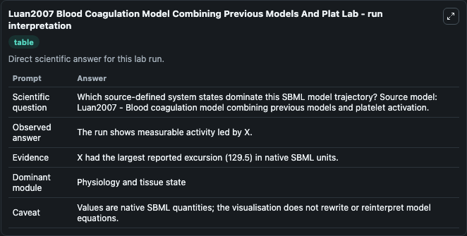
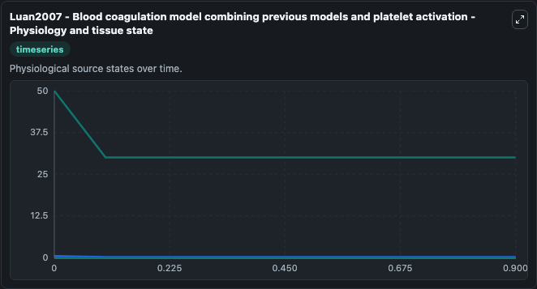
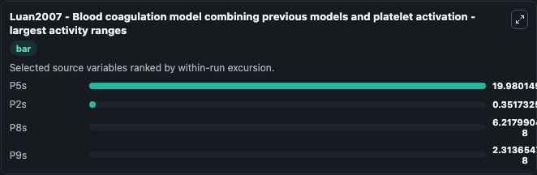
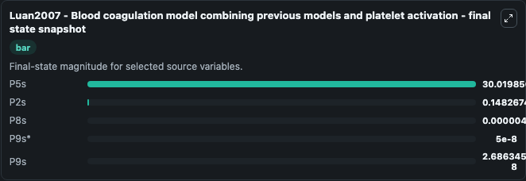
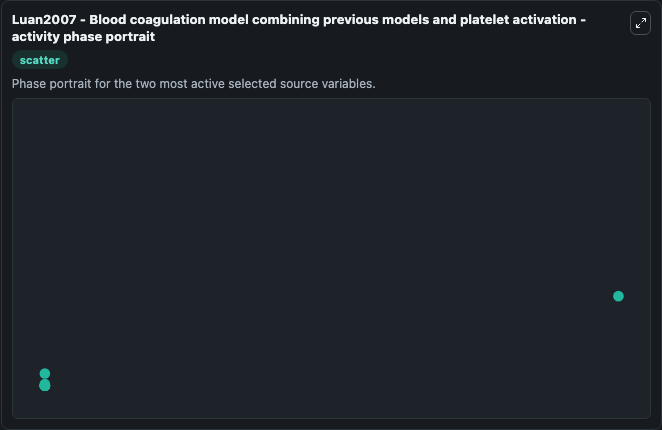

# Luan2007 Blood Coagulation Model Combining Previous Models And Plat

This Biosimulant lab wraps `Luan2007 Blood Coagulation Model Combining Previous Models And Plat` as a runnable systems biology model with a companion visualization module.
Mathematical model combining previous models (Jones1994, Leipoldt1995, Kuhursky2001, Hockin2002) into one model with platelet activation. It can be used to explore the configured dynamics and compare scenario outcomes across configurations.

## What You'll See

The lab asks: Which source-defined system states dominate this SBML model trajectory? Source model: Luan2007 - Blood coagulation model combining previous models and platelet activation. It runs for 1.0 time units with a communication step of 0.1. The run uses the model defaults declared by the curated SBML wrapper. The generated visualizations focus on P5s, P2s, P8s, P9s*, P9s, and Xa-i, combining trajectory, endpoint-comparison, and summary-table views from one completed dark-mode run.

In this captured run, **P5s** moved from 50.000 to 30.020 across 1.0 simulation windows.


### Output Visualizations



*Summary table for Luan2007 Blood Coagulation Model Combining Previous Models And Plat, reporting the scientific question, observed answer, dominant module, and caveat.*



*Trajectories of P5s, P2s, P8s, P9s, P9s*, and Xa-i across the 1.0 simulation. In this run **P5s** fell from 50.000 to 30.020 — the largest movements among the focused observables.*



*Largest-excursion ranking of the focused observables — the absolute movement magnitude during the run. Top 3: **P5s** = 19.980, **P2s** = 0.3517, **P8s** = 6.22e-08, with 1 more observable below.*



*Endpoint snapshot of the focused observables — final values from the captured run. Top 3 by value: **P5s** = 30.020, **P2s** = 0.1483, **P8s** = 4.94e-06, with 2 more observables below.*



*Visualization card from the Luan2007 Blood Coagulation Model Combining Previous Models And Plat dark-mode run.*


## Model Context

- Core model: `models/core`
- Visualization model: `models/visualisation`
- Standard: `other`
- Upstream source: `biomodels_ebi:MODEL1806050001`
- License: `CC0`

## Inputs

| Input | Maps To | Default | Notes |
|---|---|---|---|
| Initial Model State P5S | `systemsbiology_sbml_luan2007_blood_coagulation_model_combining_previ_model1806050001_model.initial_model_state_p5s` | | Source state initial condition exposed as a model-specific control because no explicit intervention parameter is identifiable. Maps to SBML symbol `P5s`. |
| Initial Model State P2S | `systemsbiology_sbml_luan2007_blood_coagulation_model_combining_previ_model1806050001_model.initial_model_state_p2s` | | Source state initial condition exposed as a model-specific control because no explicit intervention parameter is identifiable. Maps to SBML symbol `P2s`. |
| Initial Model State P8S | `systemsbiology_sbml_luan2007_blood_coagulation_model_combining_previ_model1806050001_model.initial_model_state_p8s` | | Source state initial condition exposed as a model-specific control because no explicit intervention parameter is identifiable. Maps to SBML symbol `P8s`. |
| Initial Model State P9S | `systemsbiology_sbml_luan2007_blood_coagulation_model_combining_previ_model1806050001_model.initial_model_state_p9s` | | Source state initial condition exposed as a model-specific control because no explicit intervention parameter is identifiable. Maps to SBML symbol `P9s_0`. |
| Initial Model State P9S 2 | `systemsbiology_sbml_luan2007_blood_coagulation_model_combining_previ_model1806050001_model.initial_model_state_p9s_2` | | Source state initial condition exposed as a model-specific control because no explicit intervention parameter is identifiable. Maps to SBML symbol `P9s`. |
| Initial Xa I | `systemsbiology_sbml_luan2007_blood_coagulation_model_combining_previ_model1806050001_model.initial_xa_i` | | Source state initial condition exposed as a model-specific control because no explicit intervention parameter is identifiable. Maps to SBML symbol `Xa_i`. |

## Outputs

| Output | Maps To | Role |
|---|---|---|
| `state` | `systemsbiology_sbml_luan2007_blood_coagulation_model_combining_previ_model1806050001_model.state` | Available to the visualization model and downstream workflows. |
| `summary` | `systemsbiology_sbml_luan2007_blood_coagulation_model_combining_previ_model1806050001_model.summary` | Available to the visualization model and downstream workflows. |
| `species_labels` | `systemsbiology_sbml_luan2007_blood_coagulation_model_combining_previ_model1806050001_model.species_labels` | Available to the visualization model and downstream workflows. |
| `p5s` | `systemsbiology_sbml_luan2007_blood_coagulation_model_combining_previ_model1806050001_model.p5s` | Available to the visualization model and downstream workflows. |
| `p2s` | `systemsbiology_sbml_luan2007_blood_coagulation_model_combining_previ_model1806050001_model.p2s` | Available to the visualization model and downstream workflows. |
| `p8s` | `systemsbiology_sbml_luan2007_blood_coagulation_model_combining_previ_model1806050001_model.p8s` | Available to the visualization model and downstream workflows. |
| `p9s` | `systemsbiology_sbml_luan2007_blood_coagulation_model_combining_previ_model1806050001_model.p9s` | Available to the visualization model and downstream workflows. |
| `p9s_2` | `systemsbiology_sbml_luan2007_blood_coagulation_model_combining_previ_model1806050001_model.p9s_2` | Available to the visualization model and downstream workflows. |
| `xa_i` | `systemsbiology_sbml_luan2007_blood_coagulation_model_combining_previ_model1806050001_model.xa_i` | Available to the visualization model and downstream workflows. |

## Runtime

- Duration: `1.0`
- Communication step: `0.1`

## Running Locally

```bash
biosimulant labs serve
```
