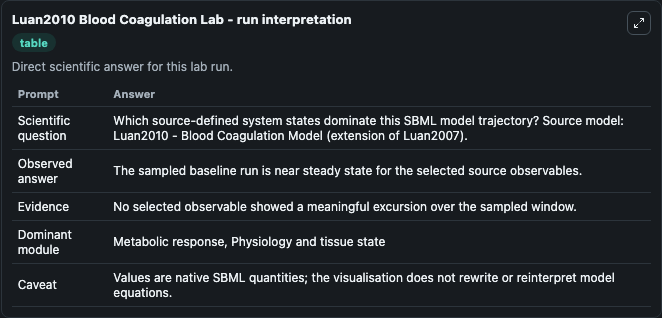
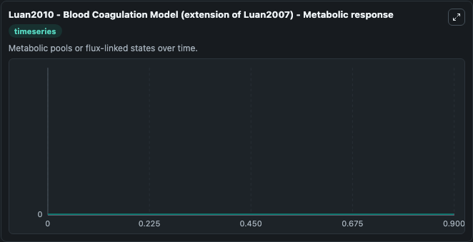

# Luan2010 Blood Coagulation

This Biosimulant lab wraps `Luan2010 Blood Coagulation` as a runnable systems biology model with a companion visualization module.
Mathematical model of blood coagulation. It can be used to explore the configured dynamics and compare scenario outcomes across configurations.

## What You'll See

The lab asks: Which source-defined system states dominate this SBML model trajectory? Source model: Luan2010 - Blood Coagulation Model (extension of Luan2007). It runs for 1.0 time units with a communication step of 0.1. The run uses the model defaults declared by the curated SBML wrapper. The generated visualizations focus on ADP-PL-Psub, ADP-PL, ADP, uPA-PCI, uPA-PAI2, and uPA-PAI1, combining trajectory, endpoint-comparison, and summary-table views from one completed dark-mode run.

In this captured run, **ADP-PL-Psub** moved from 0 to 0 across 1.0 simulation windows.


### Output Visualizations



*Summary table for Luan2010 Blood Coagulation, reporting the scientific question, observed answer, dominant module, and caveat.*



*Trajectories of ADP-PL-Psub, ADP-PL, ADP, uPA-PCI, uPA-PAI2, and uPA-PAI1 across the 1.0 simulation. In this run ADP-PL-Psub, ADP-PL, ADP, uPA-PCI stayed near their initial values — no observable moved appreciably.*


## Model Context

- Core model: `models/core`
- Visualization model: `models/visualisation`
- Standard: `other`
- Upstream source: `biomodels_ebi:MODEL1806250001`
- License: `CC0`

## Inputs

| Input | Maps To | Default | Notes |
|---|---|---|---|
| Initial ADP Pl Psub | `systemsbiology_sbml_luan2010_blood_coagulation_model_extension_of_lu_model1806250001_model.initial_adp_pl_psub` | | Source state initial condition exposed as a model-specific control because no explicit intervention parameter is identifiable. Maps to SBML symbol `ADP_PL_Psub`. |
| Initial ADP Pl | `systemsbiology_sbml_luan2010_blood_coagulation_model_extension_of_lu_model1806250001_model.initial_adp_pl` | | Source state initial condition exposed as a model-specific control because no explicit intervention parameter is identifiable. Maps to SBML symbol `ADP_PL`. |
| Initial Model State ADP | `systemsbiology_sbml_luan2010_blood_coagulation_model_extension_of_lu_model1806250001_model.initial_model_state_adp` | | Source state initial condition exposed as a model-specific control because no explicit intervention parameter is identifiable. Maps to SBML symbol `ADP`. |
| Initial U Pa Pci | `systemsbiology_sbml_luan2010_blood_coagulation_model_extension_of_lu_model1806250001_model.initial_u_pa_pci` | | Source state initial condition exposed as a model-specific control because no explicit intervention parameter is identifiable. Maps to SBML symbol `uPA_PCI`. |
| Initial U Pa Pai2 | `systemsbiology_sbml_luan2010_blood_coagulation_model_extension_of_lu_model1806250001_model.initial_u_pa_pai2` | | Source state initial condition exposed as a model-specific control because no explicit intervention parameter is identifiable. Maps to SBML symbol `uPA_PAI2`. |
| Initial U Pa Pai1 | `systemsbiology_sbml_luan2010_blood_coagulation_model_extension_of_lu_model1806250001_model.initial_u_pa_pai1` | | Source state initial condition exposed as a model-specific control because no explicit intervention parameter is identifiable. Maps to SBML symbol `uPA_PAI1`. |

## Outputs

| Output | Maps To | Role |
|---|---|---|
| `state` | `systemsbiology_sbml_luan2010_blood_coagulation_model_extension_of_lu_model1806250001_model.state` | Available to the visualization model and downstream workflows. |
| `summary` | `systemsbiology_sbml_luan2010_blood_coagulation_model_extension_of_lu_model1806250001_model.summary` | Available to the visualization model and downstream workflows. |
| `species_labels` | `systemsbiology_sbml_luan2010_blood_coagulation_model_extension_of_lu_model1806250001_model.species_labels` | Available to the visualization model and downstream workflows. |
| `adp_pl_psub` | `systemsbiology_sbml_luan2010_blood_coagulation_model_extension_of_lu_model1806250001_model.adp_pl_psub` | Available to the visualization model and downstream workflows. |
| `adp_pl` | `systemsbiology_sbml_luan2010_blood_coagulation_model_extension_of_lu_model1806250001_model.adp_pl` | Available to the visualization model and downstream workflows. |
| `adp` | `systemsbiology_sbml_luan2010_blood_coagulation_model_extension_of_lu_model1806250001_model.adp` | Available to the visualization model and downstream workflows. |
| `u_pa_pci` | `systemsbiology_sbml_luan2010_blood_coagulation_model_extension_of_lu_model1806250001_model.u_pa_pci` | Available to the visualization model and downstream workflows. |
| `u_pa_pai2` | `systemsbiology_sbml_luan2010_blood_coagulation_model_extension_of_lu_model1806250001_model.u_pa_pai2` | Available to the visualization model and downstream workflows. |
| `u_pa_pai1` | `systemsbiology_sbml_luan2010_blood_coagulation_model_extension_of_lu_model1806250001_model.u_pa_pai1` | Available to the visualization model and downstream workflows. |

## Runtime

- Duration: `1.0`
- Communication step: `0.1`

## Running Locally

```bash
biosimulant labs serve
```
