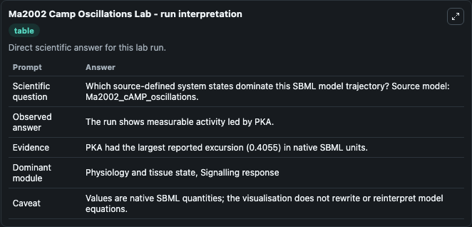
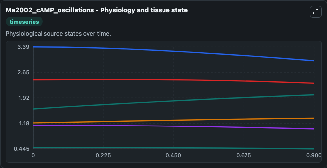
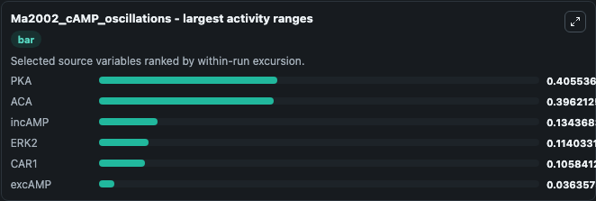
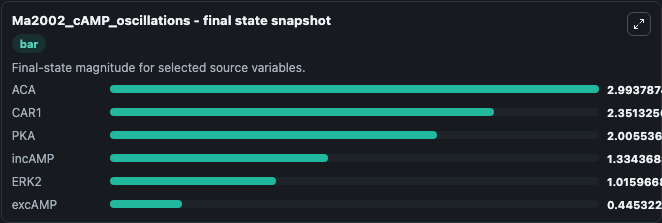
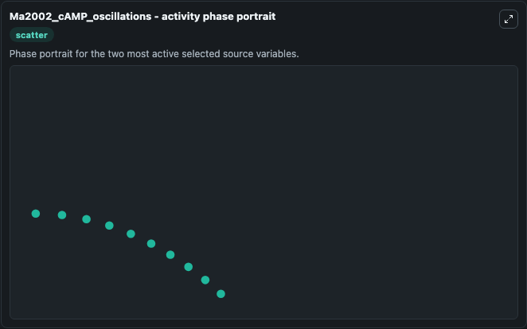

# Ma2002 Camp Oscillations

This Biosimulant lab wraps `Ma2002 Camp Oscillations` as a runnable systems biology model with a companion visualization module.
This a model from the article: Quantifying robustness of biochemical network models. It can be used to explore the configured dynamics and compare scenario outcomes across configurations.

## What You'll See

The lab asks: Which source-defined system states dominate this SBML model trajectory? Source model: Ma2002_cAMP_oscillations. It runs for 1.0 time units with a communication step of 0.1. The run uses the model defaults declared by the curated SBML wrapper. The generated visualizations focus on ERK2, incAMP, excAMP, ACA, CAR1, and PKA, combining trajectory, endpoint-comparison, and summary-table views from one completed dark-mode run.

In this captured run, **PKA** moved from 1.600 to 2.006 across 1.0 simulation windows.


### Output Visualizations



*Summary table for Ma2002 Camp Oscillations, reporting the scientific question, observed answer, dominant module, and caveat.*



*Trajectories of PKA, ACA, incAMP, ERK2, CAR1, and excAMP across the 1.0 simulation. In this run **PKA** climbed from 1.600 to 2.006 and **ACA** fell from 3.390 to 2.994 — the largest movements among the focused observables.*



*Largest-excursion ranking of the focused observables — the absolute movement magnitude during the run. Top 3: **PKA** = 0.4055, **ACA** = 0.3962, **incAMP** = 0.1344, with 3 more observables below.*



*Endpoint snapshot of the focused observables — final values from the captured run. Top 3 by value: **ACA** = 2.994, **CAR1** = 2.351, **PKA** = 2.006, with 3 more observables below.*



*Visualization card from the Ma2002 Camp Oscillations dark-mode run.*


## Model Context

- Core model: `models/core`
- Visualization model: `models/visualisation`
- Standard: `other`
- Upstream source: `biomodels_ebi:BIOMD0000000229`
- License: `CC0`

## Inputs

| Input | Maps To | Default | Notes |
|---|---|---|---|
| Initial Erk2 | `systemsbiology_sbml_ma2002_camp_oscillations_biomd0000000229_model.initial_erk2` | | Source state initial condition exposed as a model-specific control because no explicit intervention parameter is identifiable. Maps to SBML symbol `ERK2`. |
| Initial Incamp | `systemsbiology_sbml_ma2002_camp_oscillations_biomd0000000229_model.initial_incamp` | | Source state initial condition exposed as a model-specific control because no explicit intervention parameter is identifiable. Maps to SBML symbol `incAMP`. |
| Initial Excamp | `systemsbiology_sbml_ma2002_camp_oscillations_biomd0000000229_model.initial_excamp` | | Source state initial condition exposed as a model-specific control because no explicit intervention parameter is identifiable. Maps to SBML symbol `excAMP`. |
| Initial Model State Aca | `systemsbiology_sbml_ma2002_camp_oscillations_biomd0000000229_model.initial_model_state_aca` | | Source state initial condition exposed as a model-specific control because no explicit intervention parameter is identifiable. Maps to SBML symbol `ACA`. |
| Initial Car1 | `systemsbiology_sbml_ma2002_camp_oscillations_biomd0000000229_model.initial_car1` | | Source state initial condition exposed as a model-specific control because no explicit intervention parameter is identifiable. Maps to SBML symbol `CAR1`. |
| Initial Model State Pka | `systemsbiology_sbml_ma2002_camp_oscillations_biomd0000000229_model.initial_model_state_pka` | | Source state initial condition exposed as a model-specific control because no explicit intervention parameter is identifiable. Maps to SBML symbol `PKA`. |

## Outputs

| Output | Maps To | Role |
|---|---|---|
| `state` | `systemsbiology_sbml_ma2002_camp_oscillations_biomd0000000229_model.state` | Available to the visualization model and downstream workflows. |
| `summary` | `systemsbiology_sbml_ma2002_camp_oscillations_biomd0000000229_model.summary` | Available to the visualization model and downstream workflows. |
| `species_labels` | `systemsbiology_sbml_ma2002_camp_oscillations_biomd0000000229_model.species_labels` | Available to the visualization model and downstream workflows. |
| `erk2` | `systemsbiology_sbml_ma2002_camp_oscillations_biomd0000000229_model.erk2` | Available to the visualization model and downstream workflows. |
| `incamp` | `systemsbiology_sbml_ma2002_camp_oscillations_biomd0000000229_model.incamp` | Available to the visualization model and downstream workflows. |
| `excamp` | `systemsbiology_sbml_ma2002_camp_oscillations_biomd0000000229_model.excamp` | Available to the visualization model and downstream workflows. |
| `aca` | `systemsbiology_sbml_ma2002_camp_oscillations_biomd0000000229_model.aca` | Available to the visualization model and downstream workflows. |
| `car1` | `systemsbiology_sbml_ma2002_camp_oscillations_biomd0000000229_model.car1` | Available to the visualization model and downstream workflows. |
| `pka` | `systemsbiology_sbml_ma2002_camp_oscillations_biomd0000000229_model.pka` | Available to the visualization model and downstream workflows. |

## Runtime

- Duration: `1.0`
- Communication step: `0.1`

## Running Locally

```bash
biosimulant labs serve
```
