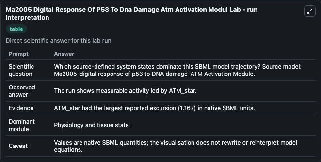
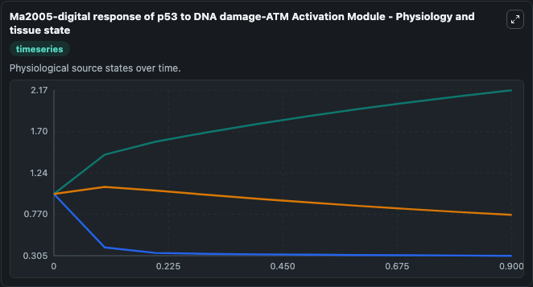
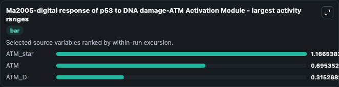
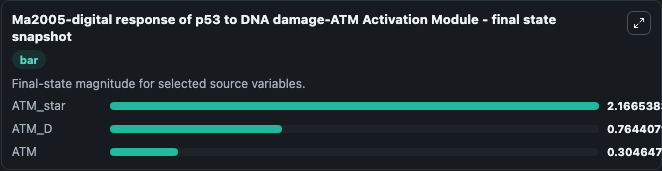
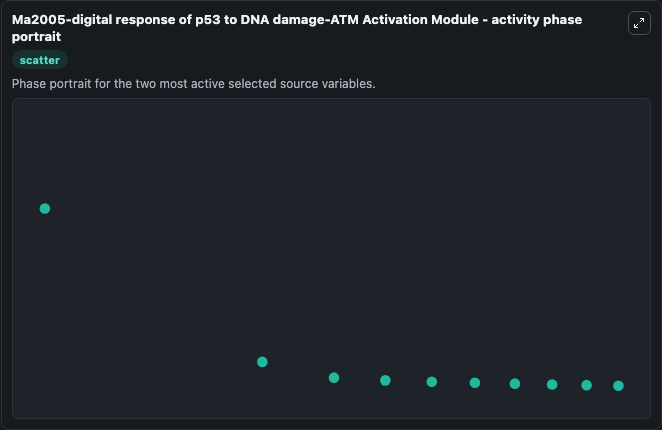

# Ma2005 Digital Response Of P53 To Dna Damage Atm Activation Modul

This Biosimulant lab wraps `Ma2005 Digital Response Of P53 To Dna Damage Atm Activation Modul` as a runnable systems biology model with a companion visualization module.
Recent observations show that the single-cell response of p53 to ionizing radiation (IR) is “digital” in that it is the number of oscillations rather than the amplitude of p53 that shows dependence on. It can be used to explore the configured dynamics and compare scenario outcomes across configurations.

## What You'll See

The lab asks: Which source-defined system states dominate this SBML model trajectory? Source model: Ma2005-digital response of p53 to DNA damage-ATM Activation Module. It runs for 1.0 time units with a communication step of 0.1. The run uses the model defaults declared by the curated SBML wrapper. The generated visualizations focus on ATM_star, ATM_D, and ATM, combining trajectory, endpoint-comparison, and summary-table views from one completed dark-mode run.

In this captured run, **ATM_star** moved from 1.000 to 2.167 across 1.0 simulation windows.


### Output Visualizations



*Summary table for Ma2005 Digital Response Of P53 To Dna Damage Atm Activation Modul, reporting the scientific question, observed answer, dominant module, and caveat.*



*Trajectories of ATM_star, ATM, and ATM_D across the 1.0 simulation. In this run **ATM_star** climbed from 1.000 to 2.167 and **ATM** fell from 1.000 to 0.3046 — the largest movements among the focused observables.*



*Trajectories of ATM_star, ATM, and ATM_D across the 1.0 simulation. In this run **ATM_star** climbed from 1.000 to 2.167 and **ATM** fell from 1.000 to 0.3046 — the largest movements among the focused observables.*



*Trajectories of ATM_star, ATM, and ATM_D across the 1.0 simulation. In this run **ATM_star** climbed from 1.000 to 2.167 and **ATM** fell from 1.000 to 0.3046 — the largest movements among the focused observables.*



*Trajectories of ATM_star, ATM, and ATM_D across the 1.0 simulation. In this run **ATM_star** climbed from 1.000 to 2.167 and **ATM** fell from 1.000 to 0.3046 — the largest movements among the focused observables.*


## Model Context

- Core model: `models/core`
- Visualization model: `models/visualisation`
- Standard: `other`
- Upstream source: `biomodels_ebi:MODEL2005130001`
- License: `CC0`

## Inputs

| Input | Maps To | Default | Notes |
|---|---|---|---|
| Initial Atm Star | `systemsbiology_sbml_ma2005_digital_response_of_p53_to_dna_damage_atm_model2005130001_model.initial_atm_star` | | Source state initial condition exposed as a model-specific control because no explicit intervention parameter is identifiable. Maps to SBML symbol `ATM_star`. |
| Initial Atm D | `systemsbiology_sbml_ma2005_digital_response_of_p53_to_dna_damage_atm_model2005130001_model.initial_atm_d` | | Source state initial condition exposed as a model-specific control because no explicit intervention parameter is identifiable. Maps to SBML symbol `ATM_D`. |
| Initial Model State Atm | `systemsbiology_sbml_ma2005_digital_response_of_p53_to_dna_damage_atm_model2005130001_model.initial_model_state_atm` | | Source state initial condition exposed as a model-specific control because no explicit intervention parameter is identifiable. Maps to SBML symbol `ATM`. |

## Outputs

| Output | Maps To | Role |
|---|---|---|
| `state` | `systemsbiology_sbml_ma2005_digital_response_of_p53_to_dna_damage_atm_model2005130001_model.state` | Available to the visualization model and downstream workflows. |
| `summary` | `systemsbiology_sbml_ma2005_digital_response_of_p53_to_dna_damage_atm_model2005130001_model.summary` | Available to the visualization model and downstream workflows. |
| `species_labels` | `systemsbiology_sbml_ma2005_digital_response_of_p53_to_dna_damage_atm_model2005130001_model.species_labels` | Available to the visualization model and downstream workflows. |
| `atm_star` | `systemsbiology_sbml_ma2005_digital_response_of_p53_to_dna_damage_atm_model2005130001_model.atm_star` | Available to the visualization model and downstream workflows. |
| `atm_d` | `systemsbiology_sbml_ma2005_digital_response_of_p53_to_dna_damage_atm_model2005130001_model.atm_d` | Available to the visualization model and downstream workflows. |
| `atm` | `systemsbiology_sbml_ma2005_digital_response_of_p53_to_dna_damage_atm_model2005130001_model.atm` | Available to the visualization model and downstream workflows. |

## Runtime

- Duration: `1.0`
- Communication step: `0.1`

## Running Locally

```bash
biosimulant labs serve
```
