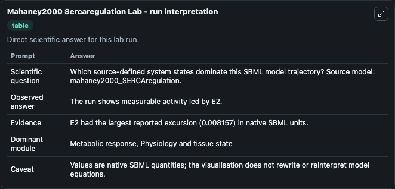
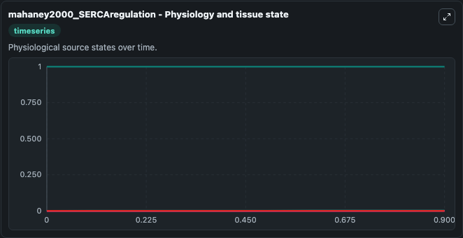
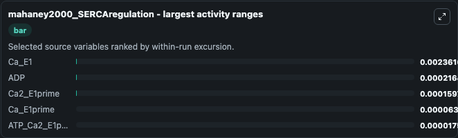
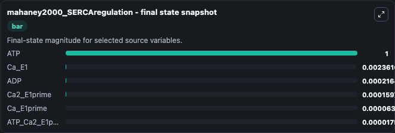
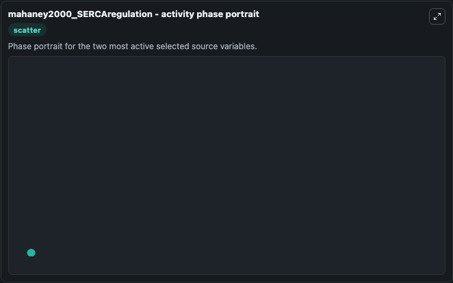

# Mahaney2000 Sercaregulation

This Biosimulant lab wraps `Mahaney2000 Sercaregulation` as a runnable systems biology model with a companion visualization module.
This model originates from BioModels Database: A Database of Annotated Published Models. It can be used to explore the configured dynamics and compare scenario outcomes across configurations.

## What You'll See

The lab asks: Which source-defined system states dominate this SBML model trajectory? Source model: mahaney2000_SERCAregulation. It runs for 1.0 time units with a communication step of 0.1. The run uses the model defaults declared by the curated SBML wrapper. The generated visualizations focus on ATP_Ca2_E1prime, ATP, ADP, Ca_E1prime, Ca_E1, and Ca2_E1prime, combining trajectory, endpoint-comparison, and summary-table views from one completed dark-mode run.

In this captured run, **Ca_E1** moved from 0 to 0.00236 across 1.0 simulation windows.


### Output Visualizations



*Summary table for Mahaney2000 Sercaregulation, reporting the scientific question, observed answer, dominant module, and caveat.*



*Trajectories of Ca_E1, ADP, Ca2_E1prime, Ca_E1prime, ATP_Ca2_E1prime, and ATP across the 1.0 simulation. In this run **Ca_E1** climbed from 0 to 0.00236 — the largest movements among the focused observables.*



*Largest-excursion ranking of the focused observables — the absolute movement magnitude during the run. Top 3: **Ca_E1** = 0.00236, **ADP** = 0.000216, **Ca2_E1prime** = 0.00016, with 2 more observables below.*



*Endpoint snapshot of the focused observables — final values from the captured run. Top 3 by value: **ATP** = 1.000, **Ca_E1** = 0.00236, **ADP** = 0.000216, with 3 more observables below.*



*Visualization card from the Mahaney2000 Sercaregulation dark-mode run.*


## Model Context

- Core model: `models/core`
- Visualization model: `models/visualisation`
- Standard: `other`
- Upstream source: `biomodels_ebi:MODEL4816599063`
- License: `CC0`

## Inputs

| Input | Maps To | Default | Notes |
|---|---|---|---|
| Initial ATP CA2 E1prime | `systemsbiology_sbml_mahaney2000_sercaregulation_model4816599063_model.initial_atp_ca2_e1prime` | | Source state initial condition exposed as a model-specific control because no explicit intervention parameter is identifiable. Maps to SBML symbol `ATP_Ca2_E1prime`. |
| Initial Model State ATP | `systemsbiology_sbml_mahaney2000_sercaregulation_model4816599063_model.initial_model_state_atp` | | Source state initial condition exposed as a model-specific control because no explicit intervention parameter is identifiable. Maps to SBML symbol `ATP`. |
| Initial Model State ADP | `systemsbiology_sbml_mahaney2000_sercaregulation_model4816599063_model.initial_model_state_adp` | | Source state initial condition exposed as a model-specific control because no explicit intervention parameter is identifiable. Maps to SBML symbol `ADP`. |
| Initial Ca E1prime | `systemsbiology_sbml_mahaney2000_sercaregulation_model4816599063_model.initial_ca_e1prime` | | Source state initial condition exposed as a model-specific control because no explicit intervention parameter is identifiable. Maps to SBML symbol `Ca_E1prime`. |
| Initial Ca E1 | `systemsbiology_sbml_mahaney2000_sercaregulation_model4816599063_model.initial_ca_e1` | | Source state initial condition exposed as a model-specific control because no explicit intervention parameter is identifiable. Maps to SBML symbol `Ca_E1`. |
| Initial CA2 E1prime | `systemsbiology_sbml_mahaney2000_sercaregulation_model4816599063_model.initial_ca2_e1prime` | | Source state initial condition exposed as a model-specific control because no explicit intervention parameter is identifiable. Maps to SBML symbol `Ca2_E1prime`. |

## Outputs

| Output | Maps To | Role |
|---|---|---|
| `state` | `systemsbiology_sbml_mahaney2000_sercaregulation_model4816599063_model.state` | Available to the visualization model and downstream workflows. |
| `summary` | `systemsbiology_sbml_mahaney2000_sercaregulation_model4816599063_model.summary` | Available to the visualization model and downstream workflows. |
| `species_labels` | `systemsbiology_sbml_mahaney2000_sercaregulation_model4816599063_model.species_labels` | Available to the visualization model and downstream workflows. |
| `atp_ca2_e1prime` | `systemsbiology_sbml_mahaney2000_sercaregulation_model4816599063_model.atp_ca2_e1prime` | Available to the visualization model and downstream workflows. |
| `atp` | `systemsbiology_sbml_mahaney2000_sercaregulation_model4816599063_model.atp` | Available to the visualization model and downstream workflows. |
| `adp` | `systemsbiology_sbml_mahaney2000_sercaregulation_model4816599063_model.adp` | Available to the visualization model and downstream workflows. |
| `ca_e1prime` | `systemsbiology_sbml_mahaney2000_sercaregulation_model4816599063_model.ca_e1prime` | Available to the visualization model and downstream workflows. |
| `ca_e1` | `systemsbiology_sbml_mahaney2000_sercaregulation_model4816599063_model.ca_e1` | Available to the visualization model and downstream workflows. |
| `ca2_e1prime` | `systemsbiology_sbml_mahaney2000_sercaregulation_model4816599063_model.ca2_e1prime` | Available to the visualization model and downstream workflows. |

## Runtime

- Duration: `1.0`
- Communication step: `0.1`

## Running Locally

```bash
biosimulant labs serve
```
