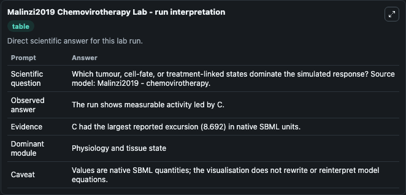
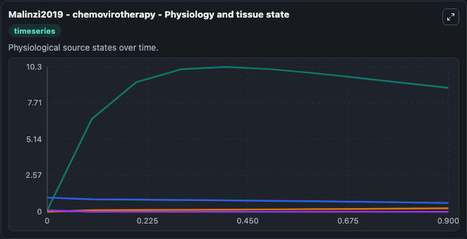
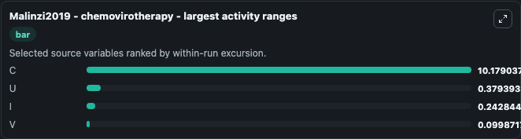
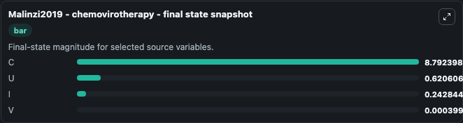
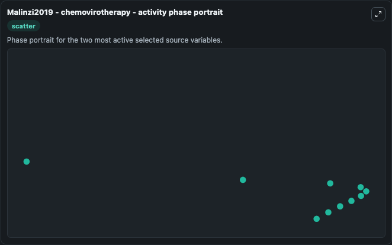

# Malinzi2019 Chemovirotherapy

This Biosimulant lab wraps `Malinzi2019 Chemovirotherapy` as a runnable systems biology model with a companion visualization module.
The paper describes a model of oncolytic virothherapy. It can be used to explore the configured dynamics and compare scenario outcomes across configurations.

## What You'll See

The lab asks: Which tumour, cell-fate, or treatment-linked states dominate the simulated response? Source model: Malinzi2019 - chemovirotherapy. It runs for 1.0 time units with a communication step of 0.1. The run uses the model defaults declared by the curated SBML wrapper. The generated visualizations focus on U, V, C, and I, combining trajectory, endpoint-comparison, and summary-table views from one completed dark-mode run.

In this captured run, **C** moved from 0.1000 to 8.792 across 1.0 simulation windows.


### Output Visualizations



*Summary table for Malinzi2019 Chemovirotherapy, reporting the scientific question, observed answer, dominant module, and caveat.*



*Trajectories of C, U, I, and V across the 1.0 simulation. In this run **C** climbed from 0.1000 to 8.792 and **U** fell from 1.000 to 0.6206 — the largest movements among the focused observables.*



*Largest-excursion ranking of the focused observables — the absolute movement magnitude during the run. Top 3: **C** = 10.179, **U** = 0.3794, **I** = 0.2428, with 1 more observable below.*



*Endpoint snapshot of the focused observables — final values from the captured run. Top 3 by value: **C** = 8.792, **U** = 0.6206, **I** = 0.2428, with 1 more observable below.*



*Visualization card from the Malinzi2019 Chemovirotherapy dark-mode run.*


## Model Context

- Core model: `models/core`
- Visualization model: `models/visualisation`
- Standard: `other`
- Upstream source: `biomodels_ebi:BIOMD0000000764`
- License: `CC0`

## Inputs

| Input | Maps To | Default | Notes |
|---|---|---|---|
| Initial Model State U | `systemsbiology_sbml_malinzi2019_chemovirotherapy_biomd0000000764_model.initial_model_state_u` | | Source state initial condition exposed as a model-specific control because no explicit intervention parameter is identifiable. Maps to SBML symbol `U`. |
| Initial Model State V | `systemsbiology_sbml_malinzi2019_chemovirotherapy_biomd0000000764_model.initial_model_state_v` | | Source state initial condition exposed as a model-specific control because no explicit intervention parameter is identifiable. Maps to SBML symbol `V`. |
| Initial Model State C | `systemsbiology_sbml_malinzi2019_chemovirotherapy_biomd0000000764_model.initial_model_state_c` | | Source state initial condition exposed as a model-specific control because no explicit intervention parameter is identifiable. Maps to SBML symbol `C`. |
| Initial Model State I | `systemsbiology_sbml_malinzi2019_chemovirotherapy_biomd0000000764_model.initial_model_state_i` | | Source state initial condition exposed as a model-specific control because no explicit intervention parameter is identifiable. Maps to SBML symbol `I`. |

## Outputs

| Output | Maps To | Role |
|---|---|---|
| `state` | `systemsbiology_sbml_malinzi2019_chemovirotherapy_biomd0000000764_model.state` | Available to the visualization model and downstream workflows. |
| `summary` | `systemsbiology_sbml_malinzi2019_chemovirotherapy_biomd0000000764_model.summary` | Available to the visualization model and downstream workflows. |
| `species_labels` | `systemsbiology_sbml_malinzi2019_chemovirotherapy_biomd0000000764_model.species_labels` | Available to the visualization model and downstream workflows. |
| `model_state_u` | `systemsbiology_sbml_malinzi2019_chemovirotherapy_biomd0000000764_model.model_state_u` | Available to the visualization model and downstream workflows. |
| `model_state_v` | `systemsbiology_sbml_malinzi2019_chemovirotherapy_biomd0000000764_model.model_state_v` | Available to the visualization model and downstream workflows. |
| `model_state_c` | `systemsbiology_sbml_malinzi2019_chemovirotherapy_biomd0000000764_model.model_state_c` | Available to the visualization model and downstream workflows. |
| `model_state_i` | `systemsbiology_sbml_malinzi2019_chemovirotherapy_biomd0000000764_model.model_state_i` | Available to the visualization model and downstream workflows. |

## Runtime

- Duration: `1.0`
- Communication step: `0.1`

## Running Locally

```bash
biosimulant labs serve
```
