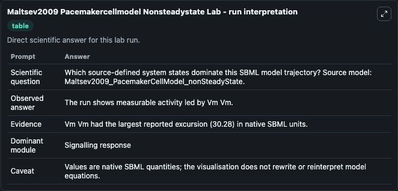
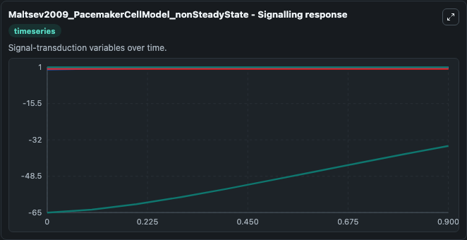
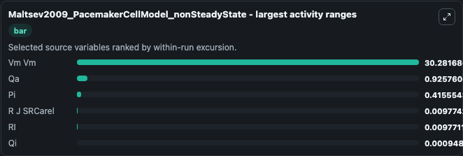
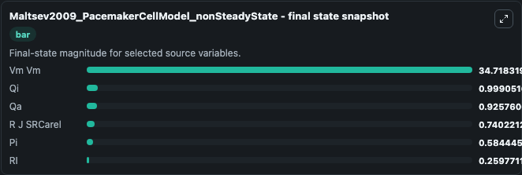
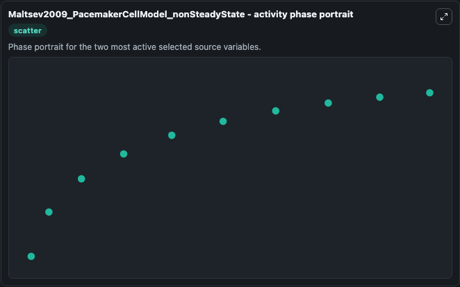

# Maltsev2009 Pacemakercellmodel Nonsteadystate

This Biosimulant lab wraps `Maltsev2009 Pacemakercellmodel Nonsteadystate` as a runnable systems biology model with a companion visualization module.
This a model from the article: Synergism of coupled subsarcolemmal Ca2+ clocks and sarcolemmal voltage clocksconfers robust and flexible pacemaker function in a novel pacemaker cell model. It can be used to explore the configured dynamics and compare scenario outcomes across configurations.

## What You'll See

The lab asks: Which source-defined system states dominate this SBML model trajectory? Source model: Maltsev2009_PacemakerCellModel_nonSteadyState. It runs for 1.0 time units with a communication step of 0.1. The run uses the model defaults declared by the curated SBML wrapper. The generated visualizations focus on Vm Vm, RI, R J SRCarel, Qi, Qa, and Pi, combining trajectory, endpoint-comparison, and summary-table views from one completed dark-mode run.

In this captured run, **Vm Vm** moved from -65.000 to -34.718 across 1.0 simulation windows.


### Output Visualizations



*Summary table for Maltsev2009 Pacemakercellmodel Nonsteadystate, reporting the scientific question, observed answer, dominant module, and caveat.*



*Trajectories of Vm Vm, Qa, Pi, R J SRCarel, RI, and Qi across the 1.0 simulation. In this run **Vm Vm** climbed from -65.000 to -34.718 and **Pi** fell from 1.000 to 0.5844 — the largest movements among the focused observables.*



*Largest-excursion ranking of the focused observables — the absolute movement magnitude during the run. Top 3: **Vm Vm** = 30.282, **Qa** = 0.9258, **Pi** = 0.4156, with 3 more observables below.*



*Endpoint snapshot of the focused observables — final values from the captured run. Top 3 by value: **Vm Vm** = 34.718, **Qi** = 0.9991, **Qa** = 0.9258, with 3 more observables below.*



*Visualization card from the Maltsev2009 Pacemakercellmodel Nonsteadystate dark-mode run.*


## Model Context

- Core model: `models/core`
- Visualization model: `models/visualisation`
- Standard: `other`
- Upstream source: `biomodels_ebi:MODEL1006230069`
- License: `CC0`

## Inputs

| Input | Maps To | Default | Notes |
|---|---|---|---|
| Initial Vm Vm | `systemsbiology_sbml_maltsev2009_pacemakercellmodel_nonsteadystate_model1006230069_model.initial_vm_vm` | | Source state initial condition exposed as a model-specific control because no explicit intervention parameter is identifiable. Maps to SBML symbol `Vm_Vm`. |
| Initial Model State Ri | `systemsbiology_sbml_maltsev2009_pacemakercellmodel_nonsteadystate_model1006230069_model.initial_model_state_ri` | | Source state initial condition exposed as a model-specific control because no explicit intervention parameter is identifiable. Maps to SBML symbol `RI`. |
| Initial R J Sr Carel | `systemsbiology_sbml_maltsev2009_pacemakercellmodel_nonsteadystate_model1006230069_model.initial_r_j_sr_carel` | | Source state initial condition exposed as a model-specific control because no explicit intervention parameter is identifiable. Maps to SBML symbol `R_j_SRCarel`. |
| Initial Model State Qi | `systemsbiology_sbml_maltsev2009_pacemakercellmodel_nonsteadystate_model1006230069_model.initial_model_state_qi` | | Source state initial condition exposed as a model-specific control because no explicit intervention parameter is identifiable. Maps to SBML symbol `qi`. |
| Initial Model State Qa | `systemsbiology_sbml_maltsev2009_pacemakercellmodel_nonsteadystate_model1006230069_model.initial_model_state_qa` | | Source state initial condition exposed as a model-specific control because no explicit intervention parameter is identifiable. Maps to SBML symbol `qa`. |
| Initial Model State Pi | `systemsbiology_sbml_maltsev2009_pacemakercellmodel_nonsteadystate_model1006230069_model.initial_model_state_pi` | | Source state initial condition exposed as a model-specific control because no explicit intervention parameter is identifiable. Maps to SBML symbol `pi_`. |

## Outputs

| Output | Maps To | Role |
|---|---|---|
| `state` | `systemsbiology_sbml_maltsev2009_pacemakercellmodel_nonsteadystate_model1006230069_model.state` | Available to the visualization model and downstream workflows. |
| `summary` | `systemsbiology_sbml_maltsev2009_pacemakercellmodel_nonsteadystate_model1006230069_model.summary` | Available to the visualization model and downstream workflows. |
| `species_labels` | `systemsbiology_sbml_maltsev2009_pacemakercellmodel_nonsteadystate_model1006230069_model.species_labels` | Available to the visualization model and downstream workflows. |
| `vm_vm` | `systemsbiology_sbml_maltsev2009_pacemakercellmodel_nonsteadystate_model1006230069_model.vm_vm` | Available to the visualization model and downstream workflows. |
| `model_state_ri` | `systemsbiology_sbml_maltsev2009_pacemakercellmodel_nonsteadystate_model1006230069_model.model_state_ri` | Available to the visualization model and downstream workflows. |
| `r_j_sr_carel` | `systemsbiology_sbml_maltsev2009_pacemakercellmodel_nonsteadystate_model1006230069_model.r_j_sr_carel` | Available to the visualization model and downstream workflows. |
| `model_state_qi` | `systemsbiology_sbml_maltsev2009_pacemakercellmodel_nonsteadystate_model1006230069_model.model_state_qi` | Available to the visualization model and downstream workflows. |
| `model_state_qa` | `systemsbiology_sbml_maltsev2009_pacemakercellmodel_nonsteadystate_model1006230069_model.model_state_qa` | Available to the visualization model and downstream workflows. |
| `model_state_pi` | `systemsbiology_sbml_maltsev2009_pacemakercellmodel_nonsteadystate_model1006230069_model.model_state_pi` | Available to the visualization model and downstream workflows. |

## Runtime

- Duration: `1.0`
- Communication step: `0.1`

## Running Locally

```bash
biosimulant labs serve
```
