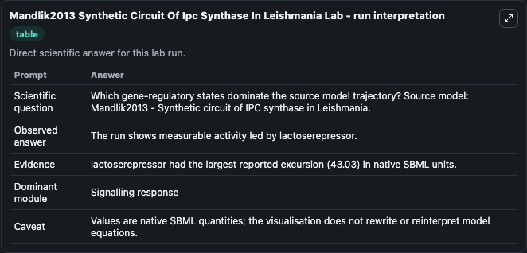
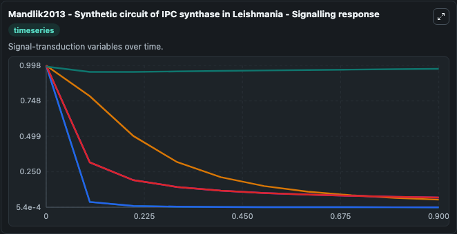
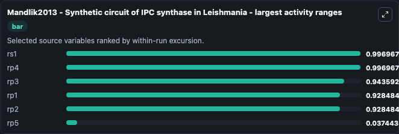
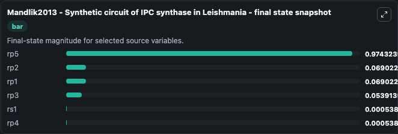
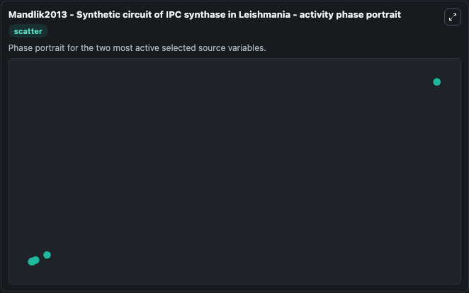

# Mandlik2013 Synthetic Circuit Of Ipc Synthase In Leishmania

This Biosimulant lab wraps `Mandlik2013 Synthetic Circuit Of Ipc Synthase In Leishmania` as a runnable systems biology model with a companion visualization module.
Mandlik2012 - Synthetic circuit of IPC synthase in Leishmania A genetic circuit for the targeted enzyme inositol phosphorylceramide (IPC) synthase belonging to the protozoan parasite Leishmania is con. It can be used to explore the configured dynamics and compare scenario outcomes across configurations.

## What You'll See

The lab asks: Which gene-regulatory states dominate the source model trajectory? Source model: Mandlik2013 - Synthetic circuit of IPC synthase in Leishmania. It runs for 1.0 time units with a communication step of 0.1. The run uses the model defaults declared by the curated SBML wrapper. The generated visualizations focus on rs1, rp5, rp4, rp3, rp2, and rp1, combining trajectory, endpoint-comparison, and summary-table views from one completed dark-mode run.

In this captured run, **rs1** moved from 0.9975 to 0.000539 across 1.0 simulation windows.


### Output Visualizations



*Summary table for Mandlik2013 Synthetic Circuit Of Ipc Synthase In Leishmania, reporting the scientific question, observed answer, dominant module, and caveat.*



*Trajectories of rs1, rp4, rp3, rp1, rp2, and rp5 across the 1.0 simulation. In this run **rs1** fell from 0.9975 to 0.000539 — the largest movements among the focused observables.*



*Largest-excursion ranking of the focused observables — the absolute movement magnitude during the run. Top 3: **rs1** = 0.9970, **rp4** = 0.9970, **rp3** = 0.9436, with 3 more observables below.*



*Endpoint snapshot of the focused observables — final values from the captured run. Top 3 by value: **rp5** = 0.9743, **rp2** = 0.0690, **rp1** = 0.0690, with 3 more observables below.*



*Visualization card from the Mandlik2013 Synthetic Circuit Of Ipc Synthase In Leishmania dark-mode run.*


## Model Context

- Core model: `models/core`
- Visualization model: `models/visualisation`
- Standard: `other`
- Upstream source: `biomodels_ebi:MODEL1208030000`
- License: `CC0`

## Inputs

| Input | Maps To | Default | Notes |
|---|---|---|---|
| Initial Model State RS1 | `systemsbiology_sbml_mandlik2013_synthetic_circuit_of_ipc_synthase_in_model1208030000_model.initial_model_state_rs1` | | Source state initial condition exposed as a model-specific control because no explicit intervention parameter is identifiable. Maps to SBML symbol `rs1`. |
| Initial Model State RP5 | `systemsbiology_sbml_mandlik2013_synthetic_circuit_of_ipc_synthase_in_model1208030000_model.initial_model_state_rp5` | | Source state initial condition exposed as a model-specific control because no explicit intervention parameter is identifiable. Maps to SBML symbol `rp5`. |
| Initial Model State RP4 | `systemsbiology_sbml_mandlik2013_synthetic_circuit_of_ipc_synthase_in_model1208030000_model.initial_model_state_rp4` | | Source state initial condition exposed as a model-specific control because no explicit intervention parameter is identifiable. Maps to SBML symbol `rp4`. |
| Initial Model State RP3 | `systemsbiology_sbml_mandlik2013_synthetic_circuit_of_ipc_synthase_in_model1208030000_model.initial_model_state_rp3` | | Source state initial condition exposed as a model-specific control because no explicit intervention parameter is identifiable. Maps to SBML symbol `rp3`. |
| Initial Model State RP2 | `systemsbiology_sbml_mandlik2013_synthetic_circuit_of_ipc_synthase_in_model1208030000_model.initial_model_state_rp2` | | Source state initial condition exposed as a model-specific control because no explicit intervention parameter is identifiable. Maps to SBML symbol `rp2`. |
| Initial Model State RP1 | `systemsbiology_sbml_mandlik2013_synthetic_circuit_of_ipc_synthase_in_model1208030000_model.initial_model_state_rp1` | | Source state initial condition exposed as a model-specific control because no explicit intervention parameter is identifiable. Maps to SBML symbol `rp1`. |

## Outputs

| Output | Maps To | Role |
|---|---|---|
| `state` | `systemsbiology_sbml_mandlik2013_synthetic_circuit_of_ipc_synthase_in_model1208030000_model.state` | Available to the visualization model and downstream workflows. |
| `summary` | `systemsbiology_sbml_mandlik2013_synthetic_circuit_of_ipc_synthase_in_model1208030000_model.summary` | Available to the visualization model and downstream workflows. |
| `species_labels` | `systemsbiology_sbml_mandlik2013_synthetic_circuit_of_ipc_synthase_in_model1208030000_model.species_labels` | Available to the visualization model and downstream workflows. |
| `rs1` | `systemsbiology_sbml_mandlik2013_synthetic_circuit_of_ipc_synthase_in_model1208030000_model.rs1` | Available to the visualization model and downstream workflows. |
| `rp5` | `systemsbiology_sbml_mandlik2013_synthetic_circuit_of_ipc_synthase_in_model1208030000_model.rp5` | Available to the visualization model and downstream workflows. |
| `rp4` | `systemsbiology_sbml_mandlik2013_synthetic_circuit_of_ipc_synthase_in_model1208030000_model.rp4` | Available to the visualization model and downstream workflows. |
| `rp3` | `systemsbiology_sbml_mandlik2013_synthetic_circuit_of_ipc_synthase_in_model1208030000_model.rp3` | Available to the visualization model and downstream workflows. |
| `rp2` | `systemsbiology_sbml_mandlik2013_synthetic_circuit_of_ipc_synthase_in_model1208030000_model.rp2` | Available to the visualization model and downstream workflows. |
| `rp1` | `systemsbiology_sbml_mandlik2013_synthetic_circuit_of_ipc_synthase_in_model1208030000_model.rp1` | Available to the visualization model and downstream workflows. |

## Runtime

- Duration: `1.0`
- Communication step: `0.1`

## Running Locally

```bash
biosimulant labs serve
```
