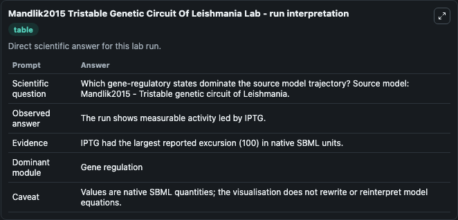
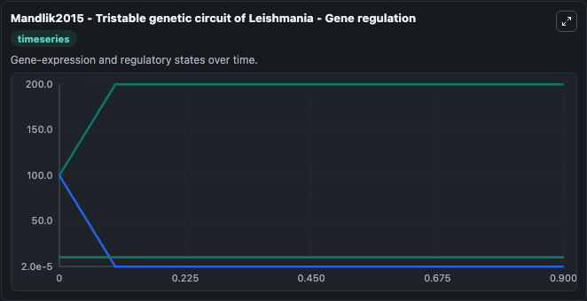
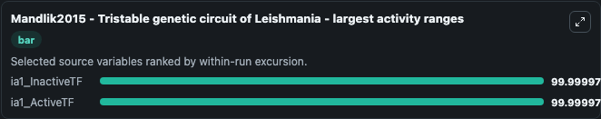
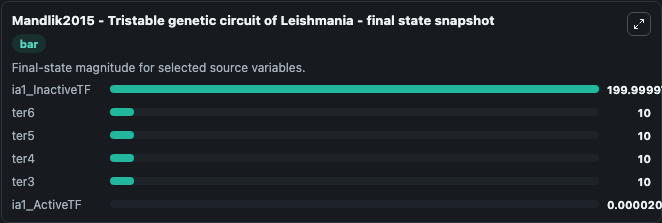
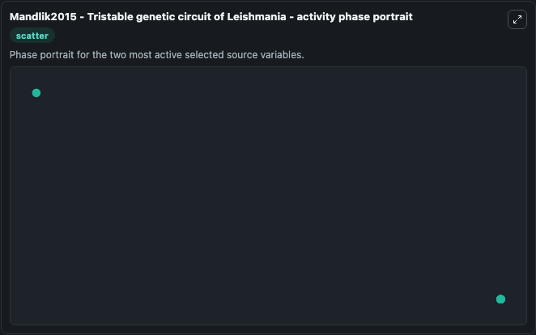

# Mandlik2015 Tristable Genetic Circuit Of Leishmania

This Biosimulant lab wraps `Mandlik2015 Tristable Genetic Circuit Of Leishmania` as a runnable systems biology model with a companion visualization module.
Vineetha Mandlik, Mayuri Gurav & Shailza Singh. It can be used to explore the configured dynamics and compare scenario outcomes across configurations.

## What You'll See

The lab asks: Which gene-regulatory states dominate the source model trajectory? Source model: Mandlik2015 - Tristable genetic circuit of Leishmania. It runs for 1.0 time units with a communication step of 0.1. The run uses the model defaults declared by the curated SBML wrapper. The generated visualizations focus on ia1_InactiveTF, ia1_ActiveTF, ter6, ter5, ter4, and ter3, combining trajectory, endpoint-comparison, and summary-table views from one completed dark-mode run.

In this captured run, **ia1_InactiveTF** moved from 100.0 to 200.0 across 1.0 simulation windows.


### Output Visualizations



*Summary table for Mandlik2015 Tristable Genetic Circuit Of Leishmania, reporting the scientific question, observed answer, dominant module, and caveat.*



*Trajectories of ia1_InactiveTF, ia1_ActiveTF, ter6, ter5, ter4, and ter3 across the 1.0 simulation. In this run **ia1_InactiveTF** climbed from 100.0 to 200.0 and **ia1_ActiveTF** fell from 100.0 to 2.02e-05 — the largest movements among the focused observables.*



*Largest-excursion ranking of the focused observables — the absolute movement magnitude during the run. Top 2: **ia1_InactiveTF** = 100.000, **ia1_ActiveTF** = 100.000.*



*Endpoint snapshot of the focused observables — final values from the captured run. Top 3 by value: **ia1_InactiveTF** = 200.0, **ter6** = 10.000, **ter5** = 10.000, with 3 more observables below.*



*Visualization card from the Mandlik2015 Tristable Genetic Circuit Of Leishmania dark-mode run.*


## Model Context

- Core model: `models/core`
- Visualization model: `models/visualisation`
- Standard: `other`
- Upstream source: `biomodels_ebi:BIOMD0000000584`
- License: `CC0`

## Inputs

| Input | Maps To | Default | Notes |
|---|---|---|---|
| Initial IA1 Inactive Tf | `systemsbiology_sbml_mandlik2015_tristable_genetic_circuit_of_leishma_biomd0000000584_model.initial_ia1_inactive_tf` | | Source state initial condition exposed as a model-specific control because no explicit intervention parameter is identifiable. Maps to SBML symbol `ia1_InactiveTF`. |
| Initial IA1 Active Tf | `systemsbiology_sbml_mandlik2015_tristable_genetic_circuit_of_leishma_biomd0000000584_model.initial_ia1_active_tf` | | Source state initial condition exposed as a model-specific control because no explicit intervention parameter is identifiable. Maps to SBML symbol `ia1_ActiveTF`. |
| Initial Ter6 | `systemsbiology_sbml_mandlik2015_tristable_genetic_circuit_of_leishma_biomd0000000584_model.initial_ter6` | | Source state initial condition exposed as a model-specific control because no explicit intervention parameter is identifiable. Maps to SBML symbol `ter6`. |
| Initial Ter5 | `systemsbiology_sbml_mandlik2015_tristable_genetic_circuit_of_leishma_biomd0000000584_model.initial_ter5` | | Source state initial condition exposed as a model-specific control because no explicit intervention parameter is identifiable. Maps to SBML symbol `ter5`. |
| Initial Ter4 | `systemsbiology_sbml_mandlik2015_tristable_genetic_circuit_of_leishma_biomd0000000584_model.initial_ter4` | | Source state initial condition exposed as a model-specific control because no explicit intervention parameter is identifiable. Maps to SBML symbol `ter4`. |
| Initial Ter3 | `systemsbiology_sbml_mandlik2015_tristable_genetic_circuit_of_leishma_biomd0000000584_model.initial_ter3` | | Source state initial condition exposed as a model-specific control because no explicit intervention parameter is identifiable. Maps to SBML symbol `ter3`. |

## Outputs

| Output | Maps To | Role |
|---|---|---|
| `state` | `systemsbiology_sbml_mandlik2015_tristable_genetic_circuit_of_leishma_biomd0000000584_model.state` | Available to the visualization model and downstream workflows. |
| `summary` | `systemsbiology_sbml_mandlik2015_tristable_genetic_circuit_of_leishma_biomd0000000584_model.summary` | Available to the visualization model and downstream workflows. |
| `species_labels` | `systemsbiology_sbml_mandlik2015_tristable_genetic_circuit_of_leishma_biomd0000000584_model.species_labels` | Available to the visualization model and downstream workflows. |
| `ia1_inactive_tf` | `systemsbiology_sbml_mandlik2015_tristable_genetic_circuit_of_leishma_biomd0000000584_model.ia1_inactive_tf` | Available to the visualization model and downstream workflows. |
| `ia1_active_tf` | `systemsbiology_sbml_mandlik2015_tristable_genetic_circuit_of_leishma_biomd0000000584_model.ia1_active_tf` | Available to the visualization model and downstream workflows. |
| `ter6` | `systemsbiology_sbml_mandlik2015_tristable_genetic_circuit_of_leishma_biomd0000000584_model.ter6` | Available to the visualization model and downstream workflows. |
| `ter5` | `systemsbiology_sbml_mandlik2015_tristable_genetic_circuit_of_leishma_biomd0000000584_model.ter5` | Available to the visualization model and downstream workflows. |
| `ter4` | `systemsbiology_sbml_mandlik2015_tristable_genetic_circuit_of_leishma_biomd0000000584_model.ter4` | Available to the visualization model and downstream workflows. |
| `ter3` | `systemsbiology_sbml_mandlik2015_tristable_genetic_circuit_of_leishma_biomd0000000584_model.ter3` | Available to the visualization model and downstream workflows. |

## Runtime

- Duration: `1.0`
- Communication step: `0.1`

## Running Locally

```bash
biosimulant labs serve
```
