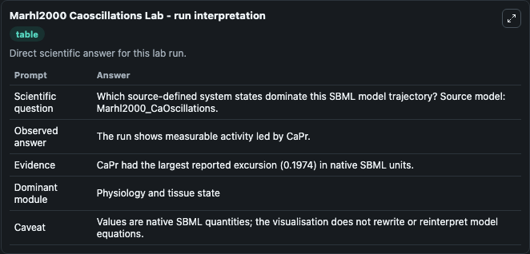
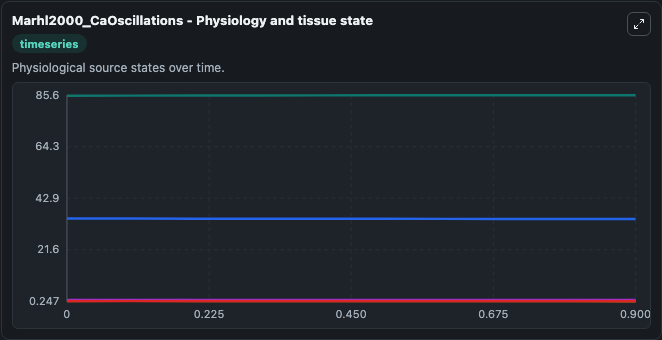
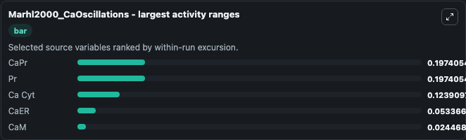
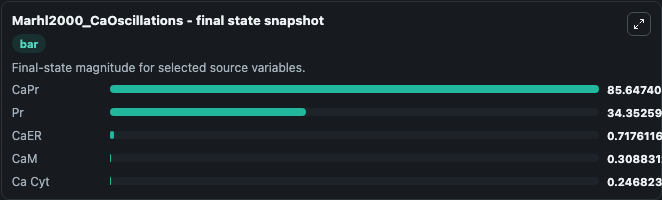
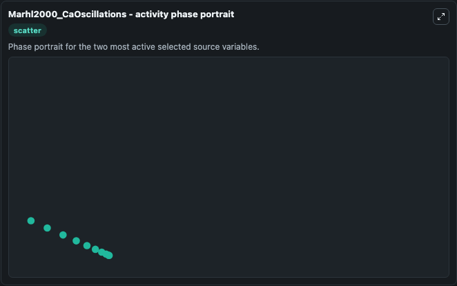

# Marhl2000 Caoscillations

This Biosimulant lab wraps `Marhl2000 Caoscillations` as a runnable systems biology model with a companion visualization module.
In order to reproduce the model, the volume of all compartment is set to 1, and the stoichiometry of CaER and CaM has been set to 0.25, corresponding to betaER/rhoER and betaM/rhoM described in the pa. It can be used to explore the configured dynamics and compare scenario outcomes across configurations.

## What You'll See

The lab asks: Which source-defined system states dominate this SBML model trajectory? Source model: Marhl2000_CaOscillations. It runs for 1.0 time units with a communication step of 0.1. The run uses the model defaults declared by the curated SBML wrapper. The generated visualizations focus on CaPr, Pr, CaER, Ca Cyt, and CaM, combining trajectory, endpoint-comparison, and summary-table views from one completed dark-mode run.

In this captured run, **CaPr** moved from 85.450 to 85.647 across 1.0 simulation windows.


### Output Visualizations



*Summary table for Marhl2000 Caoscillations, reporting the scientific question, observed answer, dominant module, and caveat.*



*Trajectories of CaPr, Pr, Ca Cyt, CaER, and CaM across the 1.0 simulation. In this run **CaPr** climbed from 85.450 to 85.647 and **Pr** fell from 34.550 to 34.353 — the largest movements among the focused observables.*



*Largest-excursion ranking of the focused observables — the absolute movement magnitude during the run. Top 3: **CaPr** = 0.1974, **Pr** = 0.1974, **Ca Cyt** = 0.1239, with 2 more observables below.*



*Endpoint snapshot of the focused observables — final values from the captured run. Top 3 by value: **CaPr** = 85.647, **Pr** = 34.353, **CaER** = 0.7176, with 2 more observables below.*



*Visualization card from the Marhl2000 Caoscillations dark-mode run.*


## Model Context

- Core model: `models/core`
- Visualization model: `models/visualisation`
- Standard: `other`
- Upstream source: `biomodels_ebi:BIOMD0000000039`
- License: `CC0`

## Inputs

| Input | Maps To | Default | Notes |
|---|---|---|---|
| Initial Ca Pr | `systemsbiology_sbml_marhl2000_caoscillations_biomd0000000039_model.initial_ca_pr` | | Source state initial condition exposed as a model-specific control because no explicit intervention parameter is identifiable. Maps to SBML symbol `CaPr`. |
| Initial Model State Pr | `systemsbiology_sbml_marhl2000_caoscillations_biomd0000000039_model.initial_model_state_pr` | | Source state initial condition exposed as a model-specific control because no explicit intervention parameter is identifiable. Maps to SBML symbol `Pr`. |
| Initial Ca Er | `systemsbiology_sbml_marhl2000_caoscillations_biomd0000000039_model.initial_ca_er` | | Source state initial condition exposed as a model-specific control because no explicit intervention parameter is identifiable. Maps to SBML symbol `CaER`. |
| Initial Ca Cyt | `systemsbiology_sbml_marhl2000_caoscillations_biomd0000000039_model.initial_ca_cyt` | | Source state initial condition exposed as a model-specific control because no explicit intervention parameter is identifiable. Maps to SBML symbol `Ca_cyt`. |
| Initial Ca M | `systemsbiology_sbml_marhl2000_caoscillations_biomd0000000039_model.initial_ca_m` | | Source state initial condition exposed as a model-specific control because no explicit intervention parameter is identifiable. Maps to SBML symbol `CaM`. |

## Outputs

| Output | Maps To | Role |
|---|---|---|
| `state` | `systemsbiology_sbml_marhl2000_caoscillations_biomd0000000039_model.state` | Available to the visualization model and downstream workflows. |
| `summary` | `systemsbiology_sbml_marhl2000_caoscillations_biomd0000000039_model.summary` | Available to the visualization model and downstream workflows. |
| `species_labels` | `systemsbiology_sbml_marhl2000_caoscillations_biomd0000000039_model.species_labels` | Available to the visualization model and downstream workflows. |
| `ca_pr` | `systemsbiology_sbml_marhl2000_caoscillations_biomd0000000039_model.ca_pr` | Available to the visualization model and downstream workflows. |
| `model_state_pr` | `systemsbiology_sbml_marhl2000_caoscillations_biomd0000000039_model.model_state_pr` | Available to the visualization model and downstream workflows. |
| `ca_er` | `systemsbiology_sbml_marhl2000_caoscillations_biomd0000000039_model.ca_er` | Available to the visualization model and downstream workflows. |
| `ca_cyt` | `systemsbiology_sbml_marhl2000_caoscillations_biomd0000000039_model.ca_cyt` | Available to the visualization model and downstream workflows. |
| `ca_m` | `systemsbiology_sbml_marhl2000_caoscillations_biomd0000000039_model.ca_m` | Available to the visualization model and downstream workflows. |

## Runtime

- Duration: `1.0`
- Communication step: `0.1`

## Running Locally

```bash
biosimulant labs serve
```
