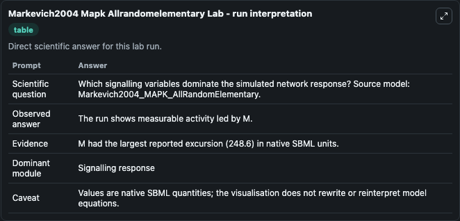
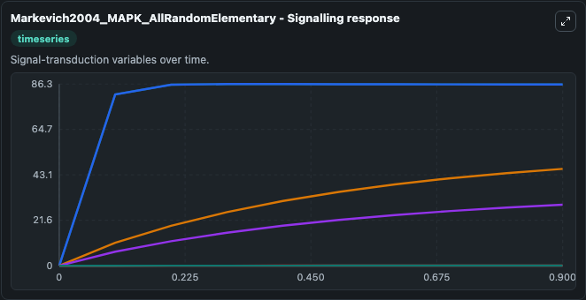
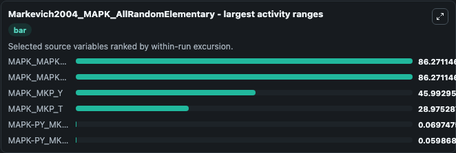
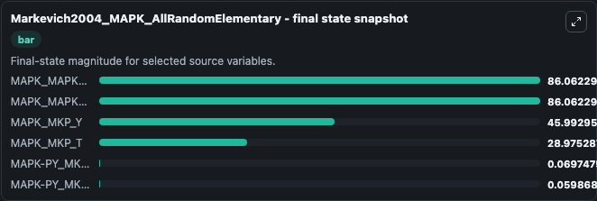
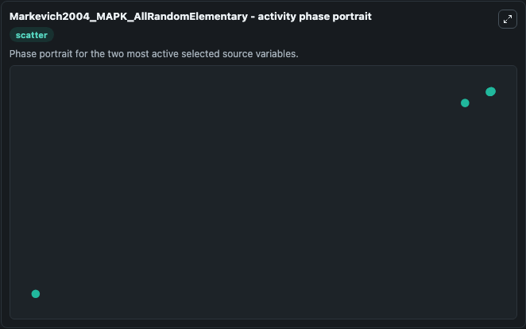

# Markevich2004 Mapk Allrandomelementary

This Biosimulant lab wraps `Markevich2004 Mapk Allrandomelementary` as a runnable systems biology model with a companion visualization module.
This model originates from BioModels Database: A Database of Annotated Published Models. It can be used to explore the configured dynamics and compare scenario outcomes across configurations.

## What You'll See

The lab asks: Which signalling variables dominate the simulated network response? Source model: Markevich2004_MAPK_AllRandomElementary. It runs for 1.0 time units with a communication step of 0.1. The run uses the model defaults declared by the curated SBML wrapper. The generated visualizations focus on MAPK_MKP_Y, MAPK_MKP_T, MAPK_MAPKK_Y, MAPK_MAPKK_T, MAPK-PY_MKP_Y, and MAPK-PY_MKP_T, combining trajectory, endpoint-comparison, and summary-table views from one completed dark-mode run.

In this captured run, **MAPK_MAPKK_Y** moved from 0 to 86.062 across 1.0 simulation windows.


### Output Visualizations



*Summary table for Markevich2004 Mapk Allrandomelementary, reporting the scientific question, observed answer, dominant module, and caveat.*



*Trajectories of MAPK_MAPKK_Y, MAPK_MAPKK_T, MAPK_MKP_Y, MAPK_MKP_T, MAPK-PY_MKP_T, and MAPK-PY_MKP_Y across the 1.0 simulation. In this run **MAPK_MAPKK_Y** climbed from 0 to 86.062 — the largest movements among the focused observables.*



*Largest-excursion ranking of the focused observables — the absolute movement magnitude during the run. Top 3: **MAPK_MAPKK_Y** = 86.271, **MAPK_MAPKK_T** = 86.271, **MAPK_MKP_Y** = 45.993, with 3 more observables below.*



*Endpoint snapshot of the focused observables — final values from the captured run. Top 3 by value: **MAPK_MAPKK_Y** = 86.062, **MAPK_MAPKK_T** = 86.062, **MAPK_MKP_Y** = 45.993, with 3 more observables below.*



*Visualization card from the Markevich2004 Mapk Allrandomelementary dark-mode run.*


## Model Context

- Core model: `models/core`
- Visualization model: `models/visualisation`
- Standard: `other`
- Upstream source: `biomodels_ebi:BIOMD0000000030`
- License: `CC0`

## Inputs

| Input | Maps To | Default | Notes |
|---|---|---|---|
| Initial MAPK Mkp Y | `systemsbiology_sbml_markevich2004_mapk_allrandomelementary_biomd0000000030_model.initial_mapk_mkp_y` | | Source state initial condition exposed as a model-specific control because no explicit intervention parameter is identifiable. Maps to SBML symbol `M_MKP_Y`. |
| Initial MAPK Mkp T | `systemsbiology_sbml_markevich2004_mapk_allrandomelementary_biomd0000000030_model.initial_mapk_mkp_t` | | Source state initial condition exposed as a model-specific control because no explicit intervention parameter is identifiable. Maps to SBML symbol `M_MKP_T`. |
| Initial MAPK Mapkk Y | `systemsbiology_sbml_markevich2004_mapk_allrandomelementary_biomd0000000030_model.initial_mapk_mapkk_y` | | Source state initial condition exposed as a model-specific control because no explicit intervention parameter is identifiable. Maps to SBML symbol `M_MAPKK_Y`. |
| Initial MAPK Mapkk T | `systemsbiology_sbml_markevich2004_mapk_allrandomelementary_biomd0000000030_model.initial_mapk_mapkk_t` | | Source state initial condition exposed as a model-specific control because no explicit intervention parameter is identifiable. Maps to SBML symbol `M_MAPKK_T`. |
| Initial MAPK Py Mkp Y | `systemsbiology_sbml_markevich2004_mapk_allrandomelementary_biomd0000000030_model.initial_mapk_py_mkp_y` | | Source state initial condition exposed as a model-specific control because no explicit intervention parameter is identifiable. Maps to SBML symbol `MpY_MKP_Y`. |
| Initial MAPK Py Mkp T | `systemsbiology_sbml_markevich2004_mapk_allrandomelementary_biomd0000000030_model.initial_mapk_py_mkp_t` | | Source state initial condition exposed as a model-specific control because no explicit intervention parameter is identifiable. Maps to SBML symbol `MpY_MKP_T`. |

## Outputs

| Output | Maps To | Role |
|---|---|---|
| `state` | `systemsbiology_sbml_markevich2004_mapk_allrandomelementary_biomd0000000030_model.state` | Available to the visualization model and downstream workflows. |
| `summary` | `systemsbiology_sbml_markevich2004_mapk_allrandomelementary_biomd0000000030_model.summary` | Available to the visualization model and downstream workflows. |
| `species_labels` | `systemsbiology_sbml_markevich2004_mapk_allrandomelementary_biomd0000000030_model.species_labels` | Available to the visualization model and downstream workflows. |
| `mapk_mkp_y` | `systemsbiology_sbml_markevich2004_mapk_allrandomelementary_biomd0000000030_model.mapk_mkp_y` | Available to the visualization model and downstream workflows. |
| `mapk_mkp_t` | `systemsbiology_sbml_markevich2004_mapk_allrandomelementary_biomd0000000030_model.mapk_mkp_t` | Available to the visualization model and downstream workflows. |
| `mapk_mapkk_y` | `systemsbiology_sbml_markevich2004_mapk_allrandomelementary_biomd0000000030_model.mapk_mapkk_y` | Available to the visualization model and downstream workflows. |
| `mapk_mapkk_t` | `systemsbiology_sbml_markevich2004_mapk_allrandomelementary_biomd0000000030_model.mapk_mapkk_t` | Available to the visualization model and downstream workflows. |
| `mapk_py_mkp_y` | `systemsbiology_sbml_markevich2004_mapk_allrandomelementary_biomd0000000030_model.mapk_py_mkp_y` | Available to the visualization model and downstream workflows. |
| `mapk_py_mkp_t` | `systemsbiology_sbml_markevich2004_mapk_allrandomelementary_biomd0000000030_model.mapk_py_mkp_t` | Available to the visualization model and downstream workflows. |

## Runtime

- Duration: `1.0`
- Communication step: `0.1`

## Running Locally

```bash
biosimulant labs serve
```
