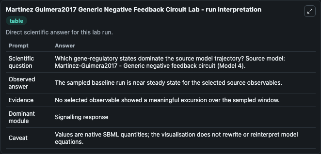
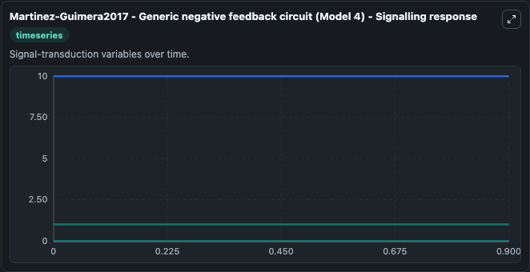
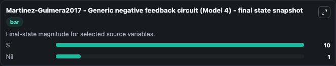

# Martinez Guimera2017 Generic Negative Feedback Circuit

This Biosimulant lab wraps `Martinez Guimera2017 Generic Negative Feedback Circuit` as a runnable systems biology model with a companion visualization module.
Martinez-Guimera2017 - Generic negative feedback circuit (Model 4) This model is described in the article: 'Molecular habituation' as a potential mechanism of gradual homeostatic loss with age. It can be used to explore the configured dynamics and compare scenario outcomes across configurations.

## What You'll See

The lab asks: Which gene-regulatory states dominate the source model trajectory? Source model: Martinez-Guimera2017 - Generic negative feedback circuit (Model 4). It runs for 1.0 time units with a communication step of 0.1. The run uses the model defaults declared by the curated SBML wrapper. The generated visualizations focus on Nil, S, O, N, F, and A, combining trajectory, endpoint-comparison, and summary-table views from one completed dark-mode run.

In this captured run, **Nil** moved from 1.000 to 1.000 across 1.0 simulation windows.


### Output Visualizations



*Summary table for Martinez Guimera2017 Generic Negative Feedback Circuit, reporting the scientific question, observed answer, dominant module, and caveat.*



*Trajectories of Nil, S, O, N, F, and A across the 1.0 simulation. In this run Nil, S, O, N stayed near their initial values — no observable moved appreciably.*



*Trajectories of Nil, S, O, N, F, and A across the 1.0 simulation. In this run Nil, S, O, N stayed near their initial values — no observable moved appreciably.*


## Model Context

- Core model: `models/core`
- Visualization model: `models/visualisation`
- Standard: `other`
- Upstream source: `biomodels_ebi:MODEL1710260003`
- License: `CC0`

## Inputs

| Input | Maps To | Default | Notes |
|---|---|---|---|
| Initial Model State Nil | `systemsbiology_sbml_martinez_guimera2017_generic_negative_feedback_c_model1710260003_model.initial_model_state_nil` | | Source state initial condition exposed as a model-specific control because no explicit intervention parameter is identifiable. Maps to SBML symbol `Nil`. |
| Initial Model State S | `systemsbiology_sbml_martinez_guimera2017_generic_negative_feedback_c_model1710260003_model.initial_model_state_s` | | Source state initial condition exposed as a model-specific control because no explicit intervention parameter is identifiable. Maps to SBML symbol `S`. |
| Initial Model State O | `systemsbiology_sbml_martinez_guimera2017_generic_negative_feedback_c_model1710260003_model.initial_model_state_o` | | Source state initial condition exposed as a model-specific control because no explicit intervention parameter is identifiable. Maps to SBML symbol `O`. |
| Initial Model State N | `systemsbiology_sbml_martinez_guimera2017_generic_negative_feedback_c_model1710260003_model.initial_model_state_n` | | Source state initial condition exposed as a model-specific control because no explicit intervention parameter is identifiable. Maps to SBML symbol `N`. |
| Initial Model State F | `systemsbiology_sbml_martinez_guimera2017_generic_negative_feedback_c_model1710260003_model.initial_model_state_f` | | Source state initial condition exposed as a model-specific control because no explicit intervention parameter is identifiable. Maps to SBML symbol `F`. |
| Initial Model State A | `systemsbiology_sbml_martinez_guimera2017_generic_negative_feedback_c_model1710260003_model.initial_model_state_a` | | Source state initial condition exposed as a model-specific control because no explicit intervention parameter is identifiable. Maps to SBML symbol `A`. |

## Outputs

| Output | Maps To | Role |
|---|---|---|
| `state` | `systemsbiology_sbml_martinez_guimera2017_generic_negative_feedback_c_model1710260003_model.state` | Available to the visualization model and downstream workflows. |
| `summary` | `systemsbiology_sbml_martinez_guimera2017_generic_negative_feedback_c_model1710260003_model.summary` | Available to the visualization model and downstream workflows. |
| `species_labels` | `systemsbiology_sbml_martinez_guimera2017_generic_negative_feedback_c_model1710260003_model.species_labels` | Available to the visualization model and downstream workflows. |
| `nil` | `systemsbiology_sbml_martinez_guimera2017_generic_negative_feedback_c_model1710260003_model.nil` | Available to the visualization model and downstream workflows. |
| `model_state_s` | `systemsbiology_sbml_martinez_guimera2017_generic_negative_feedback_c_model1710260003_model.model_state_s` | Available to the visualization model and downstream workflows. |
| `model_state_o` | `systemsbiology_sbml_martinez_guimera2017_generic_negative_feedback_c_model1710260003_model.model_state_o` | Available to the visualization model and downstream workflows. |
| `model_state_n` | `systemsbiology_sbml_martinez_guimera2017_generic_negative_feedback_c_model1710260003_model.model_state_n` | Available to the visualization model and downstream workflows. |
| `model_state_f` | `systemsbiology_sbml_martinez_guimera2017_generic_negative_feedback_c_model1710260003_model.model_state_f` | Available to the visualization model and downstream workflows. |
| `model_state_a` | `systemsbiology_sbml_martinez_guimera2017_generic_negative_feedback_c_model1710260003_model.model_state_a` | Available to the visualization model and downstream workflows. |

## Runtime

- Duration: `1.0`
- Communication step: `0.1`

## Running Locally

```bash
biosimulant labs serve
```
