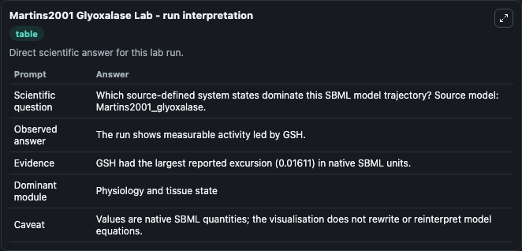
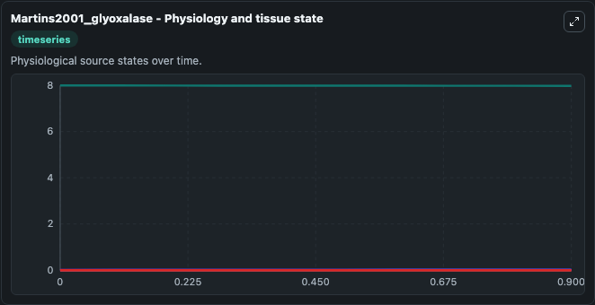
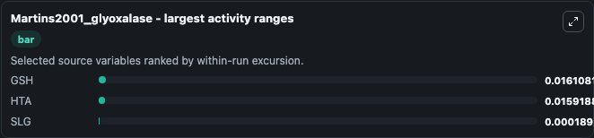
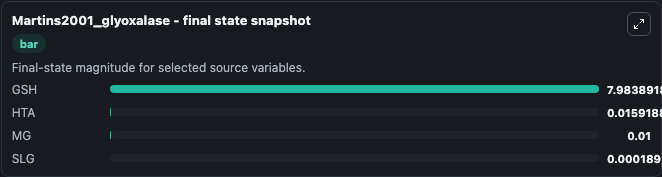
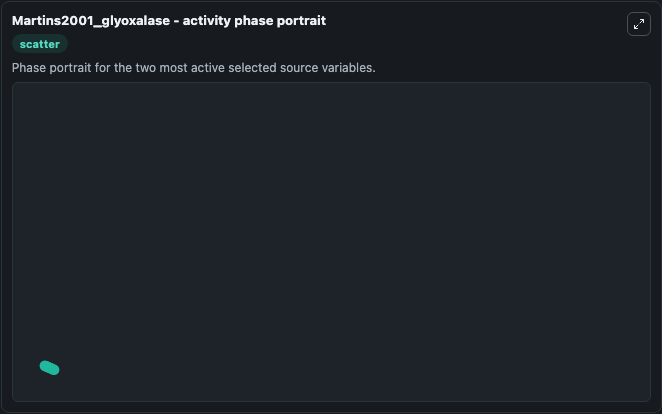

# Martins2001 Glyoxalase

This Biosimulant lab wraps `Martins2001 Glyoxalase` as a runnable systems biology model with a companion visualization module.
. It can be used to explore the configured dynamics and compare scenario outcomes across configurations.

## What You'll See

The lab asks: Which source-defined system states dominate this SBML model trajectory? Source model: Martins2001_glyoxalase. It runs for 1.0 time units with a communication step of 0.1. The run uses the model defaults declared by the curated SBML wrapper. The generated visualizations focus on GSH, MG, SLG, Lac, and HTA, combining trajectory, endpoint-comparison, and summary-table views from one completed dark-mode run.

In this captured run, **GSH** moved from 8.000 to 7.984 across 1.0 simulation windows.


### Output Visualizations



*Summary table for Martins2001 Glyoxalase, reporting the scientific question, observed answer, dominant module, and caveat.*



*Trajectories of GSH, HTA, SLG, MG, and Lac across the 1.0 simulation. In this run **HTA** climbed from 0 to 0.0159 and **GSH** fell from 8.000 to 7.984 — the largest movements among the focused observables.*



*Largest-excursion ranking of the focused observables — the absolute movement magnitude during the run. Top 3: **GSH** = 0.0161, **HTA** = 0.0159, **SLG** = 0.000189.*



*Endpoint snapshot of the focused observables — final values from the captured run. Top 3 by value: **GSH** = 7.984, **HTA** = 0.0159, **MG** = 0.0100, with 1 more observable below.*



*Visualization card from the Martins2001 Glyoxalase dark-mode run.*


## Model Context

- Core model: `models/core`
- Visualization model: `models/visualisation`
- Standard: `other`
- Upstream source: `biomodels_ebi:MODEL6624199343`
- License: `CC0`

## Inputs

| Input | Maps To | Default | Notes |
|---|---|---|---|
| Initial Model State Gsh | `systemsbiology_sbml_martins2001_glyoxalase_model6624199343_model.initial_model_state_gsh` | | Source state initial condition exposed as a model-specific control because no explicit intervention parameter is identifiable. Maps to SBML symbol `GSH`. |
| Initial Model State Mg | `systemsbiology_sbml_martins2001_glyoxalase_model6624199343_model.initial_model_state_mg` | | Source state initial condition exposed as a model-specific control because no explicit intervention parameter is identifiable. Maps to SBML symbol `MG`. |
| Initial Model State Slg | `systemsbiology_sbml_martins2001_glyoxalase_model6624199343_model.initial_model_state_slg` | | Source state initial condition exposed as a model-specific control because no explicit intervention parameter is identifiable. Maps to SBML symbol `SLG`. |
| Initial Model State Lac | `systemsbiology_sbml_martins2001_glyoxalase_model6624199343_model.initial_model_state_lac` | | Source state initial condition exposed as a model-specific control because no explicit intervention parameter is identifiable. Maps to SBML symbol `Lac`. |
| Initial Model State Hta | `systemsbiology_sbml_martins2001_glyoxalase_model6624199343_model.initial_model_state_hta` | | Source state initial condition exposed as a model-specific control because no explicit intervention parameter is identifiable. Maps to SBML symbol `HTA`. |

## Outputs

| Output | Maps To | Role |
|---|---|---|
| `state` | `systemsbiology_sbml_martins2001_glyoxalase_model6624199343_model.state` | Available to the visualization model and downstream workflows. |
| `summary` | `systemsbiology_sbml_martins2001_glyoxalase_model6624199343_model.summary` | Available to the visualization model and downstream workflows. |
| `species_labels` | `systemsbiology_sbml_martins2001_glyoxalase_model6624199343_model.species_labels` | Available to the visualization model and downstream workflows. |
| `gsh` | `systemsbiology_sbml_martins2001_glyoxalase_model6624199343_model.gsh` | Available to the visualization model and downstream workflows. |
| `model_state_mg` | `systemsbiology_sbml_martins2001_glyoxalase_model6624199343_model.model_state_mg` | Available to the visualization model and downstream workflows. |
| `slg` | `systemsbiology_sbml_martins2001_glyoxalase_model6624199343_model.slg` | Available to the visualization model and downstream workflows. |
| `lac` | `systemsbiology_sbml_martins2001_glyoxalase_model6624199343_model.lac` | Available to the visualization model and downstream workflows. |
| `hta` | `systemsbiology_sbml_martins2001_glyoxalase_model6624199343_model.hta` | Available to the visualization model and downstream workflows. |

## Runtime

- Duration: `1.0`
- Communication step: `0.1`

## Running Locally

```bash
biosimulant labs serve
```
