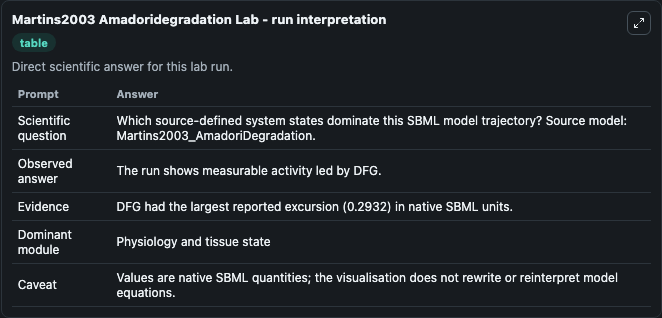
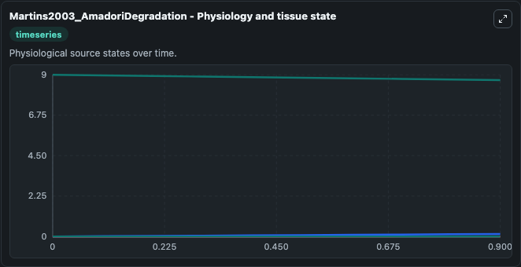
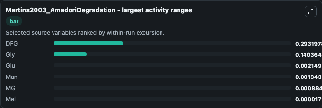
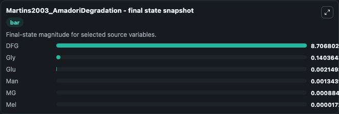
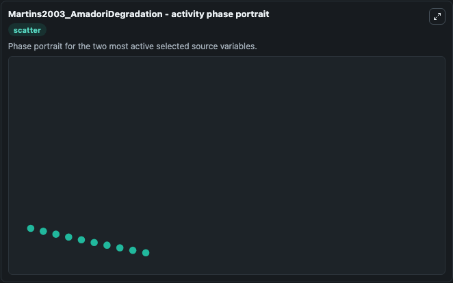

# Martins2003 Amadoridegradation

This Biosimulant lab wraps `Martins2003 Amadoridegradation` as a runnable systems biology model with a companion visualization module.
This a model from the article: Kinetic modelling of Amadori N-(1-deoxy-D-fructos-1-yl)-glycine degradation pathways. It can be used to explore the configured dynamics and compare scenario outcomes across configurations.

## What You'll See

The lab asks: Which source-defined system states dominate this SBML model trajectory? Source model: Martins2003_AmadoriDegradation. It runs for 1.0 time units with a communication step of 0.1. The run uses the model defaults declared by the curated SBML wrapper. The generated visualizations focus on DFG, Mel, Man, MG, Gly, and Glu, combining trajectory, endpoint-comparison, and summary-table views from one completed dark-mode run.

In this captured run, **DFG** moved from 9.000 to 8.707 across 1.0 simulation windows.


### Output Visualizations



*Summary table for Martins2003 Amadoridegradation, reporting the scientific question, observed answer, dominant module, and caveat.*



*Trajectories of DFG, Gly, Glu, Man, MG, and Mel across the 1.0 simulation. In this run **Gly** climbed from 0 to 0.1404 and **DFG** fell from 9.000 to 8.707 — the largest movements among the focused observables.*



*Largest-excursion ranking of the focused observables — the absolute movement magnitude during the run. Top 3: **DFG** = 0.2932, **Gly** = 0.1404, **Glu** = 0.00215, with 3 more observables below.*



*Endpoint snapshot of the focused observables — final values from the captured run. Top 3 by value: **DFG** = 8.707, **Gly** = 0.1404, **Glu** = 0.00215, with 3 more observables below.*



*Visualization card from the Martins2003 Amadoridegradation dark-mode run.*


## Model Context

- Core model: `models/core`
- Visualization model: `models/visualisation`
- Standard: `other`
- Upstream source: `biomodels_ebi:BIOMD0000000050`
- License: `CC0`

## Inputs

| Input | Maps To | Default | Notes |
|---|---|---|---|
| Initial Model State Dfg | `systemsbiology_sbml_martins2003_amadoridegradation_biomd0000000050_model.initial_model_state_dfg` | | Source state initial condition exposed as a model-specific control because no explicit intervention parameter is identifiable. Maps to SBML symbol `DFG`. |
| Initial Model State Mel | `systemsbiology_sbml_martins2003_amadoridegradation_biomd0000000050_model.initial_model_state_mel` | | Source state initial condition exposed as a model-specific control because no explicit intervention parameter is identifiable. Maps to SBML symbol `Mel`. |
| Initial Model State Man | `systemsbiology_sbml_martins2003_amadoridegradation_biomd0000000050_model.initial_model_state_man` | | Source state initial condition exposed as a model-specific control because no explicit intervention parameter is identifiable. Maps to SBML symbol `Man`. |
| Initial Model State Mg | `systemsbiology_sbml_martins2003_amadoridegradation_biomd0000000050_model.initial_model_state_mg` | | Source state initial condition exposed as a model-specific control because no explicit intervention parameter is identifiable. Maps to SBML symbol `MG`. |
| Initial Model State Gly | `systemsbiology_sbml_martins2003_amadoridegradation_biomd0000000050_model.initial_model_state_gly` | | Source state initial condition exposed as a model-specific control because no explicit intervention parameter is identifiable. Maps to SBML symbol `Gly`. |
| Initial Model State Glu | `systemsbiology_sbml_martins2003_amadoridegradation_biomd0000000050_model.initial_model_state_glu` | | Source state initial condition exposed as a model-specific control because no explicit intervention parameter is identifiable. Maps to SBML symbol `Glu`. |

## Outputs

| Output | Maps To | Role |
|---|---|---|
| `state` | `systemsbiology_sbml_martins2003_amadoridegradation_biomd0000000050_model.state` | Available to the visualization model and downstream workflows. |
| `summary` | `systemsbiology_sbml_martins2003_amadoridegradation_biomd0000000050_model.summary` | Available to the visualization model and downstream workflows. |
| `species_labels` | `systemsbiology_sbml_martins2003_amadoridegradation_biomd0000000050_model.species_labels` | Available to the visualization model and downstream workflows. |
| `dfg` | `systemsbiology_sbml_martins2003_amadoridegradation_biomd0000000050_model.dfg` | Available to the visualization model and downstream workflows. |
| `mel` | `systemsbiology_sbml_martins2003_amadoridegradation_biomd0000000050_model.mel` | Available to the visualization model and downstream workflows. |
| `man` | `systemsbiology_sbml_martins2003_amadoridegradation_biomd0000000050_model.man` | Available to the visualization model and downstream workflows. |
| `model_state_mg` | `systemsbiology_sbml_martins2003_amadoridegradation_biomd0000000050_model.model_state_mg` | Available to the visualization model and downstream workflows. |
| `gly` | `systemsbiology_sbml_martins2003_amadoridegradation_biomd0000000050_model.gly` | Available to the visualization model and downstream workflows. |
| `glu` | `systemsbiology_sbml_martins2003_amadoridegradation_biomd0000000050_model.glu` | Available to the visualization model and downstream workflows. |

## Runtime

- Duration: `1.0`
- Communication step: `0.1`

## Running Locally

```bash
biosimulant labs serve
```
