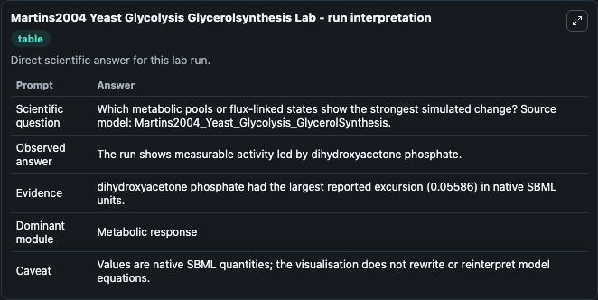
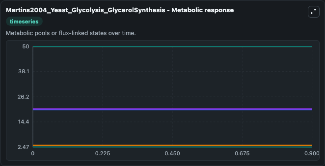
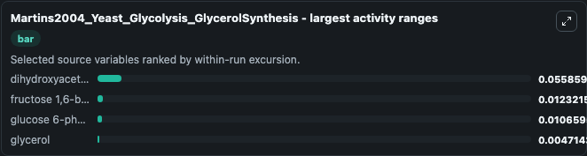
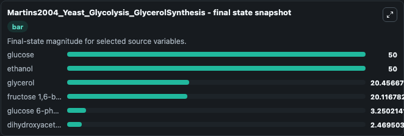
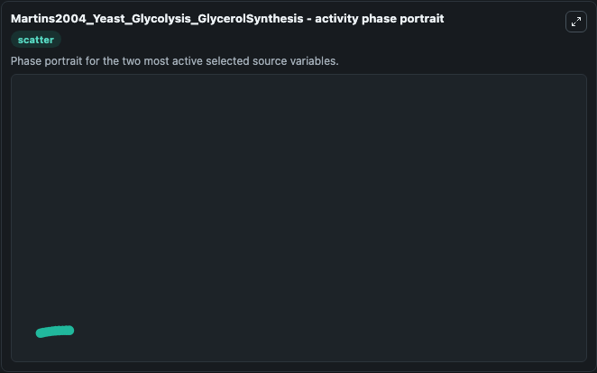

# Martins2004 Yeast Glycolysis Glycerolsynthesis

This Biosimulant lab wraps `Martins2004 Yeast Glycolysis Glycerolsynthesis` as a runnable systems biology model with a companion visualization module.
A systems biology study of two distinct growth phases of Saccharomyces cerevisiae cultures AM Martins, D Camacho, J Shuman, W Sha, P Mendes, V Shulaev, Current Genomics 2004 5:649-663 This is a model. It can be used to explore the configured dynamics and compare scenario outcomes across configurations.

## What You'll See

The lab asks: Which metabolic pools or flux-linked states show the strongest simulated change? Source model: Martins2004_Yeast_Glycolysis_GlycerolSynthesis. It runs for 1.0 time units with a communication step of 0.1. The run uses the model defaults declared by the curated SBML wrapper. The generated visualizations focus on glucose, ethanol, glycerol, fructose 1,6-bisphosphate, glucose 6-phosphate, and dihydroxyacetone phosphate, combining trajectory, endpoint-comparison, and summary-table views from one completed dark-mode run.

In this captured run, **dihydroxyacetone phosphate** moved from 2.525 to 2.470 across 1.0 simulation windows.


### Output Visualizations



*Summary table for Martins2004 Yeast Glycolysis Glycerolsynthesis, reporting the scientific question, observed answer, dominant module, and caveat.*



*Trajectories of dihydroxyacetone phosphate, fructose 1,6-bisphosphate, glucose 6-phosphate, glycerol, glucose, and ethanol across the 1.0 simulation. In this run **glycerol** climbed from 20.452 to 20.457 and **dihydroxyacetone phosphate** fell from 2.525 to 2.470 — the largest movements among the focused observables.*



*Largest-excursion ranking of the focused observables — the absolute movement magnitude during the run. Top 3: **dihydroxyacetone phosphate** = 0.0559, **fructose 1,6-bisphosphate** = 0.0123, **glucose 6-phosphate** = 0.0107, with 1 more observable below.*



*Endpoint snapshot of the focused observables — final values from the captured run. Top 3 by value: **glucose** = 50.000, **ethanol** = 50.000, **glycerol** = 20.457, with 3 more observables below.*



*Visualization card from the Martins2004 Yeast Glycolysis Glycerolsynthesis dark-mode run.*


## Model Context

- Core model: `models/core`
- Visualization model: `models/visualisation`
- Standard: `other`
- Upstream source: `biomodels_ebi:MODEL1009220000`
- License: `CC0`

## Inputs

| Input | Maps To | Default | Notes |
|---|---|---|---|
| Initial Glucose | `systemsbiology_sbml_martins2004_yeast_glycolysis_glycerolsynthesis_model1009220000_model.initial_glucose` | | Source state initial condition exposed as a model-specific control because no explicit intervention parameter is identifiable. Maps to SBML symbol `GLCx`. |
| Initial Ethanol | `systemsbiology_sbml_martins2004_yeast_glycolysis_glycerolsynthesis_model1009220000_model.initial_ethanol` | | Source state initial condition exposed as a model-specific control because no explicit intervention parameter is identifiable. Maps to SBML symbol `EtOH`. |
| Initial Glycerol | `systemsbiology_sbml_martins2004_yeast_glycolysis_glycerolsynthesis_model1009220000_model.initial_glycerol` | | Source state initial condition exposed as a model-specific control because no explicit intervention parameter is identifiable. Maps to SBML symbol `GLY`. |
| Initial Fructose 1 6 Bisphosphate | `systemsbiology_sbml_martins2004_yeast_glycolysis_glycerolsynthesis_model1009220000_model.initial_fructose_1_6_bisphosphate` | | Source state initial condition exposed as a model-specific control because no explicit intervention parameter is identifiable. Maps to SBML symbol `F16bP`. |
| Initial Glucose 6 Phosphate | `systemsbiology_sbml_martins2004_yeast_glycolysis_glycerolsynthesis_model1009220000_model.initial_glucose_6_phosphate` | | Source state initial condition exposed as a model-specific control because no explicit intervention parameter is identifiable. Maps to SBML symbol `G6P`. |
| Initial Dihydroxyacetone Phosphate | `systemsbiology_sbml_martins2004_yeast_glycolysis_glycerolsynthesis_model1009220000_model.initial_dihydroxyacetone_phosphate` | | Source state initial condition exposed as a model-specific control because no explicit intervention parameter is identifiable. Maps to SBML symbol `DHAP`. |

## Outputs

| Output | Maps To | Role |
|---|---|---|
| `state` | `systemsbiology_sbml_martins2004_yeast_glycolysis_glycerolsynthesis_model1009220000_model.state` | Available to the visualization model and downstream workflows. |
| `summary` | `systemsbiology_sbml_martins2004_yeast_glycolysis_glycerolsynthesis_model1009220000_model.summary` | Available to the visualization model and downstream workflows. |
| `species_labels` | `systemsbiology_sbml_martins2004_yeast_glycolysis_glycerolsynthesis_model1009220000_model.species_labels` | Available to the visualization model and downstream workflows. |
| `glucose` | `systemsbiology_sbml_martins2004_yeast_glycolysis_glycerolsynthesis_model1009220000_model.glucose` | Available to the visualization model and downstream workflows. |
| `ethanol` | `systemsbiology_sbml_martins2004_yeast_glycolysis_glycerolsynthesis_model1009220000_model.ethanol` | Available to the visualization model and downstream workflows. |
| `glycerol` | `systemsbiology_sbml_martins2004_yeast_glycolysis_glycerolsynthesis_model1009220000_model.glycerol` | Available to the visualization model and downstream workflows. |
| `fructose_1_6_bisphosphate` | `systemsbiology_sbml_martins2004_yeast_glycolysis_glycerolsynthesis_model1009220000_model.fructose_1_6_bisphosphate` | Available to the visualization model and downstream workflows. |
| `glucose_6_phosphate` | `systemsbiology_sbml_martins2004_yeast_glycolysis_glycerolsynthesis_model1009220000_model.glucose_6_phosphate` | Available to the visualization model and downstream workflows. |
| `dihydroxyacetone_phosphate` | `systemsbiology_sbml_martins2004_yeast_glycolysis_glycerolsynthesis_model1009220000_model.dihydroxyacetone_phosphate` | Available to the visualization model and downstream workflows. |

## Runtime

- Duration: `1.0`
- Communication step: `0.1`

## Running Locally

```bash
biosimulant labs serve
```
