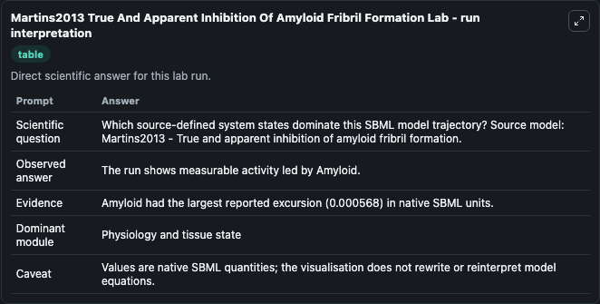
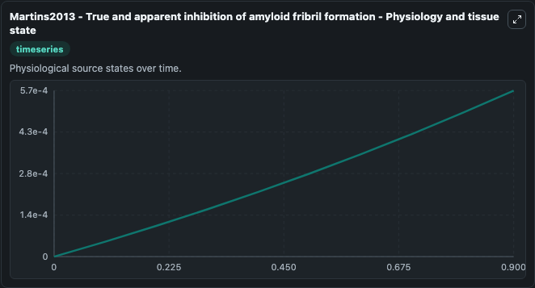
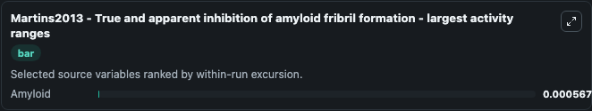
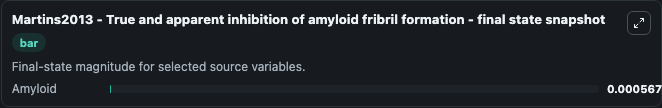

# Martins2013 True And Apparent Inhibition Of Amyloid Fribril Formation

This Biosimulant lab wraps `Martins2013 True And Apparent Inhibition Of Amyloid Fribril Formation` as a runnable systems biology model with a companion visualization module.
Martins2013 - True and apparent inhibition ofamyloid fribril formation This model is described in the article: True and apparent inhibition of amyloid fibril formation. It can be used to explore the configured dynamics and compare scenario outcomes across configurations.

## What You'll See

The lab asks: Which source-defined system states dominate this SBML model trajectory? Source model: Martins2013 - True and apparent inhibition of amyloid fribril formation. It runs for 1.0 time units with a communication step of 0.1. The run uses the model defaults declared by the curated SBML wrapper. The generated visualizations focus on Amyloid, combining trajectory, endpoint-comparison, and summary-table views from one completed dark-mode run.

In this captured run, **Amyloid** moved from 0 to 0.000568 across 1.0 simulation windows.


### Output Visualizations



*Summary table for Martins2013 True And Apparent Inhibition Of Amyloid Fribril Formation, reporting the scientific question, observed answer, dominant module, and caveat.*



*Trajectories of Amyloid across the 1.0 simulation. In this run **Amyloid** climbed from 0 to 0.000568 — the largest movements among the focused observables.*



*Largest-excursion ranking of the focused observables — the absolute movement magnitude during the run. Top 1: **Amyloid** = 0.000568.*



*Endpoint snapshot of the focused observables — final values from the captured run. Top 1 by value: **Amyloid** = 0.000568.*


## Model Context

- Core model: `models/core`
- Visualization model: `models/visualisation`
- Standard: `other`
- Upstream source: `biomodels_ebi:BIOMD0000000561`
- License: `CC0`

## Inputs

| Input | Maps To | Default | Notes |
|---|---|---|---|
| Initial Amyloid | `systemsbiology_sbml_martins2013_true_and_apparent_inhibition_of_amyl_biomd0000000561_model.initial_amyloid` | | Source state initial condition exposed as a model-specific control because no explicit intervention parameter is identifiable. Maps to SBML symbol `Amyloid`. |

## Outputs

| Output | Maps To | Role |
|---|---|---|
| `state` | `systemsbiology_sbml_martins2013_true_and_apparent_inhibition_of_amyl_biomd0000000561_model.state` | Available to the visualization model and downstream workflows. |
| `summary` | `systemsbiology_sbml_martins2013_true_and_apparent_inhibition_of_amyl_biomd0000000561_model.summary` | Available to the visualization model and downstream workflows. |
| `species_labels` | `systemsbiology_sbml_martins2013_true_and_apparent_inhibition_of_amyl_biomd0000000561_model.species_labels` | Available to the visualization model and downstream workflows. |
| `amyloid` | `systemsbiology_sbml_martins2013_true_and_apparent_inhibition_of_amyl_biomd0000000561_model.amyloid` | Available to the visualization model and downstream workflows. |

## Runtime

- Duration: `1.0`
- Communication step: `0.1`

## Running Locally

```bash
biosimulant labs serve
```
