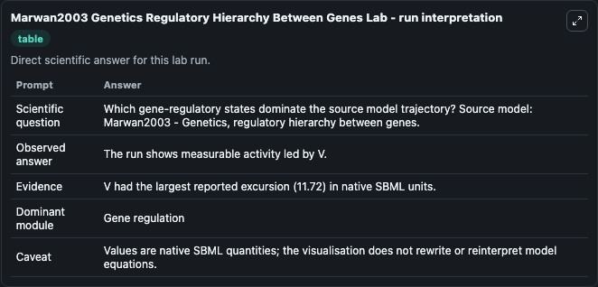
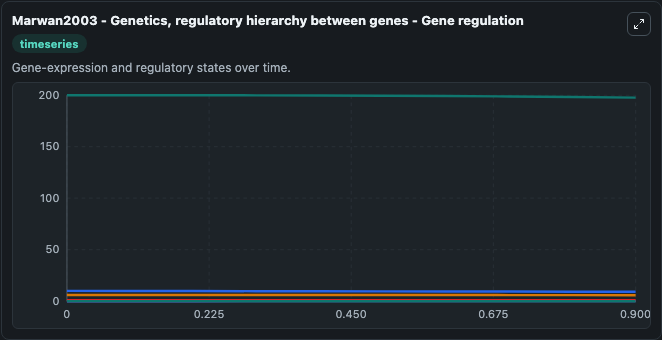
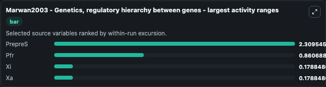
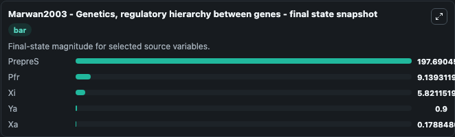
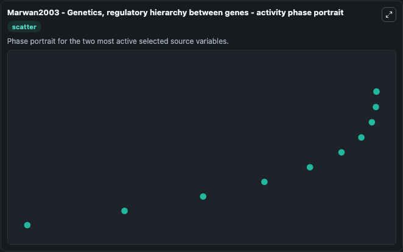

# Marwan2003 Genetics Regulatory Hierarchy Between Genes

This Biosimulant lab wraps `Marwan2003 Genetics Regulatory Hierarchy Between Genes` as a runnable systems biology model with a companion visualization module.
To the extent possible under law, all copyright and related or neighbouring rights to this encoded model have been dedicated to the public domain worldwide. It can be used to explore the configured dynamics and compare scenario outcomes across configurations.

## What You'll See

The lab asks: Which gene-regulatory states dominate the source model trajectory? Source model: Marwan2003 - Genetics, regulatory hierarchy between genes. It runs for 1.0 time units with a communication step of 0.1. The run uses the model defaults declared by the curated SBML wrapper. The generated visualizations focus on PrepreS, Pfr, Xi, Ya, Yi, and Xa, combining trajectory, endpoint-comparison, and summary-table views from one completed dark-mode run.

In this captured run, **PrepreS** moved from 200.0 to 197.7 across 1.0 simulation windows.


### Output Visualizations



*Summary table for Marwan2003 Genetics Regulatory Hierarchy Between Genes, reporting the scientific question, observed answer, dominant module, and caveat.*



*Trajectories of PrepreS, Pfr, Xi, Xa, Ya, and Yi across the 1.0 simulation. In this run **Xa** climbed from 0 to 0.1788 and **PrepreS** fell from 200.0 to 197.7 — the largest movements among the focused observables.*



*Largest-excursion ranking of the focused observables — the absolute movement magnitude during the run. Top 3: **PrepreS** = 2.310, **Pfr** = 0.8607, **Xi** = 0.1788, with 1 more observable below.*



*Endpoint snapshot of the focused observables — final values from the captured run. Top 3 by value: **PrepreS** = 197.7, **Pfr** = 9.139, **Xi** = 5.821, with 2 more observables below.*



*Visualization card from the Marwan2003 Genetics Regulatory Hierarchy Between Genes dark-mode run.*


## Model Context

- Core model: `models/core`
- Visualization model: `models/visualisation`
- Standard: `other`
- Upstream source: `biomodels_ebi:BIOMD0000000037`
- License: `CC0`

## Inputs

| Input | Maps To | Default | Notes |
|---|---|---|---|
| Initial Prepre S | `systemsbiology_sbml_marwan2003_genetics_regulatory_hierarchy_between_biomd0000000037_model.initial_prepre_s` | | Source state initial condition exposed as a model-specific control because no explicit intervention parameter is identifiable. Maps to SBML symbol `prepreS`. |
| Initial Model State Pfr | `systemsbiology_sbml_marwan2003_genetics_regulatory_hierarchy_between_biomd0000000037_model.initial_model_state_pfr` | | Source state initial condition exposed as a model-specific control because no explicit intervention parameter is identifiable. Maps to SBML symbol `Pfr`. |
| Initial Model State Xi | `systemsbiology_sbml_marwan2003_genetics_regulatory_hierarchy_between_biomd0000000037_model.initial_model_state_xi` | | Source state initial condition exposed as a model-specific control because no explicit intervention parameter is identifiable. Maps to SBML symbol `Xi`. |
| Initial Model State Ya | `systemsbiology_sbml_marwan2003_genetics_regulatory_hierarchy_between_biomd0000000037_model.initial_model_state_ya` | | Source state initial condition exposed as a model-specific control because no explicit intervention parameter is identifiable. Maps to SBML symbol `Ya`. |
| Initial Model State Yi | `systemsbiology_sbml_marwan2003_genetics_regulatory_hierarchy_between_biomd0000000037_model.initial_model_state_yi` | | Source state initial condition exposed as a model-specific control because no explicit intervention parameter is identifiable. Maps to SBML symbol `Yi`. |
| Initial Model State Xa | `systemsbiology_sbml_marwan2003_genetics_regulatory_hierarchy_between_biomd0000000037_model.initial_model_state_xa` | | Source state initial condition exposed as a model-specific control because no explicit intervention parameter is identifiable. Maps to SBML symbol `Xa`. |

## Outputs

| Output | Maps To | Role |
|---|---|---|
| `state` | `systemsbiology_sbml_marwan2003_genetics_regulatory_hierarchy_between_biomd0000000037_model.state` | Available to the visualization model and downstream workflows. |
| `summary` | `systemsbiology_sbml_marwan2003_genetics_regulatory_hierarchy_between_biomd0000000037_model.summary` | Available to the visualization model and downstream workflows. |
| `species_labels` | `systemsbiology_sbml_marwan2003_genetics_regulatory_hierarchy_between_biomd0000000037_model.species_labels` | Available to the visualization model and downstream workflows. |
| `prepre_s` | `systemsbiology_sbml_marwan2003_genetics_regulatory_hierarchy_between_biomd0000000037_model.prepre_s` | Available to the visualization model and downstream workflows. |
| `pfr` | `systemsbiology_sbml_marwan2003_genetics_regulatory_hierarchy_between_biomd0000000037_model.pfr` | Available to the visualization model and downstream workflows. |
| `model_state_xi` | `systemsbiology_sbml_marwan2003_genetics_regulatory_hierarchy_between_biomd0000000037_model.model_state_xi` | Available to the visualization model and downstream workflows. |
| `model_state_ya` | `systemsbiology_sbml_marwan2003_genetics_regulatory_hierarchy_between_biomd0000000037_model.model_state_ya` | Available to the visualization model and downstream workflows. |
| `model_state_yi` | `systemsbiology_sbml_marwan2003_genetics_regulatory_hierarchy_between_biomd0000000037_model.model_state_yi` | Available to the visualization model and downstream workflows. |
| `model_state_xa` | `systemsbiology_sbml_marwan2003_genetics_regulatory_hierarchy_between_biomd0000000037_model.model_state_xa` | Available to the visualization model and downstream workflows. |

## Runtime

- Duration: `1.0`
- Communication step: `0.1`

## Running Locally

```bash
biosimulant labs serve
```
