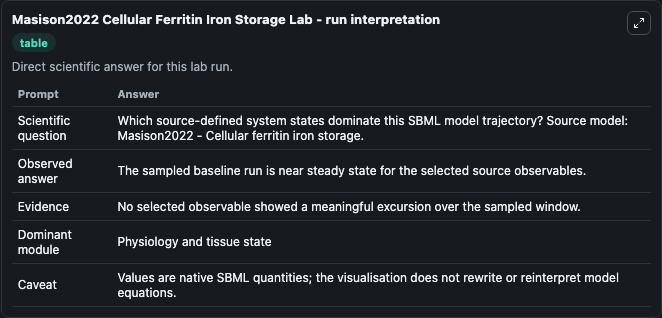
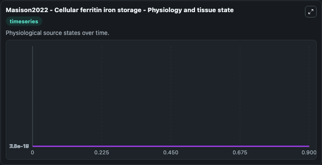
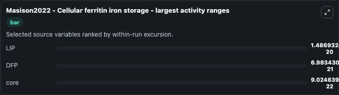
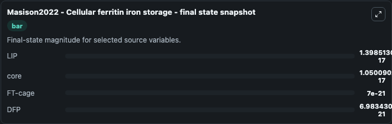
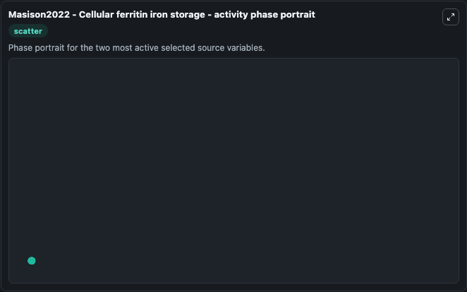

# Masison2022 Cellular Ferritin Iron Storage

This Biosimulant lab wraps `Masison2022 Cellular Ferritin Iron Storage` as a runnable systems biology model with a companion visualization module.
This is a small model of ferritin iron sequestration kinetics. It can be used to explore the configured dynamics and compare scenario outcomes across configurations.

## What You'll See

The lab asks: Which source-defined system states dominate this SBML model trajectory? Source model: Masison2022 - Cellular ferritin iron storage. It runs for 1.0 time units with a communication step of 0.1. The run uses the model defaults declared by the curated SBML wrapper. The generated visualizations focus on core, FT-cage, LIP, and DFP, combining trajectory, endpoint-comparison, and summary-table views from one completed dark-mode run.

In this captured run, **LIP** moved from 1.4e-17 to 1.4e-17 across 1.0 simulation windows.


### Output Visualizations



*Summary table for Masison2022 Cellular Ferritin Iron Storage, reporting the scientific question, observed answer, dominant module, and caveat.*



*Trajectories of LIP, DFP, core, and FT-cage across the 1.0 simulation. In this run **DFP** climbed from 0 to 6.98e-21 and **LIP** fell from 1.4e-17 to 1.4e-17 — the largest movements among the focused observables.*



*Largest-excursion ranking of the focused observables — the absolute movement magnitude during the run. Top 3: **LIP** = 1.49e-20, **DFP** = 6.98e-21, **core** = 9.02e-22.*



*Endpoint snapshot of the focused observables — final values from the captured run. Top 3 by value: **LIP** = 1.4e-17, **core** = 1.05e-17, **FT-cage** = 7e-21, with 1 more observable below.*



*Visualization card from the Masison2022 Cellular Ferritin Iron Storage dark-mode run.*


## Model Context

- Core model: `models/core`
- Visualization model: `models/visualisation`
- Standard: `other`
- Upstream source: `biomodels_ebi:MODEL2211030001`
- License: `CC0`

## Inputs

| Input | Maps To | Default | Notes |
|---|---|---|---|
| Initial Core | `systemsbiology_sbml_masison2022_cellular_ferritin_iron_storage_model2211030001_model.initial_core` | | Source state initial condition exposed as a model-specific control because no explicit intervention parameter is identifiable. Maps to SBML symbol `core`. |
| Initial Ft Cage | `systemsbiology_sbml_masison2022_cellular_ferritin_iron_storage_model2211030001_model.initial_ft_cage` | | Source state initial condition exposed as a model-specific control because no explicit intervention parameter is identifiable. Maps to SBML symbol `FT_cage`. |
| Initial Model State Lip | `systemsbiology_sbml_masison2022_cellular_ferritin_iron_storage_model2211030001_model.initial_model_state_lip` | | Source state initial condition exposed as a model-specific control because no explicit intervention parameter is identifiable. Maps to SBML symbol `LIP`. |
| Initial Model State Dfp | `systemsbiology_sbml_masison2022_cellular_ferritin_iron_storage_model2211030001_model.initial_model_state_dfp` | | Source state initial condition exposed as a model-specific control because no explicit intervention parameter is identifiable. Maps to SBML symbol `DFP`. |

## Outputs

| Output | Maps To | Role |
|---|---|---|
| `state` | `systemsbiology_sbml_masison2022_cellular_ferritin_iron_storage_model2211030001_model.state` | Available to the visualization model and downstream workflows. |
| `summary` | `systemsbiology_sbml_masison2022_cellular_ferritin_iron_storage_model2211030001_model.summary` | Available to the visualization model and downstream workflows. |
| `species_labels` | `systemsbiology_sbml_masison2022_cellular_ferritin_iron_storage_model2211030001_model.species_labels` | Available to the visualization model and downstream workflows. |
| `core` | `systemsbiology_sbml_masison2022_cellular_ferritin_iron_storage_model2211030001_model.core` | Available to the visualization model and downstream workflows. |
| `ft_cage` | `systemsbiology_sbml_masison2022_cellular_ferritin_iron_storage_model2211030001_model.ft_cage` | Available to the visualization model and downstream workflows. |
| `lip` | `systemsbiology_sbml_masison2022_cellular_ferritin_iron_storage_model2211030001_model.lip` | Available to the visualization model and downstream workflows. |
| `dfp` | `systemsbiology_sbml_masison2022_cellular_ferritin_iron_storage_model2211030001_model.dfp` | Available to the visualization model and downstream workflows. |

## Runtime

- Duration: `1.0`
- Communication step: `0.1`

## Running Locally

```bash
biosimulant labs serve
```
