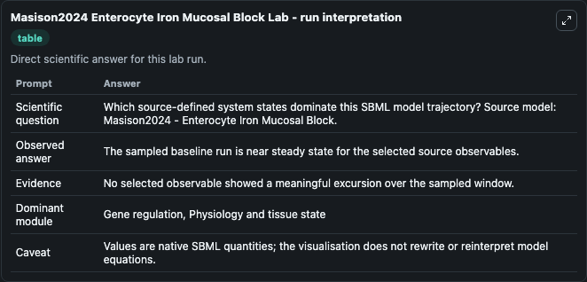
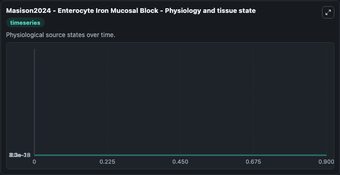
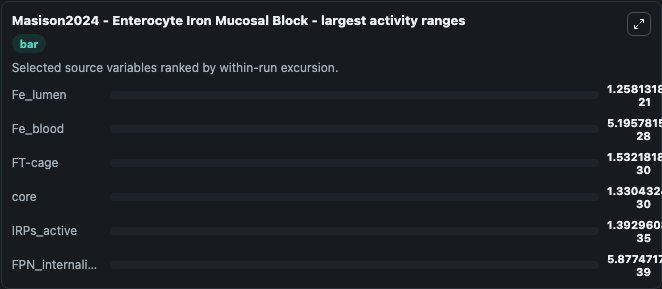
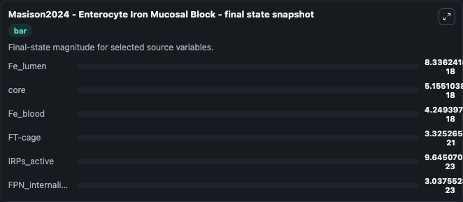
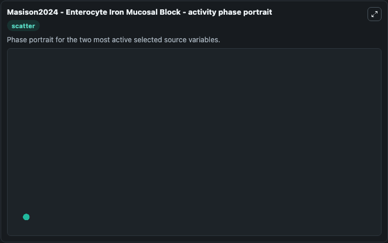

# Masison2024 Enterocyte Iron Mucosal Block

This Biosimulant lab wraps `Masison2024 Enterocyte Iron Mucosal Block` as a runnable systems biology model with a companion visualization module.
Enterocyte Iron Mucosal Block This is a model of enterocyte iron absorption, consisting of iron uptake (movement of iron from intestinal lumen into cytplasm), and transfer (transport of iron from cyto. It can be used to explore the configured dynamics and compare scenario outcomes across configurations.

## What You'll See

The lab asks: Which source-defined system states dominate this SBML model trajectory? Source model: Masison2024 - Enterocyte Iron Mucosal Block. It runs for 1.0 time units with a communication step of 0.1. The run uses the model defaults declared by the curated SBML wrapper. The generated visualizations focus on FPN_internalized, core, Fe_lumen, Fe_blood, FT-cage, and IRPs_active, combining trajectory, endpoint-comparison, and summary-table views from one completed dark-mode run.

In this captured run, **Fe_lumen** moved from 8.34e-18 to 8.34e-18 across 1.0 simulation windows.


### Output Visualizations



*Summary table for Masison2024 Enterocyte Iron Mucosal Block, reporting the scientific question, observed answer, dominant module, and caveat.*



*Trajectories of Fe_lumen, Fe_blood, FT-cage, core, IRPs_active, and FPN_internalized across the 1.0 simulation. In this run **IRPs_active** climbed from 9.65e-23 to 9.65e-23 and **Fe_lumen** fell from 8.34e-18 to 8.34e-18 — the largest movements among the focused observables.*



*Largest-excursion ranking of the focused observables — the absolute movement magnitude during the run. Top 3: **Fe_lumen** = 1.26e-21, **Fe_blood** = 5.2e-28, **FT-cage** = 1.53e-30, with 3 more observables below.*



*Endpoint snapshot of the focused observables — final values from the captured run. Top 3 by value: **Fe_lumen** = 8.34e-18, **core** = 5.16e-18, **Fe_blood** = 4.25e-18, with 3 more observables below.*



*Visualization card from the Masison2024 Enterocyte Iron Mucosal Block dark-mode run.*


## Model Context

- Core model: `models/core`
- Visualization model: `models/visualisation`
- Standard: `other`
- Upstream source: `biomodels_ebi:MODEL2405170001`
- License: `CC0`

## Inputs

| Input | Maps To | Default | Notes |
|---|---|---|---|
| Dose 0 | `systemsbiology_sbml_masison2024_enterocyte_iron_mucosal_block_model2405170001_model.dose_0` | | Source parameter exposed because its SBML label indicates a boundary, stimulus, dose, ligand, protocol, substrate, or environmental control. Maps to SBML symbol `dose_0`. |
| Dose Fe | `systemsbiology_sbml_masison2024_enterocyte_iron_mucosal_block_model2405170001_model.dose_fe` | | Source parameter exposed because its SBML label indicates a boundary, stimulus, dose, ligand, protocol, substrate, or environmental control. Maps to SBML symbol `dose_fe`. |

## Outputs

| Output | Maps To | Role |
|---|---|---|
| `state` | `systemsbiology_sbml_masison2024_enterocyte_iron_mucosal_block_model2405170001_model.state` | Available to the visualization model and downstream workflows. |
| `summary` | `systemsbiology_sbml_masison2024_enterocyte_iron_mucosal_block_model2405170001_model.summary` | Available to the visualization model and downstream workflows. |
| `species_labels` | `systemsbiology_sbml_masison2024_enterocyte_iron_mucosal_block_model2405170001_model.species_labels` | Available to the visualization model and downstream workflows. |
| `fpn_internalized` | `systemsbiology_sbml_masison2024_enterocyte_iron_mucosal_block_model2405170001_model.fpn_internalized` | Available to the visualization model and downstream workflows. |
| `core` | `systemsbiology_sbml_masison2024_enterocyte_iron_mucosal_block_model2405170001_model.core` | Available to the visualization model and downstream workflows. |
| `fe_lumen` | `systemsbiology_sbml_masison2024_enterocyte_iron_mucosal_block_model2405170001_model.fe_lumen` | Available to the visualization model and downstream workflows. |
| `fe_blood` | `systemsbiology_sbml_masison2024_enterocyte_iron_mucosal_block_model2405170001_model.fe_blood` | Available to the visualization model and downstream workflows. |
| `ft_cage` | `systemsbiology_sbml_masison2024_enterocyte_iron_mucosal_block_model2405170001_model.ft_cage` | Available to the visualization model and downstream workflows. |
| `ir_ps_active` | `systemsbiology_sbml_masison2024_enterocyte_iron_mucosal_block_model2405170001_model.ir_ps_active` | Available to the visualization model and downstream workflows. |

## Runtime

- Duration: `1.0`
- Communication step: `0.1`

## Running Locally

```bash
biosimulant labs serve
```
