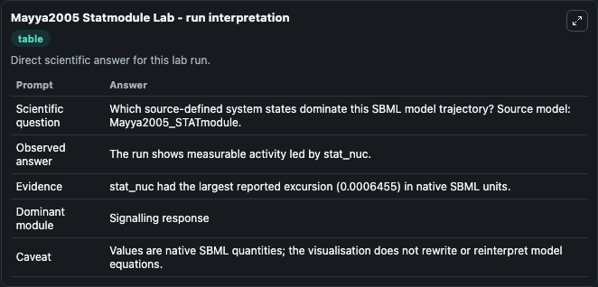
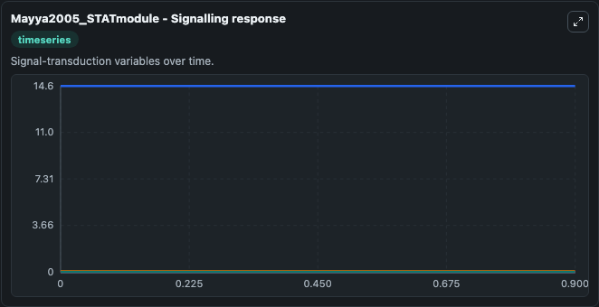
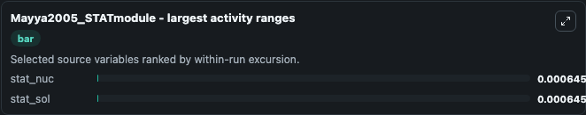
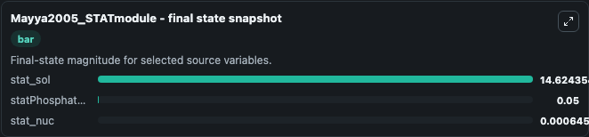
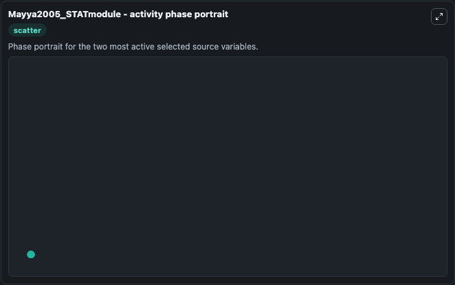

# Mayya2005 Statmodule

This Biosimulant lab wraps `Mayya2005 Statmodule` as a runnable systems biology model with a companion visualization module.
The model reproduces Fig 2B of the paper. It can be used to explore the configured dynamics and compare scenario outcomes across configurations.

## What You'll See

The lab asks: Which source-defined system states dominate this SBML model trajectory? Source model: Mayya2005_STATmodule. It runs for 1.0 time units with a communication step of 0.1. The run uses the model defaults declared by the curated SBML wrapper. The generated visualizations focus on statPhosphatase_nuc, stat_sol, stat_nuc, statKinase_sol, species_test, and Pstat_sol, combining trajectory, endpoint-comparison, and summary-table views from one completed dark-mode run.

In this captured run, **stat_nuc** moved from 0 to 0.000646 across 1.0 simulation windows.


### Output Visualizations



*Summary table for Mayya2005 Statmodule, reporting the scientific question, observed answer, dominant module, and caveat.*



*Trajectories of stat_nuc, stat_sol, statPhosphatase_nuc, statKinase_sol, species_test, and Pstat_sol across the 1.0 simulation. In this run **stat_nuc** climbed from 0 to 0.000646 and **stat_sol** fell from 14.625 to 14.624 — the largest movements among the focused observables.*



*Largest-excursion ranking of the focused observables — the absolute movement magnitude during the run. Top 2: **stat_nuc** = 0.000646, **stat_sol** = 0.000646.*



*Endpoint snapshot of the focused observables — final values from the captured run. Top 3 by value: **stat_sol** = 14.624, **statPhosphatase_nuc** = 0.0500, **stat_nuc** = 0.000646.*



*Visualization card from the Mayya2005 Statmodule dark-mode run.*


## Model Context

- Core model: `models/core`
- Visualization model: `models/visualisation`
- Standard: `other`
- Upstream source: `biomodels_ebi:BIOMD0000000167`
- License: `CC0`

## Inputs

| Input | Maps To | Default | Notes |
|---|---|---|---|
| Initial Stat Phosphatase Nuc | `systemsbiology_sbml_mayya2005_statmodule_biomd0000000167_model.initial_stat_phosphatase_nuc` | | Source state initial condition exposed as a model-specific control because no explicit intervention parameter is identifiable. Maps to SBML symbol `statPhosphatase_nuc`. |
| Initial Stat Sol | `systemsbiology_sbml_mayya2005_statmodule_biomd0000000167_model.initial_stat_sol` | | Source state initial condition exposed as a model-specific control because no explicit intervention parameter is identifiable. Maps to SBML symbol `stat_sol`. |
| Initial Stat Nuc | `systemsbiology_sbml_mayya2005_statmodule_biomd0000000167_model.initial_stat_nuc` | | Source state initial condition exposed as a model-specific control because no explicit intervention parameter is identifiable. Maps to SBML symbol `stat_nuc`. |
| Initial Stat Kinase Sol | `systemsbiology_sbml_mayya2005_statmodule_biomd0000000167_model.initial_stat_kinase_sol` | | Source state initial condition exposed as a model-specific control because no explicit intervention parameter is identifiable. Maps to SBML symbol `statKinase_sol`. |
| Initial Species Test | `systemsbiology_sbml_mayya2005_statmodule_biomd0000000167_model.initial_species_test` | | Source state initial condition exposed as a model-specific control because no explicit intervention parameter is identifiable. Maps to SBML symbol `species_test`. |
| Initial Pstat Sol | `systemsbiology_sbml_mayya2005_statmodule_biomd0000000167_model.initial_pstat_sol` | | Source state initial condition exposed as a model-specific control because no explicit intervention parameter is identifiable. Maps to SBML symbol `Pstat_sol`. |

## Outputs

| Output | Maps To | Role |
|---|---|---|
| `state` | `systemsbiology_sbml_mayya2005_statmodule_biomd0000000167_model.state` | Available to the visualization model and downstream workflows. |
| `summary` | `systemsbiology_sbml_mayya2005_statmodule_biomd0000000167_model.summary` | Available to the visualization model and downstream workflows. |
| `species_labels` | `systemsbiology_sbml_mayya2005_statmodule_biomd0000000167_model.species_labels` | Available to the visualization model and downstream workflows. |
| `stat_phosphatase_nuc` | `systemsbiology_sbml_mayya2005_statmodule_biomd0000000167_model.stat_phosphatase_nuc` | Available to the visualization model and downstream workflows. |
| `stat_sol` | `systemsbiology_sbml_mayya2005_statmodule_biomd0000000167_model.stat_sol` | Available to the visualization model and downstream workflows. |
| `stat_nuc` | `systemsbiology_sbml_mayya2005_statmodule_biomd0000000167_model.stat_nuc` | Available to the visualization model and downstream workflows. |
| `stat_kinase_sol` | `systemsbiology_sbml_mayya2005_statmodule_biomd0000000167_model.stat_kinase_sol` | Available to the visualization model and downstream workflows. |
| `species_test` | `systemsbiology_sbml_mayya2005_statmodule_biomd0000000167_model.species_test` | Available to the visualization model and downstream workflows. |
| `pstat_sol` | `systemsbiology_sbml_mayya2005_statmodule_biomd0000000167_model.pstat_sol` | Available to the visualization model and downstream workflows. |

## Runtime

- Duration: `1.0`
- Communication step: `0.1`

## Running Locally

```bash
biosimulant labs serve
```
