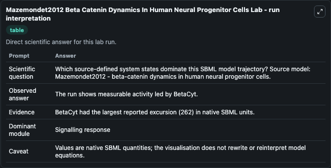
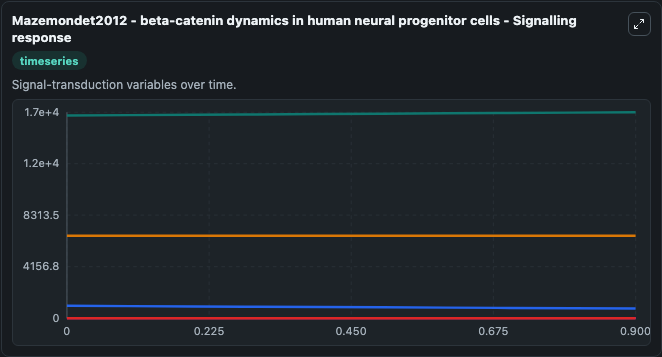
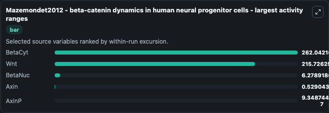
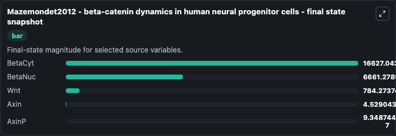
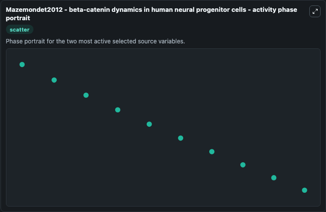

# Mazemondet2012 Beta Catenin Dynamics In Human Neural Progenitor Cells

This Biosimulant lab wraps `Mazemondet2012 Beta Catenin Dynamics In Human Neural Progenitor Cells` as a runnable systems biology model with a companion visualization module.
Systems Biology Mazemondet2012Beta Catenin Dynamics In Human Ne Model1303140000Model represents core biological mechanisms from biomodels_ebi reference biomodels_ebi:MODEL1303140000. It can be used to explore the configured dynamics and compare scenario outcomes across configurations.

## What You'll See

The lab asks: Which source-defined system states dominate this SBML model trajectory? Source model: Mazemondet2012 - beta-catenin dynamics in human neural progenitor cells. It runs for 1.0 time units with a communication step of 0.1. The run uses the model defaults declared by the curated SBML wrapper. The generated visualizations focus on BetaCyt, BetaNuc, Wnt, Axin, and AxinP, combining trajectory, endpoint-comparison, and summary-table views from one completed dark-mode run.

In this captured run, **BetaCyt** moved from 1.64e+04 to 1.66e+04 across 1.0 simulation windows.


### Output Visualizations



*Summary table for Mazemondet2012 Beta Catenin Dynamics In Human Neural Progenitor Cells, reporting the scientific question, observed answer, dominant module, and caveat.*



*Trajectories of BetaCyt, Wnt, BetaNuc, Axin, and AxinP across the 1.0 simulation. In this run **BetaCyt** climbed from 1.64e+04 to 1.66e+04 and **Wnt** fell from 1000.0 to 784.3 — the largest movements among the focused observables.*



*Largest-excursion ranking of the focused observables — the absolute movement magnitude during the run. Top 3: **BetaCyt** = 262.0, **Wnt** = 215.7, **BetaNuc** = 6.279, with 2 more observables below.*



*Endpoint snapshot of the focused observables — final values from the captured run. Top 3 by value: **BetaCyt** = 1.66e+04, **BetaNuc** = 6661.3, **Wnt** = 784.3, with 2 more observables below.*



*Visualization card from the Mazemondet2012 Beta Catenin Dynamics In Human Neural Progenitor Cells dark-mode run.*


## Model Context

- Core model: `models/core`
- Visualization model: `models/visualisation`
- Standard: `other`
- Upstream source: `biomodels_ebi:MODEL1303140000`
- License: `CC0`

## Inputs

| Input | Maps To | Default | Notes |
|---|---|---|---|
| Initial Beta Cyt | `systemsbiology_sbml_mazemondet2012_beta_catenin_dynamics_in_human_ne_model1303140000_model.initial_beta_cyt` | | Source state initial condition exposed as a model-specific control because no explicit intervention parameter is identifiable. Maps to SBML symbol `species_1`. |
| Initial Beta Nuc | `systemsbiology_sbml_mazemondet2012_beta_catenin_dynamics_in_human_ne_model1303140000_model.initial_beta_nuc` | | Source state initial condition exposed as a model-specific control because no explicit intervention parameter is identifiable. Maps to SBML symbol `species_6`. |
| Initial Model State Wnt | `systemsbiology_sbml_mazemondet2012_beta_catenin_dynamics_in_human_ne_model1303140000_model.initial_model_state_wnt` | | Source state initial condition exposed as a model-specific control because no explicit intervention parameter is identifiable. Maps to SBML symbol `species_4`. |
| Initial Axin | `systemsbiology_sbml_mazemondet2012_beta_catenin_dynamics_in_human_ne_model1303140000_model.initial_axin` | | Source state initial condition exposed as a model-specific control because no explicit intervention parameter is identifiable. Maps to SBML symbol `species_2`. |
| Initial Axin P | `systemsbiology_sbml_mazemondet2012_beta_catenin_dynamics_in_human_ne_model1303140000_model.initial_axin_p` | | Source state initial condition exposed as a model-specific control because no explicit intervention parameter is identifiable. Maps to SBML symbol `species_3`. |

## Outputs

| Output | Maps To | Role |
|---|---|---|
| `state` | `systemsbiology_sbml_mazemondet2012_beta_catenin_dynamics_in_human_ne_model1303140000_model.state` | Available to the visualization model and downstream workflows. |
| `summary` | `systemsbiology_sbml_mazemondet2012_beta_catenin_dynamics_in_human_ne_model1303140000_model.summary` | Available to the visualization model and downstream workflows. |
| `species_labels` | `systemsbiology_sbml_mazemondet2012_beta_catenin_dynamics_in_human_ne_model1303140000_model.species_labels` | Available to the visualization model and downstream workflows. |
| `beta_cyt` | `systemsbiology_sbml_mazemondet2012_beta_catenin_dynamics_in_human_ne_model1303140000_model.beta_cyt` | Available to the visualization model and downstream workflows. |
| `beta_nuc` | `systemsbiology_sbml_mazemondet2012_beta_catenin_dynamics_in_human_ne_model1303140000_model.beta_nuc` | Available to the visualization model and downstream workflows. |
| `wnt` | `systemsbiology_sbml_mazemondet2012_beta_catenin_dynamics_in_human_ne_model1303140000_model.wnt` | Available to the visualization model and downstream workflows. |
| `axin` | `systemsbiology_sbml_mazemondet2012_beta_catenin_dynamics_in_human_ne_model1303140000_model.axin` | Available to the visualization model and downstream workflows. |
| `axin_p` | `systemsbiology_sbml_mazemondet2012_beta_catenin_dynamics_in_human_ne_model1303140000_model.axin_p` | Available to the visualization model and downstream workflows. |

## Runtime

- Duration: `1.0`
- Communication step: `0.1`

## Running Locally

```bash
biosimulant labs serve
```
