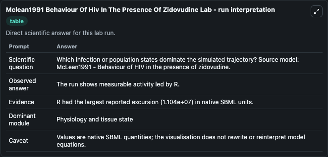
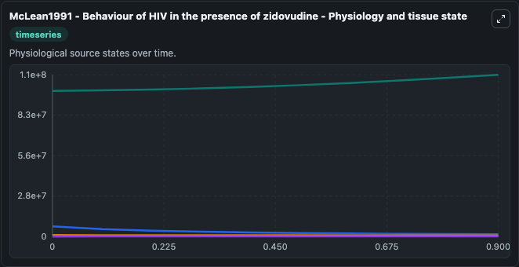
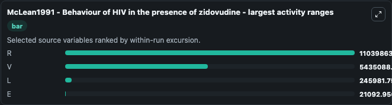
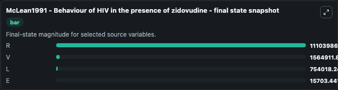
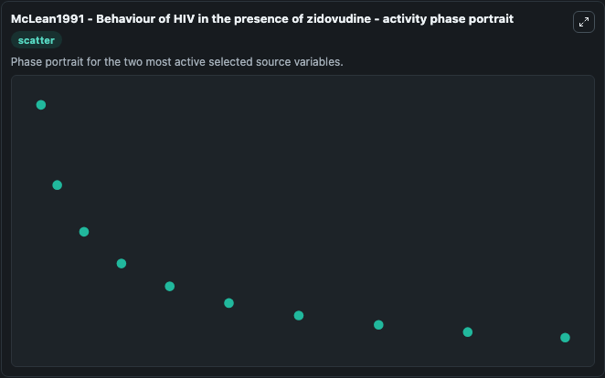

# Mclean1991 Behaviour Of Hiv In The Presence Of Zidovudine

This Biosimulant lab wraps `Mclean1991 Behaviour Of Hiv In The Presence Of Zidovudine` as a runnable systems biology model with a companion visualization module.
A new mechanism is proposed for the apparent breakthrough of HIV that occurs approximately 6 months after the commencement of therapy with zidovudine (AZT). It can be used to explore the configured dynamics and compare scenario outcomes across configurations.

## What You'll See

The lab asks: Which infection or population states dominate the simulated trajectory? Source model: McLean1991 - Behaviour of HIV in the presence of zidovudine. It runs for 1.0 time units with a communication step of 0.1. The run uses the model defaults declared by the curated SBML wrapper. The generated visualizations focus on R, V, L, and E, combining trajectory, endpoint-comparison, and summary-table views from one completed dark-mode run.

In this captured run, **R** moved from 1e+08 to 1.11e+08 across 1.0 simulation windows.


### Output Visualizations



*Summary table for Mclean1991 Behaviour Of Hiv In The Presence Of Zidovudine, reporting the scientific question, observed answer, dominant module, and caveat.*



*Trajectories of R, V, L, and E across the 1.0 simulation. In this run **R** climbed from 1e+08 to 1.11e+08 and **V** fell from 7e+06 to 1.56e+06 — the largest movements among the focused observables.*



*Largest-excursion ranking of the focused observables — the absolute movement magnitude during the run. Top 3: **R** = 1.1e+07, **V** = 5.44e+06, **L** = 2.46e+05, with 1 more observable below.*



*Endpoint snapshot of the focused observables — final values from the captured run. Top 3 by value: **R** = 1.11e+08, **V** = 1.56e+06, **L** = 7.54e+05, with 1 more observable below.*



*Visualization card from the Mclean1991 Behaviour Of Hiv In The Presence Of Zidovudine dark-mode run.*


## Model Context

- Core model: `models/core`
- Visualization model: `models/visualisation`
- Standard: `other`
- Upstream source: `biomodels_ebi:BIOMD0000000967`
- License: `CC0`

## Inputs

| Input | Maps To | Default | Notes |
|---|---|---|---|
| Initial Model State R | `systemsbiology_sbml_mclean1991_behaviour_of_hiv_in_the_presence_of_z_biomd0000000967_model.initial_model_state_r` | | Source state initial condition exposed as a model-specific control because no explicit intervention parameter is identifiable. Maps to SBML symbol `R`. |
| Initial Model State V | `systemsbiology_sbml_mclean1991_behaviour_of_hiv_in_the_presence_of_z_biomd0000000967_model.initial_model_state_v` | | Source state initial condition exposed as a model-specific control because no explicit intervention parameter is identifiable. Maps to SBML symbol `V`. |
| Initial Model State L | `systemsbiology_sbml_mclean1991_behaviour_of_hiv_in_the_presence_of_z_biomd0000000967_model.initial_model_state_l` | | Source state initial condition exposed as a model-specific control because no explicit intervention parameter is identifiable. Maps to SBML symbol `L`. |
| Initial Model State E | `systemsbiology_sbml_mclean1991_behaviour_of_hiv_in_the_presence_of_z_biomd0000000967_model.initial_model_state_e` | | Source state initial condition exposed as a model-specific control because no explicit intervention parameter is identifiable. Maps to SBML symbol `E`. |

## Outputs

| Output | Maps To | Role |
|---|---|---|
| `state` | `systemsbiology_sbml_mclean1991_behaviour_of_hiv_in_the_presence_of_z_biomd0000000967_model.state` | Available to the visualization model and downstream workflows. |
| `summary` | `systemsbiology_sbml_mclean1991_behaviour_of_hiv_in_the_presence_of_z_biomd0000000967_model.summary` | Available to the visualization model and downstream workflows. |
| `species_labels` | `systemsbiology_sbml_mclean1991_behaviour_of_hiv_in_the_presence_of_z_biomd0000000967_model.species_labels` | Available to the visualization model and downstream workflows. |
| `model_state_r` | `systemsbiology_sbml_mclean1991_behaviour_of_hiv_in_the_presence_of_z_biomd0000000967_model.model_state_r` | Available to the visualization model and downstream workflows. |
| `model_state_v` | `systemsbiology_sbml_mclean1991_behaviour_of_hiv_in_the_presence_of_z_biomd0000000967_model.model_state_v` | Available to the visualization model and downstream workflows. |
| `model_state_l` | `systemsbiology_sbml_mclean1991_behaviour_of_hiv_in_the_presence_of_z_biomd0000000967_model.model_state_l` | Available to the visualization model and downstream workflows. |
| `model_state_e` | `systemsbiology_sbml_mclean1991_behaviour_of_hiv_in_the_presence_of_z_biomd0000000967_model.model_state_e` | Available to the visualization model and downstream workflows. |

## Runtime

- Duration: `1.0`
- Communication step: `0.1`

## Running Locally

```bash
biosimulant labs serve
```
